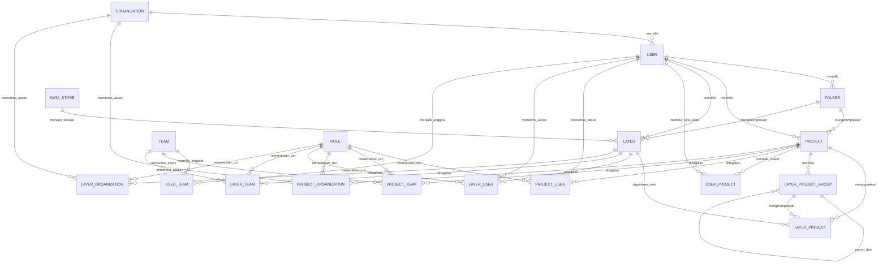

# Detail Kolom dan Relasi Database: Peta, User, dan Layer

## 1. Ruang Lingkup

Dokumen ini menjelaskan tabel PostgreSQL pada schema `customer` yang berkaitan langsung dengan user, peta/project, layer, folder, dan akses berbagi.

Sumber utama definisi adalah model SQLModel pada `apps/core/src/core/db/models/`. Data geospasial feature yang ditampilkan pada peta dikelola oleh DuckLake/DuckDB melalui `apps/geoapi`; PostgreSQL menyimpan metadata, konfigurasi, kepemilikan, dan relasinya.

## 2. Konvensi Kolom

- Kolom `UUID` digunakan sebagai identifier utama pada entitas user, project, layer, folder, organisasi, dan team.
- Tabel penghubung umumnya menggunakan `INTEGER` auto-increment sebagai primary key.
- `JSONB` digunakan untuk konfigurasi fleksibel seperti style, filter, chart, dan konfigurasi builder.
- Kolom waktu pada model utama memakai `created_at` dan `updated_at`.
- Kolom `extent` pada layer menggunakan PostGIS `MultiPolygon` dengan SRID 4326.
- `ON DELETE CASCADE` berarti record turunan atau relasi penghubung ikut dihapus saat parent dihapus.

## 3. Diagram Relasi Domain Peta



## 4. Tabel `customer.user`

User adalah pemilik atau pengguna resource dalam aplikasi. Sebagian atribut identitas dapat disinkronkan dari Keycloak.

| Kolom | Tipe | Null | Keterangan |
| --- | --- | --- | --- |
| `id` | UUID | Tidak | Primary key, default `uuid_generate_v4()` |
| `email` | TEXT | Tidak | Email user |
| `firstname` | TEXT | Ya | Nama depan |
| `lastname` | TEXT | Ya | Nama belakang |
| `avatar` | TEXT | Ya | URL atau referensi avatar |
| `newsletter_subscribe` | BOOLEAN | Ya | Status langganan newsletter |
| `hubspot_id` | TEXT | Ya | Identifier integrasi HubSpot |
| `organization_id` | UUID | Ya | FK ke `organization.id`, cascade saat organisasi dihapus |
| `created_at` | TIMESTAMP | Ya | Waktu pembuatan record |
| `updated_at` | TIMESTAMP | Ya | Waktu perubahan record |

### Relasi user

- `user.organization_id -> organization.id`: banyak user dapat berada dalam satu organisasi.
- `folder.user_id -> user.id`: user dapat memiliki banyak folder.
- `project.user_id -> user.id`: user menjadi owner banyak project.
- `layer.user_id -> user.id`: user menjadi owner banyak layer.
- `uploaded_asset.user_id -> user.id`: user dapat mengunggah banyak asset.
- `user_project`: relasi user ke project beserta state tampilan awal.
- `project_user`: grant akses project per user dengan role.
- `layer_user`: grant akses layer per user dengan role.
- `user_team`: keanggotaan user pada team.
- `user_role`: role RBAC langsung untuk user.
- `system_setting`: preferensi personal user.

Index yang terlihat pada model: `idx_user_organization_id` pada `organization_id`.

## 5. Tabel `customer.folder`

Folder mengelompokkan project dan layer milik user.

| Kolom | Tipe | Null | Keterangan |
| --- | --- | --- | --- |
| `id` | UUID | Tidak | Primary key, default UUID server |
| `user_id` | UUID | Tidak | FK ke `user.id`, cascade |
| `name` | TEXT | Tidak | Nama folder |
| `created_at` | TIMESTAMP WITH TIME ZONE | Tidak | Waktu pembuatan |
| `updated_at` | TIMESTAMP WITH TIME ZONE | Tidak | Waktu perubahan |

Constraint penting: kombinasi `user_id` dan `name` harus unik.

Relasi:

- Satu user memiliki banyak folder.
- Satu folder dapat memiliki banyak project.
- Satu folder dapat memiliki banyak layer.
- `uploaded_asset.folder_id` bersifat opsional dan memakai `ON DELETE SET NULL`.
- Project dan layer merujuk ke folder dengan `ON DELETE CASCADE`.

## 6. Tabel `customer.project` sebagai Peta

Dalam domain aplikasi, project adalah container peta. Project menyimpan konfigurasi peta dan menjadi parent untuk layer yang digunakan, group layer, workflow, serta output publikasi.

### Kolom project

| Kolom | Tipe | Null | Keterangan |
| --- | --- | --- | --- |
| `id` | UUID | Tidak | Primary key, default `uuid_generate_v4()` |
| `folder_id` | UUID | Tidak | FK ke `folder.id`, cascade |
| `name` | TEXT | Tidak | Nama project, diwarisi dari `ContentBaseAttributes` |
| `description` | TEXT | Ya | Deskripsi project |
| `user_id` | UUID | Tidak | Owner project, FK ke `user.id`, cascade |
| `layer_order` | INTEGER[] | Ya | Urutan layer pada peta |
| `basemap` | TEXT | Ya | Basemap yang digunakan |
| `thumbnail_url` | TEXT | Ya | Thumbnail project |
| `custom_basemaps` | JSONB | Tidak | Library basemap custom per project, default array kosong |
| `max_extent` | FLOAT[] | Ya | Batas extent maksimum peta |
| `builder_config` | JSONB | Ya | Konfigurasi builder peta |
| `tags` | TEXT[] | Ya | Daftar tag project |
| `created_at` | TIMESTAMP WITH TIME ZONE | Tidak | Waktu pembuatan |
| `updated_at` | TIMESTAMP WITH TIME ZONE | Tidak | Waktu perubahan |

### Relasi project

- `project.user_id -> user.id`: owner project.
- `project.folder_id -> folder.id`: folder project.
- `layer_project.project_id -> project.id`: daftar layer yang digunakan pada peta.
- `layer_project_group.project_id -> project.id`: group layer milik project.
- `user_project.project_id -> project.id`: state tampilan user.
- `project_user.project_id -> project.id`: sharing ke user.
- `project_team.project_id -> project.id`: sharing ke team.
- `project_organization.project_id -> project.id`: sharing ke organisasi.
- `workflow.project_id -> project.id`: workflow project.
- `report_layout.project_id -> project.id`: layout report project.
- `project_public.project_id -> project.id`: konfigurasi publikasi project.

Penghapusan project melakukan cascade ke relasi turunan yang didefinisikan pada model, termasuk layer-project, group, sharing link, workflow, report layout, dan publikasi.

## 7. Tabel `customer.layer`

Layer menyimpan metadata layer dan referensi ke penyimpanan data geospasial. Record layer bukan berarti seluruh feature geospasial disimpan di PostgreSQL.

### Kolom identitas, ownership, dan storage

| Kolom | Tipe | Null | Keterangan |
| --- | --- | --- | --- |
| `id` | UUID | Tidak | Primary key, default `uuid_generate_v4()` |
| `name` | TEXT | Tidak | Nama layer, diwarisi dari `ContentBaseAttributes` |
| `description` | TEXT | Ya | Deskripsi layer |
| `user_id` | UUID | Tidak | Owner layer, FK ke `user.id`, cascade |
| `folder_id` | UUID | Tidak | FK ke `folder.id`, cascade |
| `data_store_id` | UUID | Ya | FK ke `data_store.id` |
| `type` | TEXT | Tidak | Enum: `feature`, `raster`, atau `table` |
| `url` | TEXT | Ya | URL layer vector atau imagery |
| `data_type` | TEXT | Ya | Tipe sumber/data, misalnya `mvt`, `wfs`, `wms`, `xyz`, `wmts`, atau `cog` |
| `size` | INTEGER | Ya | Ukuran layer dalam byte |
| `job_id` | UUID | Ya | Job pembentuk layer tool, tidak didefinisikan sebagai FK pada model layer |

### Kolom geospasial dan tampilan

| Kolom | Tipe | Null | Keterangan |
| --- | --- | --- | --- |
| `extent` | GEOMETRY(MULTIPOLYGON, 4326) | Ya | Extent geografis layer; memiliki spatial index pada deklarasi base dan deklarasi tabel eksplisit yang berbeda |
| `properties` | JSONB | Ya | Properti layer |
| `other_properties` | JSONB | Ya | Properti tambahan |
| `feature_layer_type` | TEXT | Ya | Enum: `standard`, `tool`, atau `street_network` |
| `feature_layer_geometry_type` | TEXT | Ya | Enum: `point`, `line`, atau `polygon` |
| `thumbnail_url` | TEXT | Ya | Thumbnail layer |
| `tags` | TEXT[] | Ya | Tag layer |
| `in_catalog` | BOOLEAN | Tidak | Apakah layer masuk katalog, default `false` |

### Kolom metadata sumber dan kualitas data

| Kolom | Tipe | Null | Keterangan |
| --- | --- | --- | --- |
| `lineage` | TEXT | Ya | Asal-usul dan derivasi data |
| `positional_accuracy` | TEXT | Ya | Akurasi posisi |
| `attribute_accuracy` | TEXT | Ya | Akurasi atribut |
| `completeness` | TEXT | Ya | Kelengkapan data |
| `geographical_code` | TEXT | Ya | Kode negara atau wilayah |
| `language_code` | TEXT | Ya | Kode bahasa ISO 639-1 |
| `distributor_name` | TEXT | Ya | Nama distributor data |
| `distributor_email` | TEXT | Ya | Email distributor |
| `distribution_url` | TEXT | Ya | URL distribusi data |
| `license` | TEXT | Ya | Lisensi data |
| `attribution` | TEXT | Ya | Atribusi sumber data |
| `data_reference_year` | INTEGER | Ya | Tahun referensi data |
| `data_category` | TEXT | Ya | Kategori data, misalnya transportation atau environment |
| `upload_reference_system` | INTEGER | Ya | SRID/reference system file upload |
| `upload_file_type` | TEXT | Ya | Tipe file upload, misalnya geojson, gpkg, kml, zip, atau parquet |
| `attribute_mapping` | JSONB | Ya | Pemetaan atribut layer ke kolom penyimpanan |
| `field_config` | JSONB | Tidak | Konfigurasi per kolom, default object kosong |

### Relasi layer

- `layer.user_id -> user.id`: owner layer.
- `layer.folder_id -> folder.id`: folder layer.
- `layer.data_store_id -> data_store.id`: backend data store opsional.
- `layer_project.layer_id -> layer.id`: penggunaan layer pada project.
- `layer_user.layer_id -> layer.id`: sharing ke user.
- `layer_team.layer_id -> layer.id`: sharing ke team.
- `layer_organization.layer_id -> layer.id`: sharing ke organisasi.

## 8. Tabel `customer.layer_project`

Tabel ini adalah relasi many-to-many antara project dan layer. Tabel ini penting karena satu layer dapat dipakai pada banyak peta, dan konfigurasi layer dapat berbeda pada setiap project.

| Kolom | Tipe | Null | Keterangan |
| --- | --- | --- | --- |
| `id` | INTEGER | Tidak | Primary key auto-increment |
| `layer_id` | UUID | Tidak | FK ke `layer.id`, cascade |
| `project_id` | UUID | Tidak | FK ke `project.id`, cascade |
| `layer_project_group_id` | INTEGER | Ya | FK ke `layer_project_group.id`, cascade |
| `order` | INTEGER | Tidak | Urutan layer dalam project, default `0` |
| `name` | TEXT | Tidak | Nama layer pada konteks project |
| `properties` | JSONB | Ya | Konfigurasi style/rendering |
| `other_properties` | JSONB | Ya | Konfigurasi tambahan |
| `query` | JSONB | Ya | Filter CQL2-JSON aktif |
| `charts` | JSONB | Ya | Konfigurasi chart layer |
| `created_at` | TIMESTAMP WITH TIME ZONE | Tidak | Waktu pembuatan link |
| `updated_at` | TIMESTAMP WITH TIME ZONE | Tidak | Waktu perubahan link |

Relasi ini memisahkan dua jenis metadata:

- `layer`: metadata sumber dan identitas layer secara umum.
- `layer_project`: cara layer tersebut ditampilkan dan difilter pada peta tertentu.

## 9. Tabel `customer.layer_project_group`

Group layer digunakan untuk mengorganisasi layer pada satu project dan mendukung struktur bertingkat.

| Kolom | Tipe | Null | Keterangan |
| --- | --- | --- | --- |
| `id` | INTEGER | Tidak | Primary key auto-increment |
| `name` | TEXT | Tidak | Nama group |
| `order` | INTEGER | Tidak | Urutan group, default `0` |
| `properties` | JSONB | Ya | Properti tampilan group |
| `project_id` | UUID | Tidak | FK ke `project.id`, cascade |
| `parent_id` | INTEGER | Ya | Self-reference ke `layer_project_group.id`, cascade |
| `created_at` | TIMESTAMP WITH TIME ZONE | Tidak | Waktu pembuatan |
| `updated_at` | TIMESTAMP WITH TIME ZONE | Tidak | Waktu perubahan |

Relasi:

- Satu project memiliki banyak group.
- Satu group dapat memiliki banyak child group melalui `parent_id`.
- Satu group dapat memiliki banyak `layer_project`.
- Penghapusan parent group dapat menghapus child group dan layer link yang terkait sesuai cascade ORM/foreign key.

## 10. Tabel Relasi User dan Akses Peta/Layer

### `customer.user_project`

Menyimpan hubungan user dengan project untuk state tampilan pribadi, bukan grant role utama.

| Kolom | Tipe | Null | Keterangan |
| --- | --- | --- | --- |
| `id` | INTEGER | Tidak | Primary key auto-increment |
| `user_id` | UUID | Tidak | FK ke `user.id`, cascade |
| `project_id` | UUID | Tidak | FK ke `project.id`, cascade |
| `initial_view_state` | JSONB | Tidak | Posisi/zoom/view state awal user |
| `created_at` | TIMESTAMP WITH TIME ZONE | Tidak | Waktu pembuatan |
| `updated_at` | TIMESTAMP WITH TIME ZONE | Tidak | Waktu perubahan |

Constraint: kombinasi `project_id` dan `user_id` unik.

### `customer.project_user`

Grant akses project kepada user tertentu.

| Kolom | Tipe | Null | Keterangan |
| --- | --- | --- | --- |
| `id` | INTEGER | Tidak | Primary key auto-increment |
| `user_id` | UUID | Tidak | FK ke `user.id`, cascade |
| `project_id` | UUID | Tidak | FK ke `project.id`, cascade |
| `role_id` | UUID | Tidak | FK ke `role.id` |

Index unik memastikan satu user tidak menerima project yang sama lebih dari satu kali. Model juga mendefinisikan index unik kombinasi `user_id`, `project_id`, dan `role_id`.

### `customer.layer_user`

Grant akses layer kepada user tertentu.

| Kolom | Tipe | Null | Keterangan |
| --- | --- | --- | --- |
| `id` | INTEGER | Tidak | Primary key auto-increment |
| `user_id` | UUID | Tidak | FK ke `user.id`, cascade |
| `layer_id` | UUID | Tidak | FK ke `layer.id`, cascade |
| `role_id` | UUID | Tidak | FK ke `role.id` |

Index unik memastikan kombinasi user dan layer tidak berulang. Tabel ini memiliki index pada `user_id`, `layer_id`, dan `role_id`.

### `customer.user_team`

Keanggotaan user dalam team yang dapat menerima akses ke project atau layer.

| Kolom | Tipe | Null | Keterangan |
| --- | --- | --- | --- |
| `id` | INTEGER | Tidak | Primary key auto-increment |
| `team_id` | UUID | Tidak | FK ke `team.id`, cascade |
| `user_id` | UUID | Tidak | FK ke `user.id`, cascade |
| `role_id` | UUID | Tidak | FK ke `role.id` |

## 11. Tabel Relasi Sharing Team dan Organisasi

### `project_team` dan `layer_team`

Kedua tabel menghubungkan team ke resource dengan pola kolom yang sama:

| Kolom | Tipe | Keterangan |
| --- | --- | --- |
| `id` | INTEGER | Primary key auto-increment |
| `team_id` | UUID | FK ke `team.id`, cascade |
| `project_id` atau `layer_id` | UUID | FK ke resource terkait, cascade |
| `role_id` | UUID | FK ke `role.id` |

### `project_organization` dan `layer_organization`

Kedua tabel menghubungkan organisasi ke project atau layer:

| Kolom | Tipe | Keterangan |
| --- | --- | --- |
| `id` | INTEGER | Primary key auto-increment |
| `organization_id` | UUID | FK ke `organization.id`, cascade |
| `project_id` atau `layer_id` | UUID | FK ke resource terkait, cascade |
| `role_id` | UUID | FK ke `role.id` |

Dengan pola ini, akses dapat diberikan langsung kepada user, team, atau seluruh organisasi. `role_id` menentukan level permission yang diterapkan.

## 12. Relasi Data Peta dengan Storage Geospasial

Alur penyimpanan dan pembacaan peta secara umum:

1. `user` membuat atau mengakses `project`.
2. `project` mengacu ke satu atau beberapa record `layer_project`.
3. `layer_project` menunjuk ke metadata sumber pada `layer`.
4. `layer` menyimpan `data_store_id`, URL, tipe data, dan metadata geospasial.
5. `apps/geoapi` menggunakan metadata tersebut untuk membaca feature/tile dari DuckLake/DuckDB, object storage, atau sumber eksternal.
6. Frontend merender hasilnya pada peta.

Jadi, `layer_project` menentukan konteks layer di peta, sedangkan `layer` menentukan identitas dan sumber data layer.

## 13. Aturan Integritas dan Catatan Implementasi

- `user.organization_id`, `project.user_id`, `project.folder_id`, `layer.user_id`, dan `layer.folder_id` adalah foreign key penting untuk ownership.
- User, project, layer, dan folder memakai UUID; link table memakai integer auto-increment.
- Penghapusan user dapat menghapus folder, project, layer, serta relasi terkait melalui cascade yang didefinisikan.
- Penghapusan folder menghapus project dan layer yang berada di dalamnya sesuai foreign key.
- `layer.job_id` menyimpan identifier job, tetapi pada model `Layer` tidak dideklarasikan sebagai foreign key.
- `layer.extent` menggunakan PostGIS dan divalidasi sebagai geometri area MultiPolygon.
- `properties`, `query`, `charts`, `builder_config`, dan `initial_view_state` memakai JSONB sehingga struktur internalnya ditentukan oleh service pemakainya.
- Index pada kolom foreign key dan kombinasi sharing membantu query ownership, daftar layer project, dan permission.

## 14. Verifikasi Schema Aktual

Model aplikasi adalah referensi desain, sedangkan database aktif dapat berbeda karena migration atau versi deployment. Gunakan query read-only berikut untuk memeriksa kolom dan foreign key aktual:

```sql
SELECT
    table_name,
    column_name,
    data_type,
    is_nullable,
    column_default
FROM information_schema.columns
WHERE table_schema = 'customer'
  AND table_name IN (
      'user', 'folder', 'project', 'layer', 'layer_project',
      'layer_project_group', 'user_project', 'project_user',
      'layer_user', 'user_team', 'project_team', 'layer_team',
      'project_organization', 'layer_organization'
  )
ORDER BY table_name, ordinal_position;

SELECT
    tc.table_name,
    kcu.column_name,
    ccu.table_name AS referenced_table,
    ccu.column_name AS referenced_column
FROM information_schema.table_constraints AS tc
JOIN information_schema.key_column_usage AS kcu
  ON tc.constraint_name = kcu.constraint_name
 AND tc.table_schema = kcu.table_schema
JOIN information_schema.constraint_column_usage AS ccu
  ON ccu.constraint_name = tc.constraint_name
 AND ccu.table_schema = tc.table_schema
WHERE tc.constraint_type = 'FOREIGN KEY'
  AND tc.table_schema = 'customer'
  AND tc.table_name IN (
      'user', 'folder', 'project', 'layer', 'layer_project',
      'layer_project_group', 'user_project', 'project_user',
      'layer_user', 'user_team', 'project_team', 'layer_team',
      'project_organization', 'layer_organization'
  )
ORDER BY tc.table_name, kcu.column_name;
```
