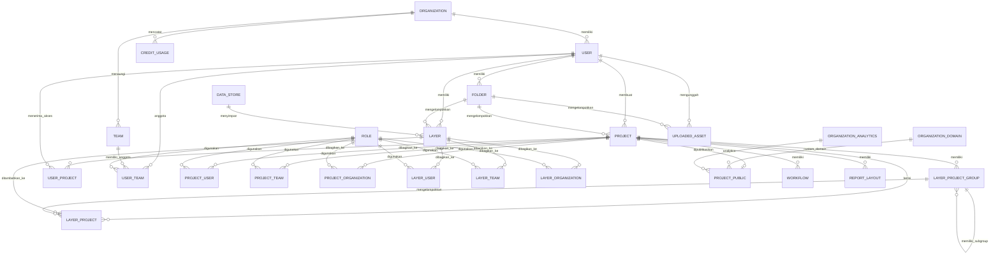

# Ringkasan Database dan Relasi GOAT

## 1. Ruang Lingkup

Database utama GOAT menggunakan PostgreSQL dengan schema aplikasi `customer`. Model database utama didefinisikan pada `apps/core/src/core/db/models/` dan dikelola oleh `apps/core`.

GOAT juga menggunakan PostGIS untuk kolom geometri serta DuckLake/DuckDB untuk data layer geospasial. PostgreSQL menyimpan metadata, kepemilikan, konfigurasi, dan relasi bisnis; data geospasial berukuran besar tidak disimpan sebagai feature utama di PostgreSQL.

Dokumen ini merangkum relasi yang terlihat dari model aplikasi. Struktur database aktual dapat berbeda menurut versi migration dan konfigurasi deployment.

## 2. Pembagian Storage

| Area | Teknologi | Isi utama | Service pengelola |
| --- | --- | --- | --- |
| `customer` | PostgreSQL/PostGIS | User, organisasi, project, layer metadata, akses, konfigurasi | `apps/core` |
| `ducklake` | DuckLake/DuckDB | Data feature/layer geospasial dan katalog DuckLake | `apps/geoapi` |
| Object storage | MinIO/S3 | File upload dan object pendukung | `apps/geoapi` dan service terkait |

Relasi `customer.layer` ke data geospasial bersifat metadata/storage reference. Kolom layer seperti `data_store_id`, tipe data, URL, dan properti menjelaskan cara data layer diakses atau disimpan.

## 3. Diagram Relasi Utama



`PROJECT_USER`, `PROJECT_TEAM`, `PROJECT_ORGANIZATION`, `LAYER_USER`, `LAYER_TEAM`, dan `LAYER_ORGANIZATION` adalah tabel penghubung untuk sharing dan menyimpan `role_id`. Pada implementasi, nama tabel menggunakan huruf kecil, misalnya `project_user` dan `layer_organization`.

## 4. Entitas Identitas dan Organisasi

### `customer.organization`

Mewakili organisasi pengguna. Selain identitas organisasi, tabel ini menyimpan informasi paket, kuota, penggunaan storage/credits/project, tipe organisasi, industri, wilayah, status trial, dan status suspended.

Relasi utama:

- Satu organisasi memiliki banyak `user`.
- Satu organisasi memiliki banyak relasi ke project melalui `project_organization`.
- Satu organisasi memiliki banyak relasi ke layer melalui `layer_organization`.
- Satu organisasi memiliki banyak catatan `credit_usage`.
- Data domain dan konfigurasi analytics organisasi berada di `organization_domain` dan `organization_analytics`.

### `customer.user`

Menyimpan identitas aplikasi yang disinkronkan dengan Keycloak, seperti email, nama, avatar, serta `organization_id`.

Relasi utama:

- `user.organization_id` mengarah ke `organization.id`.
- User dapat memiliki banyak folder, project, layer, asset, role link, team link, dan project access link.
- Pengaturan personal user disimpan di `system_setting`.

### `customer.team`

Mewakili kelompok user. Keanggotaan user-team disimpan pada tabel penghubung `user_team`. Model `team` menyimpan nama, avatar, dan deskripsi, sedangkan akses team pada project atau layer disimpan melalui tabel sharing.

### `customer.role`, `customer.permission`, dan `customer.resource`

Entitas ini mendukung RBAC:

- `role_permission` menghubungkan role dengan permission.
- `user_role` menghubungkan user dengan role.
- `resource_grant` dan `resource_permission` mengatur izin pada resource.
- Tabel sharing project/layer juga menggunakan `role_id` untuk menyimpan level akses.

## 5. Folder, Project, dan Layer

### `customer.folder`

Folder dimiliki oleh user melalui `user_id`. Folder menjadi parent untuk project dan layer pada model saat ini. Kombinasi `user_id` dan nama folder bersifat unik.

### `customer.project`

Project adalah container utama untuk peta, layer, workflow, report layout, dan konfigurasi builder. Kolom pentingnya meliputi:

- `user_id`: owner project.
- `folder_id`: folder project.
- `layer_order`: urutan layer.
- `basemap`, `custom_basemaps`, dan `max_extent`: konfigurasi tampilan peta.
- `builder_config`: konfigurasi builder berbentuk JSONB.
- `tags`: daftar tag project.

Satu project dapat memiliki banyak layer melalui `layer_project`, banyak group layer, workflow, report layout, dan relasi sharing.

### `customer.layer`

Layer menyimpan metadata dan referensi data geospasial, antara lain:

- Owner dan folder melalui `user_id` serta `folder_id`.
- Jenis layer dan tipe data.
- `data_store_id` ke `data_store` bila layer memakai data store terdaftar.
- `extent` berupa geometri MultiPolygon dengan SRID 4326.
- `properties` dan `other_properties` berbentuk JSONB.
- URL, attribute mapping, tipe tool, tag, dan metadata publikasi.

Satu layer dapat digunakan pada banyak project melalui `layer_project`.

### `customer.data_store`

Menyimpan tipe backend data store yang digunakan oleh layer. Relasinya one-to-many: satu data store dapat direferensikan banyak layer melalui `layer.data_store_id`.

### `customer.layer_project`

Merupakan tabel penghubung antara project dan layer. Selain `layer_id` dan `project_id`, tabel ini menyimpan konteks layer di dalam project:

- Nama layer pada project.
- Urutan tampilan melalui `order`.
- `properties` untuk style/rendering.
- `other_properties` untuk konfigurasi tambahan.
- `query` untuk filter CQL2-JSON.
- `charts` untuk konfigurasi chart.
- `layer_project_group_id` untuk group layer.

Dengan demikian, metadata sumber layer berada di `layer`, sedangkan konfigurasi penggunaan layer dalam project berada di `layer_project`.

### `customer.layer_project_group`

Menyimpan group layer di dalam project. Relasi `parent_id` mengarah kembali ke tabel yang sama sehingga group dapat dibuat bertingkat. Group memiliki `project_id`, nama, urutan, properties, serta daftar layer yang tergabung.

## 6. Relasi Sharing

Akses project dan layer tidak disimpan hanya pada owner. Tabel penghubung berikut mewakili target sharing:

| Tabel | Relasi |
| --- | --- |
| `project_user` | Project ke user |
| `project_team` | Project ke team |
| `project_organization` | Project ke organization |
| `layer_user` | Layer ke user |
| `layer_team` | Layer ke team |
| `layer_organization` | Layer ke organization |
| `user_team` | User ke team |

Sebagian besar tabel tersebut memiliki `role_id` dan foreign key ke `role`. Penghapusan project atau layer menggunakan cascade pada relasi penghubung terkait.

`user_project` juga menghubungkan user dengan project dan menyimpan `initial_view_state`. Tabel ini memiliki constraint unik pada kombinasi `project_id` dan `user_id`; fungsinya berbeda dari tabel sharing ber-role karena menyimpan state tampilan awal user.

## 7. Publikasi, Workflow, dan Report

### `customer.project_public`

Menyimpan konfigurasi publikasi project, termasuk password, snapshot konfigurasi JSONB, custom domain, dan analytics. Relasinya:

- `project_id` mengarah ke `project` dan bersifat cascade saat project dihapus.
- `custom_domain_id` mengarah ke `organization_domain` dan menjadi `NULL` jika domain dihapus.
- `analytics_id` mengarah ke `organization_analytics` dan menjadi `NULL` jika instance analytics dihapus.

Snapshot `config` adalah konfigurasi project publikasi, sehingga perubahan project live tidak otomatis berarti snapshot publik ikut berubah.

### `customer.workflow`

Workflow dimiliki project melalui `project_id`. Kolom `config` berbentuk JSONB dan menyimpan nodes, edges, serta viewport untuk workflow editor. Satu project dapat memiliki banyak workflow dan workflow dapat ditandai sebagai default.

### `customer.report_layout`

Layout report dimiliki project melalui `project_id`. Konfigurasi JSONB menyimpan page setup, elements, theme, dan pengaturan report. Layout dapat berupa default atau predefined.

## 8. Asset, Settings, Undangan, dan Billing

### `customer.uploaded_asset`

Mencatat file yang diunggah user. `user_id` wajib mengarah ke user, sedangkan `folder_id` opsional dan menjadi `NULL` ketika folder dihapus. File aktual disimpan di object storage; database menyimpan `s3_key`, nama file, MIME type, ukuran, tipe asset, category, dan content hash.

### `customer.system_setting`

Menyimpan preferensi per user seperti tema client, bahasa, dan unit. Relasinya one-to-one secara konseptual dengan user melalui `user_id`.

### `customer.invitation`

Menyimpan undangan yang berkaitan dengan user, team, dan role. Undangan mendukung proses penambahan user ke organisasi atau team.

### `customer.organization_domain` dan `customer.organization_analytics`

Keduanya menyimpan konfigurasi tambahan milik organisasi. Domain dapat dipakai oleh publikasi project, sedangkan analytics dapat dikaitkan ke `project_public`.

### `customer.credit_usage` dan `customer.cost`

`credit_usage` adalah ledger penggunaan credit pada level user dan organization. Tabel ini menyimpan action, cost, unit, payload JSONB, dan waktu pencatatan. `organization_id` memiliki foreign key ke organization. `cost` menyimpan definisi atau tarif penggunaan sesuai kebutuhan billing aplikasi.

## 9. Catatan Tentang Skenario dan Job Analitik

Source model `apps/core` saat ini memperlihatkan entitas utama metadata di atas. Tool analitik pada `packages/python/goatlib` juga mereferensikan tabel skenario seperti `scenario_scenario_feature` dan `scenario_feature`; tabel tersebut perlu diverifikasi terhadap migration/database deployment yang sedang digunakan sebelum membuat dokumentasi kolom atau foreign key yang lebih rinci.

Secara konseptual, relasinya adalah:

```text
scenario
└── scenario_scenario_feature
    └── scenario_feature
        └── layer_project
```

`scenario_feature` menyimpan perubahan atau feature hasil editing untuk konteks layer-project, sedangkan tabel penghubung mengaitkannya dengan scenario. Job analitik dan status eksekusi dikelola melalui layer proses/Windmill; detail tabel job harus disesuaikan dengan migration atau service deployment yang aktif.

## 10. Aturan Integritas Data Penting

- ID utama umumnya UUID dengan default `uuid_generate_v4()`; beberapa tabel penghubung memakai integer auto-increment.
- Foreign key owner atau parent penting umumnya memakai `ON DELETE CASCADE`.
- `uploaded_asset.folder_id` memakai `ON DELETE SET NULL` agar asset tetap ada saat folder dihapus.
- `project_public.custom_domain_id` dan `analytics_id` memakai `ON DELETE SET NULL`.
- `layer_project_group.parent_id` adalah self-reference untuk nested group dan memakai cascade.
- Kolom konfigurasi fleksibel menggunakan JSONB, misalnya project config, layer properties, filter, workflow, dan report layout.
- Kolom geospasial menggunakan PostGIS; extent layer menggunakan MultiPolygon SRID 4326.

## 11. Cara Verifikasi Schema di Environment

Untuk melihat tabel pada database yang sedang berjalan, gunakan koneksi PostgreSQL melalui container database dan query read-only:

```sql
SELECT table_name
FROM information_schema.tables
WHERE table_schema = 'customer'
ORDER BY table_name;

SELECT
    tc.table_name,
    kcu.column_name,
    ccu.table_name AS foreign_table_name,
    ccu.column_name AS foreign_column_name
FROM information_schema.table_constraints AS tc
JOIN information_schema.key_column_usage AS kcu
  ON tc.constraint_name = kcu.constraint_name
 AND tc.table_schema = kcu.table_schema
JOIN information_schema.constraint_column_usage AS ccu
  ON ccu.constraint_name = tc.constraint_name
 AND ccu.table_schema = tc.table_schema
WHERE tc.constraint_type = 'FOREIGN KEY'
  AND tc.table_schema = 'customer'
ORDER BY tc.table_name, kcu.column_name;
```

Query tersebut membantu membandingkan migration/model dengan schema aktual tanpa mengubah data.
