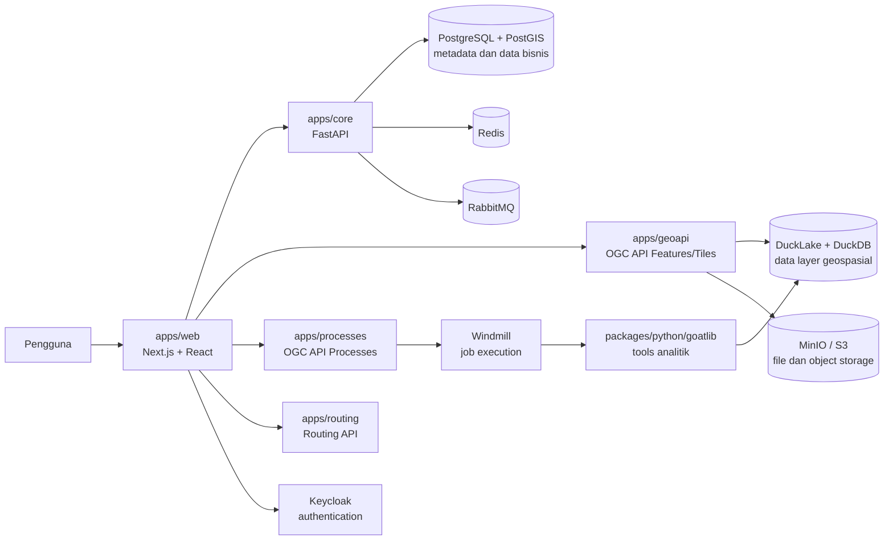

# Ringkasan Project dan Arsitektur GOAT

## 1. Gambaran Umum

GOAT adalah platform WebGIS open source untuk integrated planning. Platform ini menggabungkan pemetaan berbasis web, pengelolaan data geospasial, tools GIS, workflow analitik, dan analisis aksesibilitas untuk membantu perencanaan berbasis data.

GOAT dikembangkan sebagai monorepo. Kode frontend, layanan backend, library bersama, konfigurasi infrastruktur, dokumentasi, dan pengujian berada dalam satu repository agar dapat dikembangkan dan dirilis secara terkoordinasi.

## 2. Struktur Utama Repository

```text
GOAT
├── apps/
│   ├── web/          # Aplikasi frontend utama
│   ├── core/         # Backend utama dan metadata bisnis
│   ├── geoapi/       # API data geospasial dan OGC API
│   ├── processes/    # API proses analitik dan job management
│   ├── routing/      # Layanan routing dan navigasi
│   ├── docs/         # Website dokumentasi Docusaurus
│   └── storybook/    # Pengembangan dan pengujian komponen UI
├── packages/
│   ├── js/           # Library dan konfigurasi JavaScript/TypeScript
│   ├── python/
│   │   └── goatlib/  # Library analitik dan tools geospasial
│   ├── cpp/          # Komponen routing C++
│   └── rust/         # Komponen routing Rust
├── scripts/          # Script linting, database, dan Windmill
├── dokumentasi/      # Dokumentasi teknis tambahan
└── compose.yaml      # Infrastruktur dan deployment Docker Compose
```

## 3. Arsitektur Tingkat Tinggi



## 4. Komponen Aplikasi

### 4.1 Frontend: `apps/web`

Frontend utama dibangun dengan Next.js, React, dan TypeScript. Tanggung jawab utamanya meliputi:

- Menyediakan antarmuka peta dan workflow perencanaan.
- Mengelola state aplikasi menggunakan Redux Toolkit.
- Mengambil data dari API menggunakan SWR dan custom fetcher.
- Menampilkan peta menggunakan MapLibre GL JS melalui `react-map-gl`.
- Menyediakan workflow editor berbasis React Flow.
- Memvalidasi input dengan Zod.
- Menyediakan localization bahasa Inggris dan Jerman melalui i18next.
- Menggunakan MUI, Emotion, dan tss-react untuk UI dan styling.

Client API diorganisasi berdasarkan domain, seperti project, layer, dataset, tools, processes, dan workflow.

### 4.2 Core API: `apps/core`

`core` adalah backend utama untuk kebutuhan bisnis dan metadata. Service ini dibangun dengan FastAPI, Pydantic, SQLAlchemy/SQLModel, dan PostgreSQL/PostGIS.

Tanggung jawabnya meliputi:

- User, organisasi, team, dan role.
- Project, folder, dan scenario.
- Metadata layer dan informasi bisnis lainnya.
- Authentication dan authorization pada sisi API.
- Database migration menggunakan Alembic.
- Pekerjaan background menggunakan Celery, Redis, dan RabbitMQ.

`core` tidak menangani upload dan pemrosesan utama file layer. Data layer geospasial ditangani oleh `geoapi`.

### 4.3 GeoAPI: `apps/geoapi`

`geoapi` menyediakan akses terhadap data geospasial melalui standar OGC API Features dan OGC API Tiles. Service ini menangani:

- Upload dan import layer.
- Penyimpanan serta pengelolaan data geospasial di DuckLake.
- Query feature dan tile untuk kebutuhan frontend.
- Interaksi dengan DuckDB untuk query data.
- Interaksi dengan object storage seperti MinIO atau S3.

Service ini dioptimalkan untuk request geospasial yang sering dan cepat, sehingga pekerjaan analitik yang lama tidak dijalankan di proses yang sama.

### 4.4 Processes API: `apps/processes`

`processes` menyediakan antarmuka OGC API Processes dan menjadi penghubung antara frontend, job execution, dan tools analitik. Tanggung jawabnya meliputi:

- Menyediakan daftar dan deskripsi process.
- Menerima permintaan analitik.
- Menjalankan analisis sinkron jika sesuai.
- Membuat dan memantau asynchronous job melalui Windmill.
- Mengelola status job dan hasil proses.

Pemisahan `processes` dari `geoapi` mencegah analitik yang membutuhkan waktu lama menghambat request feature dan tile.

### 4.5 Routing API: `apps/routing`

`routing` menyediakan kemampuan routing dan navigasi. API ini merupakan service terpisah dan dapat menggunakan komponen routing pada `packages/cpp/routing` atau `packages/rust/fast-routing` sesuai kebutuhan implementasi.

### 4.6 GOAT Library: `packages/python/goatlib`

`goatlib` adalah library Python bersama yang menjadi pusat logika analitik dan pemrosesan geospasial. Isinya mencakup:

- Tools analitik pada `goatlib/tools/`.
- Algoritma analisis pada `goatlib/analysis/`.
- Utilitas input/output pada `goatlib/io/`.
- Model Pydantic dan model domain pada `goatlib/models/`.
- Service bersama pada `goatlib/services/`.

Tool baru dibuat di library ini, kemudian diregistrasikan pada registry tools dan diekspos melalui Processes API. Eksekusi background dilakukan oleh worker Windmill.

### 4.7 Dokumentasi dan UI Components

- `apps/docs` berisi website dokumentasi berbasis Docusaurus.
- `apps/storybook` digunakan untuk mengembangkan dan menguji komponen UI.
- `packages/js/ui` berisi komponen UI bersama.
- `packages/js/types` berisi tipe TypeScript bersama.
- Package lain di `packages/js` menyediakan konfigurasi ESLint, Prettier, TypeScript, dan Keycloak theme.

## 5. Pemisahan Data

GOAT menggunakan pemisahan yang jelas antara metadata dan data layer:

| Jenis data | Storage | Service utama |
| --- | --- | --- |
| User, organisasi, project, scenario, dan metadata layer | PostgreSQL/PostGIS | `apps/core` |
| Feature dan data layer geospasial | DuckLake dengan DuckDB | `apps/geoapi` |
| File dan object pendukung | MinIO atau S3 | `apps/geoapi` |
| Status dan antrean pekerjaan | Redis, RabbitMQ, serta Windmill | `apps/core` dan `apps/processes` |

Pemisahan ini memungkinkan metadata bisnis dan data geospasial memiliki pola akses serta skalabilitas yang berbeda.

## 6. Alur Request Utama

### 6.1 Menampilkan peta

1. Pengguna membuka aplikasi melalui `apps/web`.
2. Frontend meminta metadata project dan layer ke `apps/core`.
3. Frontend meminta feature atau tile geospasial ke `apps/geoapi`.
4. `geoapi` membaca data dari DuckLake/DuckDB dan mengembalikan response OGC.
5. Frontend merender data tersebut pada MapLibre.

### 6.2 Menjalankan analitik

1. Pengguna memilih tool dan parameter di frontend.
2. Frontend mengirim permintaan process ke `apps/processes`.
3. `processes` membuat job sinkron atau asynchronous sesuai jenis proses.
4. Windmill menjalankan tool dari `packages/python/goatlib`.
5. Tool membaca input dari DuckLake atau object storage, lalu menjalankan analisis.
6. Hasil analisis disimpan atau dipublikasikan sebagai layer output.
7. Frontend memantau status job dan memuat hasilnya melalui API yang sesuai.

## 7. Authentication dan Konfigurasi

Keycloak digunakan untuk authentication pada deployment dengan authentication aktif. JWT divalidasi oleh service backend menggunakan library terkait. Untuk development lokal, authentication dapat dinonaktifkan dengan `AUTH=False`; konfigurasi ini juga menyediakan default user dan organisasi sesuai environment.

Konfigurasi service dikelola melalui environment variable. Beberapa kelompok konfigurasi penting adalah:

- PostgreSQL: `POSTGRES_*`.
- Object storage: `S3_*`.
- URL frontend dan API: `NEXT_PUBLIC_*`.
- Authentication: `AUTH`, `KEYCLOAK_*`, dan `REALM_NAME`.
- Windmill: `WINDMILL_URL` dan `WINDMILL_TOKEN`.
- Data directory: `DATA_DIR`.

## 8. Deployment dan Infrastruktur

`compose.yaml` menyediakan beberapa profile Docker Compose:

| Profile | Isi |
| --- | --- |
| Tanpa profile | Infrastruktur dasar: PostgreSQL, MinIO, Redis, RabbitMQ, dan Windmill |
| `dev` | Infrastruktur dasar ditambah devcontainer dan mount source code |
| `prod` | Infrastruktur dasar ditambah seluruh service GOAT dan worker |

Service utama pada deployment production adalah:

- Web UI.
- Core API.
- GeoAPI.
- Processes API.
- Routing service bila diperlukan.
- Windmill server dan worker.
- PostgreSQL/PostGIS.
- MinIO.
- Redis dan RabbitMQ.

Port development yang umum digunakan:

| Service | Port |
| --- | ---: |
| Web | 3000 |
| Core API | 8000 |
| GeoAPI | 8100 |
| Routing API | 8200 |
| Processes API | 8300 |

## 9. Pengembangan Lokal

Tool utama yang digunakan:

- `pnpm` dan Turborepo untuk JavaScript/TypeScript.
- `uv` untuk Python workspace.
- Docker Compose untuk infrastructure.
- Vitest dan Playwright untuk pengujian frontend.
- Pytest untuk pengujian backend.
- Ruff dan mypy untuk linting serta type checking Python.
- ESLint dan Prettier untuk frontend.

Contoh perintah:

```bash
# Sinkronisasi dependency Python
uv sync --all-packages

# Menjalankan frontend
pnpm web

# Menjalankan service backend dari folder service terkait
uv run uvicorn core.main:app --reload --port 8000
uv run uvicorn geoapi.main:app --reload --port 8100
uv run uvicorn processes.main:app --reload --port 8300

# Menjalankan infrastructure
docker compose up -d
```

Sebelum melakukan perubahan besar, jalankan test dan lint pada area yang terdampak. Script repository yang tersedia adalah `sh scripts/lint-web.sh` dan `sh scripts/lint-python.sh`.

## 10. Prinsip Arsitektur

1. **Pemisahan tanggung jawab**: metadata bisnis, data geospasial, routing, dan analitik dikelola oleh service berbeda.
2. **API berbasis standar**: data geospasial dan proses analitik diekspos melalui standar OGC.
3. **Analitik asynchronous**: pekerjaan berat dijalankan melalui Windmill agar API interaktif tetap responsif.
4. **Library bersama**: logika analitik ditempatkan di `goatlib` agar dapat digunakan oleh berbagai service dan worker.
5. **Kontrak terstruktur**: Pydantic, SQLModel, Zod, dan tipe TypeScript menjaga validasi data antar komponen.
6. **Skalabilitas independen**: setiap service dapat dikembangkan, diuji, dan diskalakan sesuai karakteristik bebannya.

## 11. Kesimpulan

GOAT adalah platform WebGIS modular dengan frontend Next.js, beberapa service FastAPI, storage yang dipisahkan berdasarkan jenis data, serta execution layer berbasis Windmill untuk analitik. Arsitektur ini mendukung kebutuhan peta interaktif berlatensi rendah sekaligus analisis geospasial yang kompleks dan berjalan lama.
