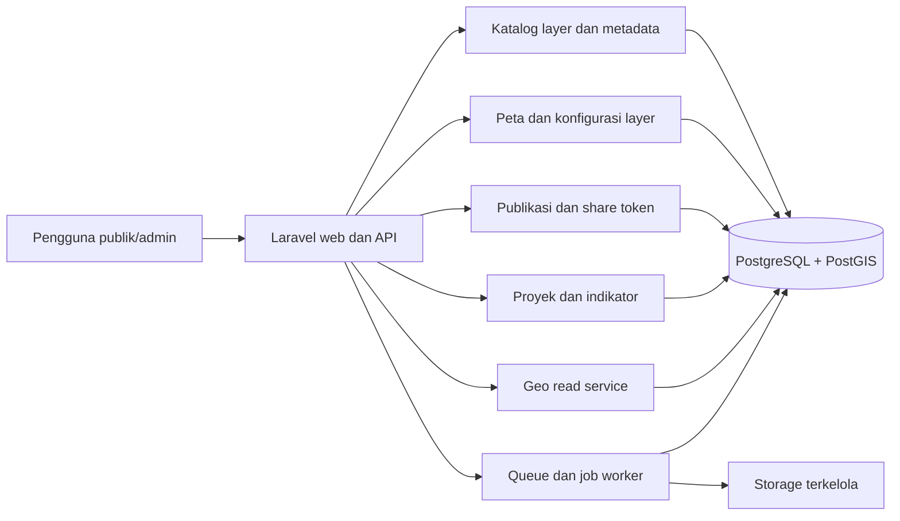
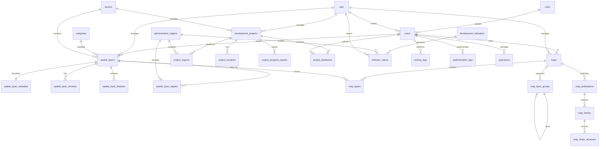
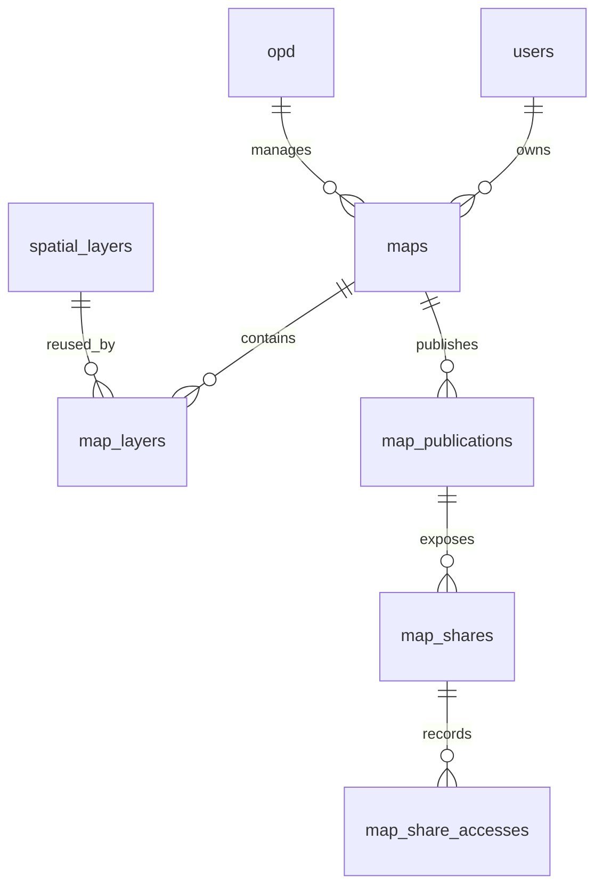

# Analisis MARIMOI V2 berdasarkan Praktik GOAT

## 1. Tujuan dan Batasan Analisis

Dokumen ini menganalisis struktur MARIMOI V2 berdasarkan temuan pada `01-current-schema.md`, `02-analysis.md`, `03-database-planning.md`, kebutuhan fitur pada `../overview.md`, dan hasil review aplikasi yang menjadi referensi analisis. Referensi GOAT digunakan sebagai sumber pola arsitektur dan pemodelan data, bukan sebagai instruksi untuk menyalin seluruh stack atau memecah MARIMOI menjadi banyak service sejak awal.

Fokus rekomendasi:

- metadata dan katalog layer peta;
- project/peta yang dapat memuat banyak layer;
- sharing peta dengan URL dan QR code;
- data pembangunan, monitoring, dan dashboard;
- pemisahan request interaktif dari proses impor/analitik yang berat;
- ownership, authorization, audit, dan integritas data.

## 2. Ringkasan Eksekutif

GOAT membedakan dengan tegas antara **metadata bisnis**, **konfigurasi project**, **data feature geospasial**, **file/object storage**, dan **proses analitik**. MARIMOI saat ini masih memusatkan banyak tanggung jawab pada `data_spatial`: identitas layer, tipe layanan, kategori, deskripsi, atribut DBF, tahun, geometri, dan penghitung akses bercampur dalam satu tabel. Konfigurasi peta juga belum menjadi entitas tersendiri, sedangkan `project_feedbacks` masih menggunakan nama proyek dan wilayah sebagai teks bebas.

Perbaikan arsitektur yang disarankan adalah **modular monolith Laravel dengan batas domain yang jelas**:

1. `Catalog`: layer, metadata, sumber, versi, keyword, wilayah, dan status publikasi.
2. `Mapping`: map/project, layer yang dipakai, urutan, style, filter, extent, dan basemap.
3. `Sharing`: token URL, expiry, revoke, QR, dan audit akses.
4. `Development`: proyek pembangunan, lokasi, wilayah, progres, keuangan, indikator, dan histori laporan.
5. `Ingestion`: upload, import, validasi geometri, pemetaan atribut, dan status job.
6. `Analytics`: query agregasi dan proses geospasial yang dapat dipindahkan ke queue atau worker ketika beban meningkat.

Laravel tetap dapat menjadi satu aplikasi dan satu API pada tahap awal. Pola GOAT yang paling penting untuk diadopsi sekarang adalah batas tanggung jawab dan model datanya. Pemisahan `geoapi`, `processes`, DuckLake, dan Windmill hanya dilakukan ketika ukuran data, latensi, atau durasi proses sudah membenarkannya.

Dokumen ini menggunakan istilah berikut secara konsisten:

- **map** adalah konfigurasi/komposisi peta yang dapat dibuka atau dibagikan;
- **layer** adalah dataset bertema beserta metadata, sumber, owner, dan versinya;
- **map layer** adalah relasi layer pada map yang menyimpan urutan, visibility, style, filter, dan zoom;
- **feature** adalah satu objek/record dalam layer;
- **geometry** adalah bentuk spasial feature, seperti Point, LineString, atau Polygon.

## 3. Perbandingan Pola GOAT dan MARIMOI

| Praktik GOAT | Kondisi MARIMOI | Adaptasi yang disarankan |
| --- | --- | --- |
| `project` menjadi container peta, layer, workflow, dan publikasi | Belum ada entitas peta; lima menu lama tercermin pada tipe data | Tambahkan `maps` sebagai container peta dan `map_layers` sebagai konteks layer di dalam peta |
| `layer` menyimpan metadata dan referensi dataset | `data_spatial` menyimpan geometry dan atribut DBF per record sehingga maknanya berpotensi feature, bukan layer | Tetapkan cardinality lebih dahulu; gunakan katalog `spatial_layers` dan pertahankan `data_spatial` sebagai compatibility/feature store |
| `layer_project` menyimpan order, properties, query, charts | Belum ada pivot konfigurasi per peta | Simpan visibility, opacity, style, filter, chart, zoom, dan layer order pada `map_layers` |
| Ownership dan sharing memakai user, team, organization, dan role | Akses layer terutama berdasarkan `user_id` dan role global | Mulai dengan owner user/OPD dan policy; tambah resource grants/team bila kebutuhan kolaborasi muncul |
| Project publik memiliki publikasi/snapshot terpisah | Belum ada status publikasi dan snapshot map | Tambahkan `map_publications` atau gunakan revision/snapshot untuk membedakan draft dari versi publik |
| Metadata bisnis di PostgreSQL, feature besar di DuckLake/DuckDB | Metadata dan feature masih berada di PostgreSQL/PostGIS | Tahap awal tetap PostGIS; siapkan adapter data store agar pemindahan feature di masa depan tidak mengubah kontrak layer |
| OGC API Features/Tiles untuk akses geospasial | Endpoint custom mengubah geometry menjadi GeoJSON dan mencari JSON mentah | Standarkan response GeoJSON/tiles secara bertahap; pisahkan query feature dari endpoint admin dan CRUD |
| Analitik berat melalui Processes API dan worker | Import/analisis berpotensi berjalan dalam request web | Gunakan job Laravel untuk import dan agregasi; pindahkan ke service khusus bila durasi dan volume meningkat |
| JSONB digunakan untuk konfigurasi fleksibel | `dbf_attributes` menjadi tempat utama pencarian dan analitik | Pertahankan JSONB untuk raw/config, tetapi petakan atribut bisnis yang penting ke kolom atau tabel terstruktur |

## 4. Target Arsitektur MARIMOI

### 4.1. Arsitektur logis



Pada tahap awal, semua modul berada dalam aplikasi Laravel. Batas modul harus tercermin pada model, service/action, policy, request, resource, dan route masing-masing. Hindari controller yang sekaligus memvalidasi upload, membaca shapefile, mengubah geometri, dan membentuk response publik seperti pola saat ini pada `DataSpatialController`.

### 4.2. Batas tanggung jawab

- **Web/API**: autentikasi, authorization, validasi, pagination, resource response, dan orchestration.
- **Catalog**: identitas layer serta metadata yang dapat ditelusuri.
- **Geo read**: query bounding box, feature, geometry simplification, dan GeoJSON/tiles.
- **Ingestion**: membaca file, memvalidasi SRID/geometri, menyimpan hasil, dan mencatat error per batch.
- **Development**: sumber angka dashboard dan histori progres pembangunan.
- **Sharing**: hanya menerbitkan map yang lolos pemeriksaan visibility dan status layer.
- **Queue/worker**: proses yang tidak layak menahan HTTP request, seperti import besar, hitung extent, validasi geometri, dan snapshot dashboard.

### 4.3. Bentuk implementasi Laravel

Belum perlu membuat microservice. Gunakan struktur domain yang konsisten, misalnya:

```text
app/
	Actions/Catalog/
	Actions/Mapping/
	Actions/Sharing/
	Actions/Development/
	Jobs/
	Models/
	Policies/
	Http/Requests/
	Http/Resources/
	Services/Geo/
```

Action/service menangani use case, model menangani relasi dan scope, policy menangani akses, dan controller tetap tipis. Kontrak response publik dipisahkan dari model database menggunakan API Resource. Ketika modul telah stabil, folder dapat dinaikkan menjadi domain module tanpa mengubah skema publik.

### 4.4. Aturan bisnis V2 yang memengaruhi arsitektur

- Admin Sistem membuat dan memberikan role Admin Bappeda serta Admin OPD Teknis.
- Login Google mandiri selalu menghasilkan role `publik`; role tersebut tidak boleh mengakses dashboard administrasi.
- Dashboard administrasi dibatasi dengan kombinasi role dan scope OPD, bukan role global saja.
- Lima menu peta lama digabung menjadi satu menu yang mengelompokkan layer `thematic` dan `development`.
- User publik yang telah login dapat mengirim aspirasi, kritik/saran, tanggapan proyek, dan membuat share peta sesuai policy.
- Share peta hanya read-only dan merepresentasikan publication/map state yang dipilih, bukan akses edit ke layer.
- Login, perubahan role, publication, import, dan aktivitas CRUD dicatat pada audit yang sesuai.

## 5. Target Model Database

### 5.0. ERD target MARIMOI V2

ERD berikut menunjukkan relasi utama yang direkomendasikan. Tabel yang berakhiran `_metadata`, `_versions`, `_reports`, `_values`, `_accesses`, atau `_histories` menyimpan detail/histori, bukan master referensi. `data_spatial` ditampilkan sebagai legacy feature store dan akan digantikan oleh `spatial_layer_features` bila hasil verifikasi cardinality mendukung.



Catatan ERD:

- `spatial_layers` adalah katalog layer; `spatial_layer_features` adalah objek/feature di dalamnya.
- `maps` adalah padanan konsep GOAT `project`, bukan satu feature dan bukan metadata layer.
- `map_layers` adalah tabel konteks penggunaan layer pada map, setara dengan `layer_project` GOAT.
- `map_publications` adalah versi yang diterbitkan; `map_shares` adalah akses berbasis token terhadap publication.
- `development_projects` adalah master/identitas proyek pembangunan; `project_progress_reports` adalah histori transaksionalnya.
- `data_spatial` legacy tidak perlu memiliki relasi langsung ke `maps` setelah `spatial_layers` menjadi sumber katalog resmi.

### 5.1. Pemisahan master data dan transaksional data

Pemisahan ini digunakan untuk menentukan ownership, aturan perubahan, index, audit, dan kebijakan penghapusan. Klasifikasi bersifat berdasarkan fungsi: satu domain dapat memiliki tabel master sekaligus tabel transaksi.

#### Master dan reference data

Master/reference data menjadi sumber pilihan dan identitas yang digunakan oleh banyak transaksi. Data ini harus memiliki kode stabil, constraint unique, status aktif, dan perubahan yang terkendali.

| Kelompok | Tabel | Karakteristik |
| --- | --- | --- |
| Identity dan akses | `roles`, `opd`, `users` | identitas user, role, dan organisasi; perubahan role/OPD perlu histori terpisah |
| Klasifikasi | `categories`, `sectors` | daftar kategori/urusan yang dipakai layer, proyek, dan dashboard |
| Wilayah | `administrative_regions` | kode wilayah resmi, level, parent, dan geometry referensi |
| Katalog layer | `spatial_layers`, `spatial_layer_metadata`, `spatial_layer_sources` | identitas, metadata, sumber, owner, visibility, dan status katalog |
| Storage dan konfigurasi referensi | `data_stores`, basemap catalog bila diperlukan | cara akses dataset dan pilihan basemap yang dapat digunakan |
| Definisi indikator | `development_indicators` | definisi metric, satuan, arah capaian, sumber, dan frekuensi |
| Identitas proyek | `development_projects` | kode/nama proyek, OPD, sektor, tahun anggaran, status, dan sumber dana |

Aturan master:

- gunakan `code` atau `slug` yang unique dan stabil;
- hindari hard delete jika sudah direferensikan transaksi; gunakan `is_active` atau `deleted_at`;
- perubahan nama, owner, status, atau definisi penting dicatat pada audit/history;
- foreign key transaksi mengarah ke master, bukan menyimpan nama bebas sebagai sumber utama;
- data master boleh memiliki JSONB untuk konfigurasi tambahan, tetapi identitas dan field filter tetap kolom terstruktur.

#### Transactional, association, dan historical data

Data transaksional mencatat aktivitas, penggunaan, perubahan status, snapshot, atau hasil pengukuran pada waktu tertentu. Data ini bertambah dari waktu ke waktu dan umumnya tidak boleh ditimpa tanpa menyisakan histori.

| Kelompok | Tabel | Karakteristik |
| --- | --- | --- |
| Feature layer | `spatial_layer_features` atau legacy `data_spatial` | objek spasial dan atributnya; terkait ke layer serta versi sumber |
| Map composition | `map_layers`, `map_layer_groups` | relasi map-layer, urutan, visibility, style, filter, dan zoom |
| Version dan publication | `spatial_layer_versions`, `map_publications` | snapshot, checksum, revision, source, dan waktu publikasi |
| Sharing | `map_shares`, `map_share_accesses` | token, expiry, revoke, counter, serta histori akses |
| Pembangunan | `project_regions`, `project_locations`, `project_progress_reports`, `indicator_values` | lokasi, laporan berkala, target/realisasi, dan nilai indikator |
| Partisipasi publik | `aspirations`, `project_feedbacks`, `submission_status_histories` | pengajuan, tanggapan, status, actor, dan timeline |
| Audit dan keamanan | `authentication_logs`, `activity_logs` | kejadian login dan perubahan resource yang dapat ditelusuri |

Aturan transaksional:

- gunakan primary key dan timestamp untuk identifikasi kejadian;
- simpan actor, sumber, periode, dan status jika data memengaruhi dashboard atau keputusan;
- jangan menghapus laporan, status history, publication, atau audit hanya karena master berubah;
- gunakan foreign key `set null` untuk owner/actor historis bila user dapat dinonaktifkan;
- gunakan `cascade` hanya untuk detail yang tidak bermakna tanpa parent, seperti pivot `map_layers` saat map dihapus;
- pisahkan current state dari history: status saat ini boleh berada di tabel utama, seluruh transisi berada di history.

#### Contoh alur data

```text
Master:
OPD -> Sector -> Development Project -> Administrative Region

Katalog:
Spatial Layer -> Layer Metadata -> Layer Version -> Layer Feature

Transaksi peta:
User -> Map -> Map Layer -> Published Map -> Share Access

Transaksi monitoring:
Development Project -> Progress Report -> Dashboard Metric
```

`categories`, `sectors`, dan `administrative_regions` tidak boleh disalin sebagai teks ke setiap transaksi jika relasi resmi tersedia. Sebaliknya, `style_config`, `filter_config`, dan `config_snapshot` memang bersifat transaksional/kontekstual karena dapat berbeda untuk setiap map atau publication.

### 5.2. Entitas layer dan metadata

`data_spatial` saat ini tidak boleh langsung diasumsikan sebagai layer. Karena setiap record memiliki `geom` dan `dbf_attributes`, ada dua kemungkinan model: satu record adalah feature, atau satu record adalah dataset kecil yang kebetulan memiliki satu geometry. Cardinality harus diverifikasi pada Fase 0.

Target yang direkomendasikan mengikuti model GOAT: `spatial_layers` menyimpan identitas/katalog, sedangkan `spatial_layer_features` menyimpan feature. `data_spatial` dipertahankan sebagai legacy feature store selama compatibility period. Perubahan minimum yang disarankan:

| Tabel | Peran | Kolom penting |
| --- | --- | --- |
| `spatial_layers` | Identitas layer dan referensi data | `id`, `uuid` non-null unique, `slug`, `name`, `layer_class`, `owner_user_id`, `owner_opd_id`, `storage_type`, `is_active`, `visibility`, `published_at`, `deleted_at` |
| `spatial_layer_metadata` | Metadata katalog satu per layer | `spatial_layer_id`, `title`, `abstract`, `description`, `source_name`, `source_url`, `license`, `attribution`, kontak, `data_reference_year`, `update_frequency`, `last_verified_at`, `geometry_type`, `srid`, `extent`, `quality_notes`, `limitations` |
| `spatial_layer_versions` | Riwayat impor dan perubahan dataset | `spatial_layer_id`, `version_number`, `label`, `source_file`, `source_format`, `file_size`, `checksum`, `feature_count`, `imported_by`, `imported_at`, `change_notes`, `is_current` |
| `spatial_layer_sources` | Banyak sumber untuk satu layer | `spatial_layer_id`, `name`, `url`, `organization`, `published_at`, `retrieved_at`, `citation` |
| `spatial_keywords` dan pivot | Pencarian katalog | `keyword`, `spatial_layer_id`, unique gabungan |
| `administrative_regions` | Master wilayah resmi | `code`, `name`, `level`, `parent_id`, `geom`, timestamps |
| `spatial_layer_regions` | Cakupan wilayah layer | `spatial_layer_id`, `region_id`, unique gabungan |

`data_spatial.dbf_attributes` dipertahankan sebagai raw import JSONB untuk compatibility dan inspeksi. Jika target `spatial_layer_features` dibuat, gunakan `attributes` JSONB pada feature dan `source_version_id` untuk lineage. Field yang dipakai dashboard, pencarian utama, atau filter berulang tidak boleh hanya ada di JSONB. Contohnya tahun anggaran, OPD penanggung jawab, status proyek, sektor, dan kode wilayah harus memiliki relasi/kolom terstruktur.

#### `spatial_layer_features`

Jika geometry dan atribut memang tersimpan satu baris per objek, gunakan tabel ini sebagai target pengganti bertahap `data_spatial`. Kolom umum: `id`, `spatial_layer_id`, `external_id`, `geometry`, `attributes` JSONB, `source_version_id`, `created_at`, dan `updated_at`. Jika satu record lama ternyata mewakili dataset utuh, pertahankan tabel tersebut sebagai storage layer dan jangan membuat tabel feature tanpa verifikasi cardinality.

Metadata minimum sebelum layer berstatus `public`:

- judul dan deskripsi;
- sumber dan instansi pengelola;
- tanggal data dan tanggal pembaruan/validasi;
- tipe geometri dan SRID;
- status aktif serta visibility;
- batasan kualitas atau catatan penggunaan.

### 5.3. Peta, layer aktif, dan snapshot

GOAT menunjukkan bahwa layer dapat dipakai ulang dalam banyak project, sedangkan konfigurasi penggunaannya berbeda pada setiap project. Terapkan pola berikut:



#### `maps`

Kolom minimum: `uuid`, `slug`, `title`, `description`, `owner_id`, `owner_opd_id`, `visibility` (`private`, `unlisted`, `public`), `is_active`, `basemap_config`, `center_point`, `zoom`, `bbox`, `published_at`, `deleted_at`, timestamps.

#### `map_layers`

Kolom minimum: `map_id`, `spatial_layer_id`, `layer_order`, `is_visible`, `opacity`, `style_config` JSONB, `filter_config` JSONB, `chart_config` JSONB, `min_zoom`, `max_zoom`, `layer_name`, timestamps.

Constraint dan index:

- unique `(map_id, spatial_layer_id)`;
- index `(map_id, layer_order)`;
- foreign key ke `maps` dan `spatial_layers` dengan kebijakan delete yang eksplisit;
- check `opacity >= 0 AND opacity <= 1`;
- validasi schema JSON pada application layer;
- `style_config` dan `filter_config` tidak menyimpan salinan metadata layer.

#### Publikasi dan snapshot

Pisahkan draft dari tampilan publik. `map_publications` dapat menyimpan `map_id`, `revision`, `config_snapshot` JSONB, `published_by`, `published_at`, `unpublished_at`, dan `is_current`. Ini mencegah perubahan draft langsung mengubah peta yang sedang dibagikan dan mengikuti pola `project_public` GOAT.

Jika keputusan bisnisnya adalah publik selalu membaca data terbaru, snapshot cukup menyimpan konfigurasi map dan version layer yang dipilih. Jika diperlukan reproduksi historis, simpan `spatial_layer_version_id` pada `map_layers` atau publication snapshot.

### 5.4. URL share dan QR code

Gunakan `map_shares` untuk token publik, bukan menambah URL atau token ke `data_spatial` atau `spatial_layers`.

Kolom minimum:

- `map_publication_id`;
- `token_hash` unique dan token plaintext hanya ditampilkan saat dibuat;
- `expires_at`, `revoked_at`, `is_active`;
- `created_by`, `access_count`, `last_accessed_at`;
- opsional `qr_path` bila QR perlu dicetak dan dicache;
- timestamps.

Token dibuat dengan generator kriptografis dan URL memakai route bernama, misalnya `/maps/share/{token}`. QR code dibuat dari URL yang sama; QR tidak menyimpan konfigurasi sendiri. Pada setiap request server wajib memeriksa token, expiry, revoke, status publikasi, visibility map, dan status layer yang dirujuk. Untuk audit lebih rinci, gunakan `map_share_accesses` dengan `accessed_at`, `ip_hash`, `user_agent`, `referer`, dan `response_status`; jangan menyimpan IP mentah tanpa kebutuhan dan retensi yang jelas.

### 5.5. Proyek pembangunan dan dashboard

Review aplikasi meminta dashboard fisik, keuangan, progres, indikator, tren, serta filter wilayah/OPD/sektor/tahun. Model GOAT berupa project container tidak cukup untuk data kinerja, sehingga MARIMOI memerlukan domain pembangunan tersendiri:

| Tabel | Peran |
| --- | --- |
| `sectors` | Master sektor/urusan dengan `code` unique dan status aktif |
| `development_projects` | Identitas proyek, kode, OPD, sektor, tahun anggaran, status, pagu, sumber dana, target, dan deskripsi |
| `project_regions` | Relasi proyek ke wilayah resmi |
| `project_locations` | Geometry proyek, tipe geometry, SRID, dan catatan |
| `project_progress_reports` | Histori periode, target/realisasi fisik, target/realisasi keuangan, status, sumber, pelapor, dan catatan |
| `development_indicators` | Definisi indikator, satuan, arah capaian, sumber, frekuensi, owner OPD/sektor |
| `indicator_values` | Nilai indikator per wilayah, sektor, OPD, periode, target, nilai, dan sumber |
| `project_feedbacks` | Aspirasi/feedback masyarakat yang terhubung ke project atau lokasi terverifikasi |

`project_feedbacks` sebaiknya tidak langsung diperlakukan sebagai tabel proyek. Pertahankan `nama_proyek` sebagai data historis, lalu tambahkan `development_project_id` nullable. Migrasikan ke relasi baru hanya setelah nama dan wilayah diverifikasi. Tambahkan `region_id`/`administrative_region_id` dan gunakan `project_location_id` atau geometry untuk lokasi; kolom teks lama dapat dideprecate setelah compatibility period.

## 6. Penyimpanan Geospasial dan Data Store

GOAT memisahkan metadata PostgreSQL dari feature besar di DuckLake/DuckDB. Untuk MARIMOI, keputusan pragmatisnya adalah:

### Tahap sekarang: PostgreSQL/PostGIS

- tetap gunakan PostGIS karena aplikasi sudah menggunakannya;
- tetapkan SRID standar, misalnya 4326 untuk API dan transformasi yang jelas untuk analisis;
- gunakan tipe geometry eksplisit, bukan `GEOMETRY` tanpa batasan bila domain sudah diketahui;
- tambahkan GiST index untuk kolom geometry;
- validasi `ST_IsValid`, SRID, empty geometry, dan bounding box saat import;
- hindari mengirim seluruh feature pada endpoint list; gunakan pagination, bbox, simplification, atau tile.

### Tahap skala meningkat: adapter data store

Tambahkan `data_stores` atau `storage_type` pada layer dengan nilai seperti `postgis`, `object_storage`, atau `ducklake`. Kontrak layer hanya menyimpan metadata dan cara mengakses dataset. Importer dan geo read service memilih adapter berdasarkan storage tersebut. Dengan pola ini, perpindahan feature besar ke DuckDB/DuckLake tidak memaksa perubahan pada `maps`, `map_layers`, metadata, atau URL publik.

Object storage menyimpan file sumber dan hasil ekspor; database menyimpan key/path, MIME type, ukuran, checksum, dan pemilik. Jangan menyimpan file sebagai blob di tabel metadata.

## 7. API, Query, dan Kontrak Data

### 7.1. Endpoint yang disarankan

- `GET /api/layers`: katalog terfilter dengan pagination dan metadata ringkas;
- `GET /api/layers/{layer}`: metadata lengkap, current version, extent, dan permission;
- `GET /api/layers/{layer}/features`: feature dengan bbox/filter terstruktur;
- `GET /api/maps/{map}`: konfigurasi map untuk owner atau akses yang sah;
- `GET /maps/share/{token}`: validasi share lalu render publication yang diizinkan;
- `POST /api/maps/{map}/shares`: membuat share token;
- `DELETE /api/map-shares/{share}`: revoke token;
- `GET /api/projects`: filter tahun, OPD, sektor, wilayah, dan status;
- `GET /api/dashboard/summary`: metric resmi dengan parameter filter yang terdokumentasi.

Endpoint lama tetap dipertahankan selama client belum berpindah. Bentuk response baru menggunakan API Resource dan identifier publik yang stabil. Jangan mengekspose kolom internal atau raw attribute secara default.

### 7.2. Index berdasarkan query nyata

Prioritas index:

- `spatial_layers(uuid)`, `spatial_layers(owner_opd_id, is_active, visibility)`, `spatial_layers(layer_class, sector_id, data_reference_year)`;
- `GIST(spatial_layer_features.geometry)` atau `GIST(data_spatial.geom)` selama masa transisi;
- `map_layers(map_id, layer_order)`;
- `spatial_layer_versions(spatial_layer_id, version_number)`;
- `development_projects(owner_opd_id, sector_id, fiscal_year, status)`;
- `project_progress_reports(project_id, period)`;
- `indicator_values(indicator_id, region_id, period)`;
- `GIST(project_locations.geom)`;
- `map_shares(token_hash)` dan `map_share_accesses(map_share_id, accessed_at)`.

Audit index existing sebelum menambah index baru. Migration `data_spatial` saat ini membuat index yang berpotensi berulang pada `dbf_attributes`; index JSONB dipertahankan hanya bila query operatornya terbukti digunakan dan execution plan membutuhkannya.

Untuk dashboard, mulai dari query agregasi langsung dengan filter terindeks. Materialized view atau tabel snapshot baru dipakai jika benchmark pada data realistis menunjukkan query langsung tidak memenuhi target; simpan `calculated_at`, filter snapshot, dan sumber metrik agar angka dapat diaudit.

## 8. Authorization, Publikasi, dan Audit

Praktik sharing GOAT perlu diterjemahkan menjadi authorization yang eksplisit:

- owner user dapat mengubah draft miliknya;
- owner OPD dapat mengelola layer/peta sesuai scope OPD;
- admin memiliki akses berdasarkan policy, bukan pemeriksaan role yang tersebar di controller;
- publik hanya dapat membaca map publication aktif dan layer yang public atau diizinkan oleh publication;
- layer private tidak boleh ikut terbaca hanya karena map memiliki share token;
- token share tidak memberikan akses edit;
- publish, revoke, perubahan owner, import, dan perubahan metadata dicatat dalam audit log.

Gunakan Policy dan Form Request untuk batas akses dan validasi. `owner_opd_id` harus menjadi relasi langsung pada layer/project; jangan menyimpulkan owner hanya dari user pembuat karena user dapat berpindah OPD. Foreign key dibuat eksplisit dan kebijakan `cascade`, `restrict`, atau `set null` dipilih per relasi historis.

## 9. Urutan Implementasi yang Direkomendasikan

### Fase 0: baseline dan keputusan

- backup dan uji restore;
- inventaris pemakai `data_spatial` serta endpoint frontend;
- ukur UUID null/duplikat, geometri invalid, SRID, dan pola `dbf_attributes`;
- tetapkan standar wilayah, sektor, SRID, owner, visibility, dan mode snapshot/public terbaru.

### Fase 1: fondasi katalog

- verifikasi cardinality `data_spatial`, lalu isi dan kunci identifier publik layer/feature yang sesuai menjadi non-null unique;
- tambahkan `owner_opd_id`, `slug`, `visibility`, `is_active`, dan status publikasi;
- buat master `sectors` dan `administrative_regions`;
- buat `spatial_layer_metadata`, `spatial_layer_versions`, dan relasi wilayah;
- masukkan atribut analitis penting ke struktur relasional;
- tambah Policy dan endpoint metadata tanpa memutus API lama.

### Fase 2: map/project

- buat `maps`, `map_layers`, dan bila diperlukan nested `map_layer_groups`;
- migrasikan susunan layer aktif yang sekarang dirakit frontend;
- pindahkan style/filter/order/visibility ke `map_layers`;
- tambahkan publication/snapshot agar draft dan publik tidak tercampur.

### Fase 3: share dan QR

- buat token hash, expiry, revoke, access counter, dan audit access;
- implementasikan route publik yang memeriksa seluruh dependency;
- hasilkan QR dari URL route, tanpa menyalin konfigurasi map ke QR;
- tambahkan rate limit dan retensi audit.

### Fase 4: development dan dashboard

- buat project, sector, region, location, progress report, indicator, dan indicator value;
- hubungkan feedback ke project baru secara bertahap dan pertahankan data legacy;
- definisikan metric resmi dan query agregasi dengan filter OPD/wilayah/sektor/tahun;
- tampilkan sumber, periode, dan waktu pembaruan pada setiap metric.

### Fase 5: ingestion dan optimasi

- pindahkan import besar ke queued job dengan status `pending`, `processing`, `completed`, `failed`;
- simpan error per batch dan checksum untuk idempotensi;
- benchmark feature query, dashboard, dan import;
- siapkan adapter data store sebelum memindahkan feature ke storage lain.

## 10. Risiko Migrasi dan Pengendalian

| Risiko | Pengendalian |
| --- | --- |
| Pemindahan `data_spatial` merusak endpoint lama | additive migration, compatibility accessor/resource, dan dual-read selama transisi |
| Owner layer salah hasil tebakan dari user | isi hanya jika dapat dibuktikan; sisanya `needs_review` |
| Share token membuka layer private | validasi map, publication, layer, dan permission pada setiap request |
| Snapshot publik stale atau tidak dapat direproduksi | simpan revision dan current layer version secara eksplisit |
| JSONB menjadi sumber dashboard yang tidak tervalidasi | definisikan field analitis sebagai kolom/foreign key dan ukur query aktual |
| Import gagal setelah sebagian data tersimpan | gunakan job idempotent, staging/import batch, checksum, dan transaksi sesuai ukuran |
| Perubahan SRID membuat peta bergeser | verifikasi SRID, transformasi, sample GeoJSON, dan bbox di staging |
| Microservice terlalu dini menambah kompleksitas | tetap modular monolith sampai benchmark menunjukkan batas PostgreSQL/queue/API |

## 11. Kriteria Keberhasilan

Implementasi dianggap memenuhi pola GOAT yang relevan apabila:

1. Satu layer dapat digunakan pada banyak peta tanpa menyalin metadata.
2. Setiap peta menyimpan konfigurasi layer sendiri: urutan, visibility, style, filter, opacity, dan zoom.
3. Layer publik memiliki metadata minimum, owner OPD, current version, sumber, SRID, dan waktu pembaruan.
4. Draft, publication, share token, expiry, revoke, QR, dan audit akses dapat dibedakan dengan jelas.
5. Dashboard dapat memfilter dan mengagregasi proyek/indikator berdasarkan tahun, wilayah, OPD, sektor, dan status dari data terstruktur.
6. Import atau analitik berat tidak menahan request interaktif dan memiliki status serta histori kegagalan.
7. API publik tidak membocorkan data private dan tidak mengandalkan ID integer berurutan sebagai identifier publik.
8. Migrasi dapat dijalankan pada database berisi data tanpa menghapus data lama sebelum compatibility period selesai.

## 12. Kesimpulan

Praktik GOAT yang paling bernilai untuk MARIMOI bukan jumlah servicenya, melainkan disiplin pemisahan model: **layer adalah dataset yang memiliki metadata, map adalah container, pivot map-layer adalah konfigurasi penggunaan, publication adalah versi publik, dan proses berat berjalan asynchronous**. Struktur ini langsung menjawab temuan review tentang metadata yang tidak lengkap, dashboard yang belum analitis, filter yang terbatas, serta kebutuhan share peta.

Rekomendasi utama adalah memulai dari katalog layer dan metadata, lalu membangun `maps`/`map_layers`, `map_publications`/`map_shares`, dan domain proyek pembangunan di atas fondasi tersebut. MARIMOI dapat tetap menggunakan Laravel dan PostgreSQL/PostGIS pada tahap awal; pemisahan seperti GOAT GeoAPI, DuckLake, dan Processes API dijadikan target evolusi yang dipicu oleh kebutuhan performa, bukan prasyarat implementasi fitur.
