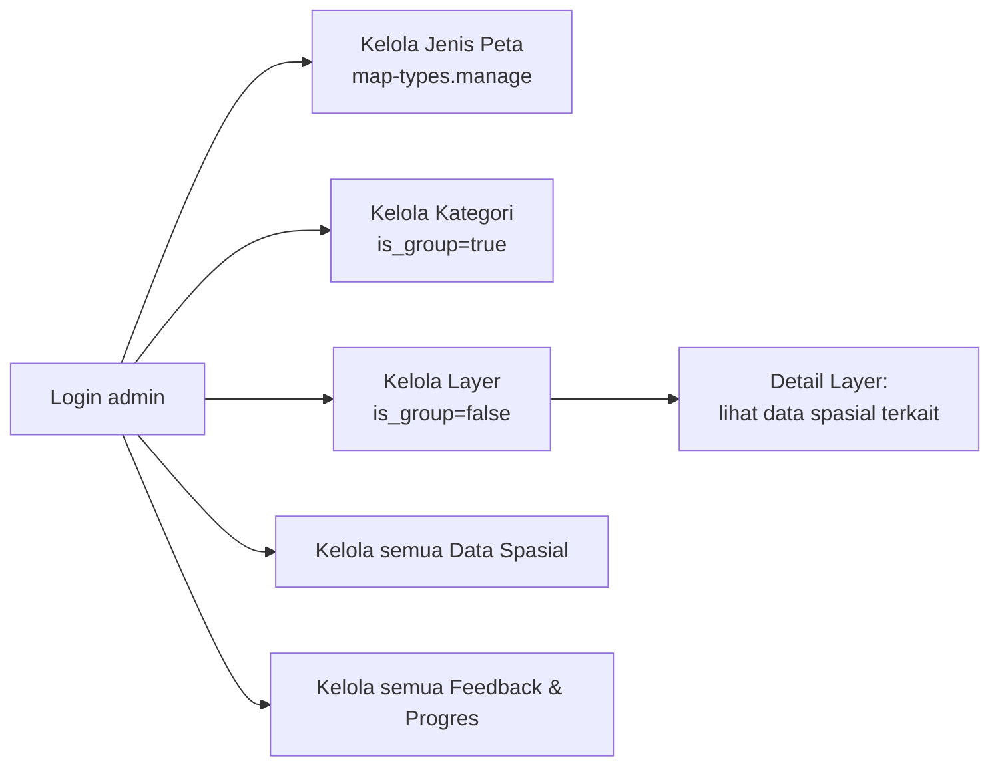

# Kondisi Database Eksisting vs. Target GOAT, dan Use Case Pemetaan per Role

> Ditulis 2026-09-27. Sumber: `mcp__laravel-boost__database-schema` (live schema), `database/migrations/`, `routes/backend.php`, `routes/web.php`, `app/Models/Permission.php`, `database/seeders/PermissionSeeder.php`, `01-current-schema.md`, dan `04-marimoi-x-goat.md`. Dokumen ini tidak mengulang isi `04-marimoi-x-goat.md` (pola target) atau `01-current-schema.md` (deskripsi skema lengkap) — keduanya jadi rujukan, di sini fokus pada **selisih** antara keduanya per 27 Sep 2026, plus use case pemetaan per role yang digrounding ke route/permission yang benar-benar ada.

## 1. Ringkasan Eksekutif

Sejak `04-marimoi-x-goat.md` ditulis, satu batch migrasi (`2026_09_26_223251` s/d `2026_09_26_223252`, lihat `08-kategori-peta-dinamis-dan-metadata-layer.md` di `04_implementation/`) sudah mengimplementasikan sebagian rekomendasinya: `map_types`, `categories.atribut_schema`, `categories.is_group` + hierarki, `sektor` + FK, dan `data_spatial_interventions`. Tahap `administrative_regions`, `analysis_layers`/`analysis_results`, dan job terjadwal analitik **sengaja ditunda** (keputusan eksplisit pemilik produk saat implementasi, bukan terlewat).

Gap terbesar yang **belum** tersentuh sama sekali oleh batch itu, dan merupakan bagian paling inti dari pola GOAT, adalah domain **`maps`/`map_layers`/`map_publications`**: MARIMOI masih memakai `shared_maps` sebagai satu tabel snapshot JSON flat, bukan tiga entitas relasional (map container, pivot map-layer, publication versioning) seperti yang direkomendasikan Bagian 5.3 `04-marimoi-x-goat.md`. Ini konsisten dengan catatan Fase 2 di dokumen itu sendiri — belum dikerjakan, bukan regresi.

| Domain GOAT | Status | Ringkas |
| --- | --- | --- |
| Katalog layer (`spatial_layers`, metadata, sektor) | 🟡 Sebagian | `categories` sudah dapat `is_group`, `map_type_id`, `sektor_id`, `atribut_schema`; belum ada `uuid`/`slug` publik, `owner_opd_id`, atau status `visibility`/`published_at` |
| Metadata per layer vs per feature | 🔴 Belum sesuai pola | `sumber_data`/`opd_pengelola_id`/`tanggal_data` disimpan di `data_spatial` (per baris/feature), bukan di `categories` (per layer) — berpotensi tidak konsisten antar baris dalam satu kategori |
| Versioning import (`spatial_layer_versions`) | 🔴 Belum ada | Tidak ada histori import/perubahan dataset |
| Wilayah administratif (`administrative_regions`) | 🔴 Belum ada (ditunda) | `kabupaten_kota` di `project_feedbacks` masih varchar bebas |
| Sektor | 🟢 Sudah ada | `sektor` + `categories.sektor_id` + `data_spatial.sektor_id`, diimplementasikan 2026-09-26 |
| Map/project container (`maps`, `map_layers`) | 🔴 Belum ada | `shared_maps` adalah snapshot JSON flat tanpa FK, tidak reusable sebagai draft yang bisa diedit ulang |
| Publikasi & share (`map_publications`, `map_shares`) | 🟡 Sebagian | `shared_maps` punya `slug` unik + `expired_at`, tapi tidak ada pemisahan draft/publish, tidak ada `revoked_at`, tidak ada log akses per pembukaan |
| Data pembangunan (`development_projects`, indikator) | 🟡 Sebagian | `project_progress_reports`+revisions sudah matang; tidak ada tabel identitas proyek terpisah (proyek = baris `data_spatial`); `development_indicators`/`indicator_values` belum ada |
| Partisipasi publik (`project_feedbacks`) | 🟢 Sudah ada, field lokasi masih teks | `nama_proyek`/`kabupaten_kota` teks bebas, belum FK ke wilayah/proyek resmi |
| Lineage eksisting↔intervensi | 🟢 Sudah ada | `data_spatial_interventions`, diimplementasikan 2026-09-26 (tidak ada di GOAT asli, tapi memenuhi kebutuhan analitik serupa dari `Rekomendasi_Pengelompokan_Layer_MARIMOI.md`) |
| Analitik terjadwal (`analysis_layers`/`results`) | 🔴 Belum ada (ditunda) | Tidak ada tabel hasil komputasi maupun job penjadwal |
| Authorization (Policy per GOAT §8) | 🟡 Sebagian | Middleware `permission:` granular sudah jalan (lihat Bagian 3); belum pakai Laravel Policy/Form Request formal per resource |
| Audit umum (`activity_logs`) | 🟡 Sebagian | `authentication_logs` ada; `project_progress_report_revisions` ada tapi khusus 1 domain; tidak ada log CRUD generik untuk `categories`/`data_spatial` |

Legenda: 🟢 sudah sesuai pola target · 🟡 sebagian/berbeda pola · 🔴 belum ada.

## 2. Perbandingan Detail per Entitas Target

### 2.1 Katalog layer

`categories` sekarang punya kolom: `id, type, nama, warna, icon, is_marker, deskripsi, parent_id, user_id, is_active, gambar, atribut_schema (jsonb), is_group (bool), map_type_id (FK), sektor_id (FK)`.

Dibanding target `spatial_layers` (§5.2 `04-marimoi-x-goat.md`):

- **Ada:** hierarki (`parent_id` + `is_group` — setara "layer_class"/kelompok), klasifikasi (`map_type_id`, `sektor_id`), metadata skema dinamis (`atribut_schema`), status aktif (`is_active`).
- **Belum ada:** identifier publik stabil non-null unik (`uuid`/`slug` — `categories.id` integer berurutan masih jadi identifier di URL `categories.show`, `categories.edit`); `owner_opd_id` eksplisit (hanya `user_id`, sesuai catatan §8 GOAT bahwa owner sebaiknya OPD, bukan disimpulkan dari user pembuat); status `visibility` (private/unlisted/public) dan `published_at` — saat ini hanya biner `is_active`.
- **Beda pola dari rekomendasi:** metadata katalog (`sumber_data`, `opd_pengelola_id`, `tanggal_data`) ditaruh di `data_spatial` per baris feature, bukan di `categories` per layer. Akibatnya satu kategori (mis. "Jalan") bisa punya ratusan baris data dengan `sumber_data` berbeda-beda tanpa ada satu sumber kebenaran di level layer — ini persis pola anti yang diperingatkan GOAT §7.1 baris "Metadata bisnis di PostgreSQL" dan alasan `spatial_layer_metadata` dipisah dari feature.

### 2.2 Feature store

`data_spatial` tetap menjadi legacy feature store sesuai catatan §5.0 `04-marimoi-x-goat.md` ("`data_spatial` legacy tidak perlu memiliki relasi langsung ke `maps`"). Penambahan `sektor_id` (2026-09-26) konsisten dengan rencana itu. Belum ada `spatial_layer_features` terpisah — cardinality belum diverifikasi ulang (masih diasumsikan 1 baris = 1 feature, sesuai audit di `01-current-schema.md` §3.2).

### 2.3 Map, publikasi, dan share

Ini domain dengan gap terbesar. Skema saat ini:

```
shared_maps: id, slug (UK), layers (json), viewport (json), filters (json),
             data_type, sub_type, year, expired_at
```

Tidak ada FK ke `categories`/`data_spatial` — snapshot JSON murni. Dibanding target:

| Target GOAT | Padanan sekarang | Gap |
| --- | --- | --- |
| `maps` (draft yang bisa dibuka/diedit ulang, punya owner) | Tidak ada — `shared_maps` dibuat sekali saat share, tidak ada "map aktif milik user" yang tersimpan sebelum dibagikan | Tidak ada draft state; state peta hidup di frontend (`public/frontend/js/map.js`) sampai user klik share |
| `map_layers` (pivot map↔layer dgn order/style/filter/opacity) | `shared_maps.layers` JSON — menyimpan snapshot, tapi tidak query-able relasional (tidak bisa `WHERE spatial_layer_id = ?` lintas semua map) | Tidak reusable untuk laporan "layer mana paling sering dipakai di share" tanpa parsing JSON |
| `map_publications` (versi draft vs publik, `is_current`) | Tidak ada pemisahan — `shared_maps` yang dibuat langsung jadi versi final, tidak bisa "unpublish tanpa hapus" | Update pada `categories`/`data_spatial` sumber tidak tercermin di share lama (`shared_maps` snapshot beku), tapi juga tidak ada mekanisme resmi untuk menandainya usang |
| `map_shares` (`token_hash`, `revoked_at`, `access_count`) | `shared_maps.slug` dipakai langsung sebagai bagian URL (bukan token hash terpisah), `expired_at` ada tapi tidak ada `revoked_at` eksplisit | Tidak bisa mencabut share sebelum `expired_at` tanpa hapus baris; `slug` yang predictable (bukan token random panjang) berisiko ditebak jika pola pembuatannya sederhana — perlu verifikasi generator slug |
| `map_share_accesses` (log tiap akses) | Tidak ada | Tidak bisa audit siapa/berapa kali share dibuka |

Ini bukan regresi — `overview.md` §"Ruang Lingkup" poin 4 dan `04-marimoi-x-goat.md` §9 Fase 2–3 memang menempatkan `maps`/`map_layers`/publication/share sebagai pekerjaan terpisah yang belum dimulai, terpisah dari batch kategori-dinamis yang baru selesai.

### 2.4 Data pembangunan

`project_progress_reports` + `project_progress_report_revisions` sudah cukup matang dan sesuai pola GOAT (histori periode, snapshot revisi, FK `RESTRICT` untuk integritas audit — lihat `01-current-schema.md` §3.4). Yang belum sesuai pola:

- Tidak ada `development_projects` sebagai master identitas proyek terpisah — identitas proyek strategis masih menyatu dengan baris `data_spatial` (`data_type = 'proyek_strategis'`). Akibatnya kode/nama/OPD/tahun anggaran proyek tersimpan bersama geometry dan atribut DBF-nya, bukan di entitas master yang bisa dirujuk banyak baporan tanpa duplikasi.
- Tidak ada `development_indicators`/`indicator_values` — dashboard indikator (jika dibutuhkan di luar realisasi anggaran/fisik) belum punya fondasi tabel.
- `project_feedbacks.nama_proyek` dan `.kabupaten_kota` masih teks bebas (bukan FK ke `development_project_id`/wilayah resmi) — persis seperti yang direkomendasikan §5.5 GOAT untuk dimigrasikan bertahap, belum dikerjakan.

### 2.5 Yang sengaja ditunda (bukan gap tak disadari)

Berdasarkan keputusan implementasi sebelumnya, tiga hal berikut ditunda secara eksplisit dan sebaiknya tidak dianggap "terlewat" saat membaca tabel Bagian 1:

1. `administrative_regions` — menunggu sumber data batas wilayah administratif resmi (BPS/Bappeda).
2. `analysis_layers`/`analysis_results` + job penjadwal — menunggu rumus/metodologi analisis dikunci.
3. Pemisahan `Jenis Peta` (`map_types`) sebagai permission granular (`map-types.manage`) — **ini sudah selesai**, defaultnya hanya `super-admin` (lihat Bagian 3.2), sesuai keputusan "tambahkan sebagai permission, default super admin".

## 3. Use Case / Proses Bisnis Pemetaan per Role

Empat role aktif: `super-admin` (Admin Sistem), `admin-bappeda`, `admin-opd`, `user` (Publik login Google). Permission yang benar-benar melekat per role diambil dari `PermissionSeeder::DEFAULTS` (super-admin mendapat seluruh permission tanpa daftar eksplisit) dan katalog `Permission::CATALOG`.

### 3.1 Ringkasan hak akses efektif (domain pemetaan saja)

| Permission | super-admin | admin-bappeda | admin-opd | user (publik) |
| --- | --- | --- | --- | --- |
| `categories.*` (Layer & Kategori) | ✅ semua | ✅ semua | 👁️ view saja | ❌ |
| `map-types.manage` (Jenis Peta) | ✅ | ❌ | ❌ | ❌ |
| `data-spatial.*` (Data spasial & peta admin) | ✅ semua | ✅ semua | ✅ semua | ❌ |
| `project-feedbacks.*` | ✅ semua | ✅ semua | 👁️ view + 💬 respond (tanpa delete) | ❌ (interaksi lewat rute publik, bukan permission backend) |
| `project-progress.*` | ✅ semua | ✅ semua | 👁️ view + ➕ create + ✏️ edit (tanpa delete permission) | ❌ |

Publik tidak pernah menyentuh middleware `permission:` — semua interaksinya lewat `routes/web.php` yang tidak memakai guard permission (feedback publik, aspirasi, share, lihat peta).

### 3.2 Admin Sistem (`super-admin`)



| UC | Nama | Trigger / Precondition | Alur utama | Postcondition |
| --- | --- | --- | --- | --- |
| UC-01 | Tambah Jenis Peta baru | Admin Sistem login; butuh jenis peta baru di luar `tematik`/`proyek_strategis` dst. | `GET/POST map-types` (`MapTypeController`, permission `map-types.manage`) → isi `slug`, `nama`, `konfigurasi` (jsonb flag perilaku) | Baris baru di `map_types`; langsung tersedia sebagai opsi `map_type_id` saat membuat Layer, tanpa deploy kode |
| UC-02 | Buat Kategori (kelompok) | Perlu pengelompokan baru, mis. "Infrastruktur & Konektivitas" | `POST categories.store` dengan `is_group=1` (permission `categories.create`) | Baris `categories` baru dengan `is_group=true`; tampil di halaman "Kategori", jadi induk (`parent_id`) untuk Layer di bawahnya |
| UC-03 | Buat Layer & kunci skema atribut | Perlu jenis dataset baru, mis. "Jalan" | `POST categories.store` dengan `is_group=0`, pilih `map_type_id`/`sektor_id`, isi `atribut_schema` (field dinamis: `key`, `label`, `type`, `required`) | Layer baru siap dipakai; form input Data Spasial untuk kategori ini merender field sesuai `atribut_schema` |
| UC-04 | Lihat detail Layer | Perlu tahu berapa banyak & data spasial mana saja yang memakai satu Layer | `GET categories.show` (`CategoryController::show`, `withCount('dataSpatial')` + paginated select kolom minimal — sengaja tidak load `geom`) | Halaman detail menampilkan daftar Data Spasial terkait + link ke `data-spatial.create` dengan `kategori_id` terkunci |
| UC-05 | Hapus Layer/Kategori | Layer/Kategori sudah tidak dipakai | `DELETE categories.destroy` (permission `categories.delete`) — diblokir bila `children_count > 0` atau `data_spatial_count > 0` (`withCount`, bukan `with()`, untuk menghindari eager-load `geom`) | Baris terhapus hanya jika tidak ada anak/relasi data; jika masih dipakai, redirect dengan pesan error, data tidak jadi terhapus |
| UC-06 | Kelola seluruh data spasial & feedback lintas OPD | Perlu moderasi/koreksi data OPD manapun | Akses penuh `data-spatial.*`, `project-feedbacks.*`, `project-progress.*` tanpa batasan `opd_id` | Satu-satunya role yang bisa mengubah data milik OPD lain |

### 3.3 Admin Bappeda

Hak akses identik dengan Admin Sistem untuk domain pemetaan (`data-spatial.*`, `categories.*`, `project-feedbacks.*`, `project-progress.*`), **kecuali** `map-types.manage` (tidak ada di `DEFAULTS['admin-bappeda']`) dan tidak mendapat permission manajemen `users.*`/`opd.*` yang bersifat lintas-Bappeda sepenuhnya (permission ini justru diberikan ke admin-bappeda per katalog, lihat `PermissionSeeder`, tapi konteks pemetaan tidak terpengaruh oleh itu).

| UC | Nama | Alur utama | Catatan |
| --- | --- | --- | --- |
| UC-07 | Kelola Layer & Kategori (kecuali Jenis Peta) | Sama seperti UC-02/UC-03/UC-05, tapi tidak bisa menambah `map_types` baru — hanya memilih dari yang sudah disediakan Admin Sistem | Mencerminkan pembagian: Admin Sistem mengunci taksonomi tingkat atas, Bappeda mengisi isinya |
| UC-08 | Tautkan kondisi eksisting ke intervensi | Perlu menautkan mis. "Jalan Rusak X" (eksisting) ke "Proyek Peningkatan Jalan X" (intervensi) | `POST data-spatial/{dataSpatial}/intervensi` (`DataSpatialInterventionController::store`, permission `data-spatial.edit`) — isi `jenis_hubungan` | Baris baru `data_spatial_interventions`; dasar untuk analisis "kebutuhan vs realisasi" di masa depan (§7.2 GOAT-review) |
| UC-09 | Tanggapi & tutup Feedback publik lintas OPD | Warga mengirim tanggapan proyek lewat peta publik | `PUT project-feedbacks/{id}/respond` (permission `project-feedbacks.respond`), lalu `DELETE` bila spam (permission `.delete`, khusus Bappeda/Admin Sistem) | Status feedback berubah (`pending→ditinjau→ditindaklanjuti→selesai`), `responded_at` terisi |
| UC-10 | Input & verifikasi laporan progres proyek strategis | Periode pelaporan (`periode_laporan`) proyek strategis tiba | `POST project-progress` → simpan `pagu`, `realisasi_anggaran`, `progres_fisik_persen`; update berikutnya otomatis membuat snapshot di `project_progress_report_revisions` | Histori perubahan laporan dapat diaudit kapan pun tanpa kehilangan versi sebelumnya |

### 3.4 Admin OPD Teknis

Lingkupnya paling sempit di antara role admin: hanya `categories.view` (tidak bisa membuat/mengubah Layer/Kategori sendiri), `data-spatial.*` penuh (input data miliknya), `project-feedbacks.view`+`.respond` (tanpa hapus), `project-progress.view`+`.create`+`.edit` (tanpa hapus — permission `project-progress.delete` bahkan tidak ada di katalog, jadi tidak ada role manapun yang bisa hapus laporan progres, konsisten dengan sifat auditable-nya).

| UC | Nama | Alur utama | Catatan |
| --- | --- | --- | --- |
| UC-11 | Input Data Spasial ke Layer yang sudah ada | Perlu menambah ruas jalan/fasilitas baru ke kategori "Jalan" yang sudah dibuat Bappeda | `GET/POST data-spatial/create` (opsional `?kategori_id=` terkunci dari halaman detail Layer, lihat UC-04) → isi field sesuai `atribut_schema` kategori, upload shapefile/KMZ jika ada | Baris baru `data_spatial`, otomatis tercatat `user_id` = Admin OPD, `sektor_id` ikut kategori |
| UC-12 | Import massal via shapefile/KMZ | OPD punya dataset GIS existing | `POST data-spatial/debug/shapefile` atau `/debug/kmz` lalu `store` (permission `data-spatial.create`) | Baris-baris `data_spatial` baru dengan `dbf_attributes` terisi dari file; **catatan risiko**: proses ini masih synchronous di request web (lihat §2.4 `01-current-schema.md`, belum job antrian) |
| UC-13 | Update massal kategori/atribut | Reklasifikasi banyak data sekaligus | `POST data-spatial/bulk-update-category` / `bulk-update-attribute` (permission `data-spatial.edit`) | `MapDataVersion` cache di-invalidasi otomatis (lihat `FrontendPagesTest::test_tematik_map_version_changes_after_bulk_query_operations`), publik langsung melihat versi data terbaru |
| UC-14 | Tanggapi Feedback yang menyasar OPD sendiri | Warga memberi tanggapan proyek yang di-assign ke OPD ini (`project_feedbacks.opd_id`) | `PUT project-feedbacks/{id}/respond`, atau reassign lewat `update-opd` bila salah OPD | Tidak bisa menghapus feedback (permission `.delete` tidak diberikan) — hanya Bappeda/Admin Sistem yang bisa |
| UC-15 | Laporkan progres proyek OPD sendiri | Periode laporan proyek yang jadi tanggung jawab OPD ini | Sama seperti UC-10 tapi terbatas ke `data_spatial`/proyek yang relevan dengan OPD-nya (dibatasi di level aplikasi lewat `opd_id`, bukan lewat permission granular per baris) | Tidak ada isolasi data OPD di level Policy/database (`RESTRICT` FK bersifat integritas, bukan otorisasi) — lihat gap di Bagian 2 GOAT §8 tentang Policy formal |

### 3.5 Publik (login Google, role `user`)

Tidak menyentuh backend admin sama sekali (`user` di `PermissionSeeder::DEFAULTS` hanya dapat `dashboard.view`). Semua interaksi lewat `routes/web.php`, tanpa middleware `permission:`.

| UC | Nama | Alur utama | Catatan |
| --- | --- | --- | --- |
| UC-16 | Lihat peta tematik gabungan | Buka halaman publik | `GET /peta-tematik` (`FrontendController::tematik`) — menampilkan data gabungan tematik + legacy (psd/psn/pokir/musrenbang) sejak migrasi `merge_legacy_map_types_into_tematik` | Tidak perlu login untuk sekadar melihat peta |
| UC-17 | Lihat detail satu objek peta | Klik marker/feature di peta | `GET /peta-tematik/{id}` atau rute legacy (`/proyek-strategis-daerah/{id}`, `/pokir-dprd/{id}`, dst., semua diarahkan ke `FrontendController::detailPeta*`) | Menampilkan atribut DBF, metadata (`sumber_data`, OPD pengelola, tanggal data) bila lengkap, atau badge "Metadata belum lengkap" bila tidak |
| UC-18 | Bagikan konfigurasi peta aktif | Publik ingin membagikan tampilan peta (filter+layer aktif) via URL/QR | `POST /peta-tematik/share` (`FrontendController::createSharedMap`) → baris baru `shared_maps` dengan `slug` unik | Siapapun yang membuka `GET /peta-tematik/share/{slug}` melihat snapshot yang sama, sampai `expired_at` |
| UC-19 | Kirim tanggapan/feedback proyek | Warga ingin memberi kritik/saran/apresiasi ke proyek tertentu | `POST /feedback-send` (`FrontendController::store`) — publik, wajib login Google per aturan bisnis `overview.md` | Baris baru `project_feedbacks`, status awal `pending`, menunggu ditanggapi Admin OPD/Bappeda (UC-09/UC-14) |
| UC-20 | Sampaikan & lacak aspirasi/usulan | Warga ingin mengajukan usulan pembangunan di luar konteks satu proyek spesifik | `POST /aspirasi-masyarakat` → dapat `nomor_tiket`; lacak status via `GET/POST /aspirasi-masyarakat/lacak` (rate-limited) | Status `pending→diproses→selesai/ditolak`; jalur ini terpisah dari `project_feedbacks` (aspirasi umum vs tanggapan proyek spesifik) |
| UC-21 | Pantau versi data peta (klien SPA) | Frontend map perlu tahu kapan harus refetch GeoJSON | `GET /geojson/version` (`tematik.version`, publik, di-cache lewat `MapDataVersion`) | Versi berubah setiap ada perubahan data/kategori relevan; klien membandingkan versi lokal vs versi server |

## 4. Implikasi untuk Rencana Selanjutnya

1. Domain **map/publication/share** (Bagian 2.3) adalah gap arsitektural terbesar yang tersisa dan **belum masuk rencana implementasi manapun** yang tercatat — layak jadi kandidat dokumen `04_implementation` berikutnya, mengikuti pola additive yang sama seperti batch `map_types`/`sektor` (migrasi non-destruktif, `shared_maps` dipertahankan selama transisi).
2. Memindahkan metadata (`sumber_data`, `opd_pengelola_id`, `tanggal_data`) dari per-feature (`data_spatial`) ke per-layer (`categories`) adalah perubahan pola yang lebih mendasar daripada penambahan kolom biasa — perlu keputusan produk eksplisit dulu (apakah metadata memang selalu sama untuk satu Layer, atau memang bisa berbeda per baris data karena sumbernya beragam) sebelum dikerjakan, mengikuti kebiasaan proyek ini mengunci keputusan besar lebih dulu (lihat pola "keputusan yang perlu dikunci" pada implementasi kategori dinamis sebelumnya).
3. Isolasi data per OPD (UC-15) saat ini murni konvensi aplikasi, bukan dijamin skema/Policy — kandidat risiko kalau ada penambahan role atau endpoint baru yang lupa memfilter `opd_id`.
