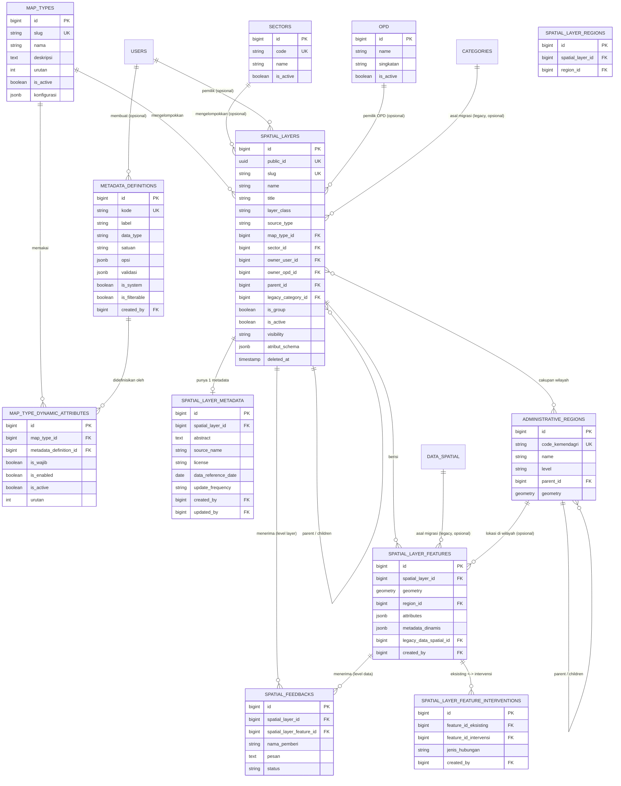

# ERD — Jenis Peta, Layer, dan Data Spasial (Skema V2)

> Dokumen ini merangkum skema database **yang sudah diimplementasikan** untuk domain
> "Jenis Peta" (map_types), "Layer & Data" (spatial_layers), dan metadata
> terkaitnya, hasil pengembangan di `docs/marimoi v2/03_plan/14-penyesuaian-database-jenis-peta.md`
> (Opsi B) dan `docs/marimoi v2/04_implementation/12-implementasi-perbaikan-pemetaan.md`.
> Sumber data: `database/migrations/*` + skema database aktual (PostgreSQL + PostGIS).
> Ditulis 2026-10-01.

## 1. Gambaran Umum

Skema ini menggantikan pasangan lama `categories` + `data_spatial` (satu tabel
generik untuk semua jenis data spasial, dibedakan lewat kolom `data_type`/`sub_type`)
dengan struktur yang lebih eksplisit:

- **`map_types`** — "Jenis Peta": master data tingkat atas yang mengelompokkan Layer
  (menggantikan peran `categories.type` + top-level `categories`).
- **`spatial_layers`** — "Layer": unit data spasial yang bisa disusun berjenjang
  (parent-child, tanpa batas kedalaman), menggantikan `categories` level
  menengah/bawah + penanda jenis pada `data_spatial`.
- **`spatial_layer_features`** — data titik/garis/area aktual suatu Layer,
  menggantikan baris-baris `data_spatial`.
- **`metadata_definitions`** + **`map_type_dynamic_attributes`** — katalog atribut
  dinamis per Jenis Peta (Opsi B: definisi atribut dipisah dari konfigurasi
  pemakaiannya, agar bisa dipakai ulang lintas Jenis Peta).
- **`spatial_layer_metadata`** — metadata deskriptif/kepatuhan (ISO 19115-ringan)
  per Layer.
- **`spatial_feedbacks`** — umpan balik publik untuk Layer atau 1 Data Spasial
  tertentu.

Tabel lama (`categories`, `data_spatial`) **masih ada dan masih dipakai** oleh
fitur "Peta Tematik" lama yang belum dimigrasikan penuh — keduanya dijembatani
lewat kolom `legacy_category_id` (di `spatial_layers`) dan `legacy_data_spatial_id`
(di `spatial_layer_features`), bukan FK yang mem-block penghapusan (`set null` /
nullable), supaya migrasi bisa bertahap tanpa memutus data lama.

## 2. Diagram ERD

## 3. Entitas Inti

### 3.1 `map_types` — Jenis Peta

**Fungsi**: master data tingkat atas yang mengelompokkan Layer berdasarkan
jenis/tema (mis. "Peta Tematik", "Usulan Musrenbang", "Pokok Pikiran DPRD",
"Proyek Strategis Daerah/Nasional"), dan menjadi titik pemakaian katalog
`metadata_definitions` lewat pivot `map_type_dynamic_attributes`.
Model: `App\Models\MapType`.

| Kolom | Tipe | Null | Keterangan |
|---|---|---|---|
| `id` | bigint PK | — | |
| `slug` | varchar(255), unik | tidak | Identitas stabil, dipakai hardcode di beberapa tempat kode — **readonly setelah dibuat** (lihat form Jenis Peta). |
| `nama` | varchar(255) | tidak | Nama tampil. |
| `deskripsi` | text | ya | |
| `urutan` | integer, default `0` | tidak | Urutan tampil di menu/listing. |
| `is_active` | boolean, default `true` | tidak | Nonaktifkan tanpa menghapus. |
| `konfigurasi` | jsonb | ya | Pengaturan bebas per Jenis (cast ke array di model). |
| `created_at`, `updated_at` | timestamp | ya | |

Relasi: `hasMany` ke `spatial_layers` dan `map_type_dynamic_attributes`. Scope
`active()` = `is_active=true` terurut `urutan`.

> **Perubahan 2026-10-01**: kolom `sumber_data`/`opd_penanggung_jawab_id`/
> `tanggal_data` (dulu "Atribut Utama" yang diketik manual tiap membuat Jenis
> Peta baru) **dihapus** dari tabel ini — ternyata salah tempat, karena nilainya
> seharusnya per-Data (per `spatial_layer_features`), bukan sekali per-Jenis.
> Lihat migrasi `move_map_type_core_attributes_to_metadata_definitions` dan
> catatan di Bagian 3.3.

### 3.2 `metadata_definitions` — Katalog Global Definisi Atribut

**Fungsi**: katalog **global** (lintas Jenis Peta) untuk definisi satu atribut
dinamis — nama/kode, label tampil, tipe data, satuan, opsi (untuk tipe
`select`), dan aturan validasi. Dipisah dari konfigurasi pemakaiannya (Opsi B,
lihat `docs/marimoi v2/03_plan/14-penyesuaian-database-jenis-peta.md` Bagian 6)
supaya definisi yang sama (mis. "Pagu", "Realisasi Anggaran") bisa dipakai ulang
oleh banyak Jenis Peta tanpa duplikasi. 4 definisi bawaan sistem (`is_system=true`):
`pagu`, `realisasi_anggaran`, `realisasi_fisik`, `status`.
Model: `App\Models\MetadataDefinition`.

| Kolom | Tipe | Null | Keterangan |
|---|---|---|---|
| `id` | bigint PK | — | |
| `kode` | varchar(255), unik | tidak | Key teknis (snake_case), dipakai sebagai key di `metadata_dinamis` pada `spatial_layer_features`. |
| `label` | varchar(255) | tidak | Label tampil. |
| `deskripsi` | text | ya | |
| `data_type` | varchar(20), default `text` | tidak | `text`, `integer`, `decimal`, `currency`, `select`, `date` (lihat `MetadataDefinition::DATA_TYPES`). |
| `satuan` | varchar(255) | ya | Mis. "Rp", "%". |
| `opsi` | jsonb | ya | Daftar pilihan untuk `data_type=select` (array, cast). |
| `validasi` | jsonb | ya | Aturan validasi tambahan (array, cast). |
| `is_system` | boolean, default `false` | tidak | `true` = 4 definisi bawaan yang di-seed migrasi, tidak dibuat user. |
| `is_filterable` | boolean, default `false` | tidak | Tandai boleh dipakai sebagai filter pencarian/peta. |
| `created_by` | bigint FK → `users.id` (`set null`) | ya | Siapa yang membuat definisi custom. |
| `created_at`, `updated_at` | timestamp | ya | |

Relasi: `hasMany` ke `map_type_dynamic_attributes`; `belongsTo` ke `users`
(`creator`).

### 3.3 `map_type_dynamic_attributes` — Pivot Jenis ↔ Definisi Atribut

**Fungsi**: tabel pivot **tipis** yang menghubungkan satu `map_types` dengan satu
`metadata_definitions`, menyimpan **konfigurasi pemakaian** (bukan definisi
atributnya sendiri): apakah wajib diisi, aktif/nonaktif, urutan tampil di form.
Nilai aktual tiap Data/Feature tetap disimpan di `spatial_layer_features.metadata_dinamis`
(JSON key-value, bukan di tabel ini). Model: `App\Models\MapTypeDynamicAttribute`.

| Kolom | Tipe | Null | Keterangan |
|---|---|---|---|
| `id` | bigint PK | — | |
| `map_type_id` | bigint FK → `map_types.id` (`cascade`) | tidak | |
| `metadata_definition_id` | bigint FK → `metadata_definitions.id` (`cascade`) | tidak | |
| `is_wajib` | boolean, default `false` | tidak | Wajib diisi saat input Data/Feature untuk Jenis ini. |
| `is_enabled` | boolean, default `true` | tidak | Sedang dipakai aktif oleh Jenis ini. |
| `is_active` | boolean, default `true` | tidak | Soft-disable baris pivot tanpa menghapus. |
| `urutan` | integer, default `0` | tidak | Urutan tampil di form. |
| `created_at`, `updated_at` | timestamp | ya | |

Unique index: `(map_type_id, metadata_definition_id)` — satu definisi hanya bisa
dipakai sekali per Jenis. Relasi: `belongsTo` ke `map_types` dan
`metadata_definitions`.

> **3 atribut inti otomatis (2026-10-01)**: `sumber_data`, `opd_penanggung_jawab`,
> `tanggal_data` (`is_system=true` di `metadata_definitions`) dipasang **otomatis**
> sebagai baris pivot `is_wajib=true` ke SETIAP Jenis Peta (baru maupun lama) oleh
> `MapTypeController::syncCoreAttributes()` — dipanggil tiap `store()`/`update()`,
> tidak bergantung payload form sama sekali. Tidak muncul di form "Jenis Peta" dan
> tidak bisa dilepas/diubah lewat form itu (UI cuma menampilkan badge info "Wajib
> (bawaan)" di halaman edit, tanpa checkbox/tombol hapus) — tapi konsekuensinya,
> field `metadata_dinamis.sumber_data`/`opd_penanggung_jawab`/`tanggal_data`
> menjadi WAJIB diisi setiap kali membuat/mengubah `spatial_layer_features` di
> Layer manapun, karena validasi di `SpatialLayerFeatureController` dibangun dari
> `is_wajib` baris pivot ini. Definisi ketiganya juga disembunyikan dari hasil
> pencarian katalog (`MetadataDefinitionController::search()`) supaya tidak bisa
> "dipilih manual" seolah opsional.

### 3.4 `spatial_layers` — Layer

**Fungsi**: unit data spasial yang bisa disusun berjenjang (parent-child, **tanpa
batas kedalaman** — lihat Keputusan #3 di
`docs/marimoi v2/04_implementation/12-implementasi-perbaikan-pemetaan.md`), mis.
"Infrastruktur" → "Jalan" → "Jalan Kabupaten". Satu Layer tergolong satu
`map_types`, bisa berupa Layer biasa (punya `features`) atau grup murni
(`is_group=true`, tidak punya data sendiri, hanya pembungkus anak-anaknya).
Soft-delete aktif. Model: `App\Models\SpatialLayer`.

| Kolom | Tipe | Null | Keterangan |
|---|---|---|---|
| `id` | bigint PK | — | |
| `public_id` | uuid, unik | tidak | Diisi otomatis saat `creating()` — identitas publik yang tidak bocor urutan `id`. |
| `slug` | varchar(255), unik | tidak | |
| `name` | varchar(255) | tidak | Nama internal/teknis. |
| `title` | varchar(255) | tidak | Judul tampil (bisa beda dari `name`). |
| `description` | text | ya | |
| `layer_class` | varchar(30) | tidak | `thematic` atau `development` (lihat `Rule::in` di controller). |
| `source_type` | varchar(50), default `feature` | tidak | Sumber data Layer. |
| `legacy_category_id` | bigint FK → `categories.id` (`set null`) | ya | Jejak migrasi dari `categories` lama — bukan relasi fungsional aktif. |
| `map_type_id` | bigint FK → `map_types.id` (`set null`) | ya | Jenis Peta Layer ini. Nullable di DB (data lama hasil backfill bisa kosong) meski form create/edit mewajibkannya. |
| `sector_id` | bigint FK → `sectors.id` (`set null`) | ya | Sektor pembangunan terkait (opsional). |
| `owner_user_id` | bigint FK → `users.id` (`set null`) | ya | Pembuat/pemilik. |
| `owner_opd_id` | bigint FK → `opd.id` (`set null`) | ya | OPD pemilik. |
| `geometry_type` | varchar(30) | ya | Point/LineString/Polygon, dsb. |
| `srid` | integer | ya | Sistem referensi koordinat. |
| `extent` | geometry | ya | Bounding box Layer. |
| `center_point` | geometry | ya | Titik tengah untuk auto-zoom peta. |
| `min_zoom`, `max_zoom` | smallint | ya | Batas tampil di peta. |
| `visibility` | varchar(20), default `private` | tidak | Visibilitas Layer. |
| `is_active` | boolean, default `true` | tidak | |
| `is_downloadable` | boolean, default `false` | tidak | Boleh diunduh publik. |
| `parent_id` | bigint FK → `spatial_layers.id` (self, `set null`) | ya | Hierarki parent-child. |
| `is_group` | boolean, default `false` | tidak | `true` = grup murni (lihat scope `groups()`/`selectable()`). |
| `atribut_schema` | jsonb | ya | Skema field custom Layer ini (array, cast) — dipakai `atributValidationRules()` untuk validasi dinamis form Data. |
| `published_at` | timestamp | ya | |
| `thumbnail_path` | varchar(255) | ya | |
| `color`, `icon` | varchar | ya | Gaya tampil default di peta. |
| `is_marker` | boolean, default `false` | tidak | Ditampilkan sebagai marker, bukan layer poligon/garis. |
| `opacity` | numeric(4,3), default `1` | tidak | |
| `created_at`, `updated_at`, `deleted_at` | timestamp | ya | |

Relasi: `belongsTo` ke `map_types`, `sectors`, self (`parent`); `hasMany` ke self
(`children`), `spatial_layer_features` (`features`); `hasOne` ke
`spatial_layer_metadata` (`metadata`); `belongsToMany` ke `administrative_regions`
lewat `spatial_layer_regions` (`regions`). Method `wouldCreateCycle()` mencegah
siklus saat mengubah `parent_id`.

### 3.5 `spatial_layer_metadata` — Metadata Deskriptif Layer

**Fungsi**: metadata tingkat katalog data (mirip ISO 19115 ringan) untuk satu
Layer — abstrak, sumber, lisensi, kontak, akurasi, kelengkapan — terpisah dari
`spatial_layers` agar form "Informasi Dasar" tetap ringkas. **Relasi 1:1** dengan
Layer. Model: `App\Models\SpatialLayerMetadata`.

| Kolom | Tipe | Null | Keterangan |
|---|---|---|---|
| `id` | bigint PK | — | |
| `spatial_layer_id` | bigint FK → `spatial_layers.id`, **unik** (`cascade`) | tidak | Satu Layer = maksimal satu baris metadata. |
| `abstract` | text | ya | Ringkasan isi dataset. |
| `source_name` | varchar(255) | ya | Nama sumber data. |
| `source_url` | text | ya | |
| `license` | varchar(255) | ya | Lisensi penggunaan data. |
| `attribution` | text | ya | Teks atribusi wajib. |
| `contact_name`, `contact_email`, `contact_phone` | varchar | ya | Kontak penanggung jawab data. |
| `data_reference_date` | date | ya | Tanggal referensi data. |
| `data_reference_year` | smallint | ya | |
| `update_frequency` | varchar(50) | ya | Mis. "tahunan", "bulanan". |
| `last_verified_at` | timestamp | ya | |
| `lineage` | text | ya | Riwayat/silsilah data. |
| `positional_accuracy`, `attribute_accuracy`, `completeness`, `limitations` | text | ya | Kualitas data (akurasi posisi/atribut, kelengkapan, batasan). |
| `language_code` | varchar(10), default `id` | tidak | |
| `created_by`, `updated_by` | bigint FK → `users.id` (`set null`) | ya | |
| `created_at`, `updated_at` | timestamp | ya | |

### 3.6 `spatial_layer_features` — Data Spasial per Layer

**Fungsi**: baris data spasial aktual (titik/garis/area) milik satu Layer —
pengganti baris `data_spatial` lama untuk Layer yang sudah dimigrasikan ke skema
V2. Menyimpan geometri, atribut terstruktur (`attributes`, sesuai
`spatial_layers.atribut_schema`), dan **nilai aktual Metadata Dinamis**
(`metadata_dinamis`, sesuai definisi di `map_type_dynamic_attributes`/
`metadata_definitions` milik Jenis Peta Layer induknya). Model:
`App\Models\SpatialLayerFeature`.

| Kolom | Tipe | Null | Keterangan |
|---|---|---|---|
| `id` | bigint PK | — | |
| `spatial_layer_id` | bigint FK → `spatial_layers.id` (`restrict`) | tidak | Tidak bisa hapus Layer selama masih punya Data (lihat `SpatialLayerController::destroy`). |
| `source_version_id` | bigint | ya | Versi sumber data (import/upload). |
| `external_id` | varchar(255) | ya | ID dari sumber data eksternal. |
| `geometry` | geometry | tidak | Geometri aktual (indexed GiST). |
| `region_id` | bigint FK → `administrative_regions.id` (`set null`) | ya | Wilayah administratif lokasi data. |
| `attributes` | jsonb | ya | Nilai field custom sesuai `atribut_schema` Layer (array, cast). |
| `metadata_dinamis` | jsonb | ya | Nilai aktual Metadata Dinamis Jenis Peta (key = `metadata_definitions.kode`) (array, cast). |
| `gambar` | varchar(255) | ya | Foto/lampiran data. |
| `created_by` | bigint FK → `users.id` (`set null`) | ya | |
| `legacy_data_spatial_id` | bigint FK → `data_spatial.id` (`set null`), indexed | ya | Jejak migrasi dari `data_spatial` lama. |
| `created_at`, `updated_at` | timestamp | ya | |

Relasi: `belongsTo` ke `spatial_layers` (`layer`), `administrative_regions`
(`region`); `hasMany` ke `spatial_layer_feature_interventions` (dua arah,
`intervensiTerkait` & `kondisiEksistingTerkait`).

### 3.7 `spatial_layer_feature_interventions` — Relasi Eksisting ↔ Intervensi

**Fungsi**: tabel pivot yang menghubungkan dua `spatial_layer_features` —
biasanya data "kondisi eksisting" (mis. jalan rusak) dengan data "intervensi"
(mis. proyek perbaikan jalan) — agar dashboard bisa menyandingkan kondisi
sebelum/sesudah sebuah intervensi pembangunan. Model:
`App\Models\SpatialLayerFeatureIntervention`.

| Kolom | Tipe | Null | Keterangan |
|---|---|---|---|
| `id` | bigint PK | — | |
| `feature_id_eksisting` | bigint FK → `spatial_layer_features.id` (`cascade`) | tidak | Data kondisi eksisting. |
| `feature_id_intervensi` | bigint FK → `spatial_layer_features.id` (`cascade`) | tidak | Data intervensi/proyek terkait. |
| `jenis_hubungan` | varchar(50), default `terkait` | tidak | Jenis relasi antar keduanya. |
| `created_by` | bigint FK → `users.id` (`set null`) | ya | |
| `created_at`, `updated_at` | timestamp | ya | |

Unique index: `(feature_id_eksisting, feature_id_intervensi)` — pasangan yang
sama tidak boleh berulang.

### 3.8 `spatial_layer_regions` — Cakupan Wilayah Layer

**Fungsi**: tabel pivot many-to-many antara `spatial_layers` dan
`administrative_regions`, menandai wilayah administratif mana saja yang
dicakup satu Layer (untuk filter/agregasi berbasis wilayah). Tidak punya model
Eloquent sendiri — diakses lewat `SpatialLayer::regions()`.

| Kolom | Tipe | Null | Keterangan |
|---|---|---|---|
| `id` | bigint PK | — | |
| `spatial_layer_id` | bigint FK → `spatial_layers.id` (`cascade`) | tidak | |
| `region_id` | bigint FK → `administrative_regions.id` (`cascade`) | tidak | |
| `created_at`, `updated_at` | timestamp | ya | |

Unique index: `(spatial_layer_id, region_id)`.

### 3.9 `spatial_feedbacks` — Umpan Balik Pemetaan

**Fungsi**: umpan balik publik yang ditujukan ke **tepat satu** target — satu
Layer (`spatial_layer_id`) ATAU satu Data/Feature (`spatial_layer_feature_id`),
tidak pernah keduanya sekaligus atau tidak ada sama sekali (dijaga lewat CHECK
constraint `spatial_feedbacks_target_check` di database, bukan hanya validasi
aplikasi). Berbeda dari `project_feedbacks` yang spesifik untuk proyek
strategis. Model: `App\Models\SpatialFeedback`.

| Kolom | Tipe | Null | Keterangan |
|---|---|---|---|
| `id` | bigint PK | — | |
| `spatial_layer_id` | bigint FK → `spatial_layers.id` (`cascade`) | ya* | *Diisi XOR dengan `spatial_layer_feature_id` (CHECK constraint). |
| `spatial_layer_feature_id` | bigint FK → `spatial_layer_features.id` (`cascade`) | ya* | |
| `nama_pemberi` | varchar(255) | tidak | |
| `email` | varchar(255) | ya | |
| `phone` | varchar(20) | ya | |
| `pesan` | text | tidak | Isi umpan balik. |
| `status` | varchar(20), default `baru` | tidak | Status tindak lanjut (mis. `baru`, `ditanggapi`). |
| `response_admin` | text | ya | |
| `responded_at` | timestamp | ya | |
| `created_at`, `updated_at` | timestamp | ya | |

## 4. Entitas Pendukung / Referensi

Tabel-tabel ini bukan inti domain Jenis Peta/Layer, tapi dirujuk langsung oleh
entitas di atas sebagai referensi/master data.

### 4.1 `opd` — Organisasi Perangkat Daerah
Dirujuk oleh `spatial_layers.owner_opd_id` (OPD pemilik Layer). (Sampai
2026-10-01 juga dirujuk `map_types.opd_penanggung_jawab_id` — kolom itu sudah
dihapus, lihat catatan di Bagian 3.1/3.3.)

| Kolom | Tipe | Null | Keterangan |
|---|---|---|---|
| `id` | bigint PK | — | |
| `name` | varchar(255) | tidak | Nama lengkap OPD. |
| `singkatan` | varchar(20) | tidak | Nama singkat (indexed), dipakai di badge/label UI. |
| `logo`, `telepon`, `email` | varchar | ya | |
| `is_active` | boolean, default `true` | tidak | |

### 4.2 `sectors` — Sektor Pembangunan
Dirujuk oleh `spatial_layers.sector_id` (opsional) untuk pengelompokan Layer
berdasarkan sektor pembangunan (selain pengelompokan utama lewat `map_type_id`).

| Kolom | Tipe | Null | Keterangan |
|---|---|---|---|
| `id` | bigint PK | — | |
| `code` | varchar(50), unik | tidak | |
| `name` | varchar(255) | tidak | |
| `description` | text | ya | |
| `is_active` | boolean, default `true` | tidak | |

### 4.3 `administrative_regions` — Wilayah Administratif
Hierarki wilayah (provinsi → kabupaten/kota → kecamatan → dst., lewat
`parent_id` self-referencing) dengan geometri batas wilayah. Dirujuk oleh
`spatial_layer_features.region_id` (lokasi satu data) dan
`spatial_layer_regions` (cakupan wilayah satu Layer).

| Kolom | Tipe | Null | Keterangan |
|---|---|---|---|
| `id` | bigint PK | — | |
| `code_kemendagri` | varchar(50), unik | tidak | Kode wilayah resmi Kemendagri. |
| `code_bps` | varchar(20), unik | ya | Kode wilayah BPS. |
| `name` | varchar(255) | tidak | |
| `level` | varchar(30), indexed | tidak | Mis. `provinsi`, `kabupaten`, `kecamatan`. |
| `parent_id` | bigint FK → self (`set null`) | ya | Hierarki wilayah. |
| `geometry` | geometry (GiST indexed) | ya | Batas wilayah. |
| `is_active` | boolean, default `true` | tidak | |

### 4.4 `categories` dan `data_spatial` — Skema Lama (Legacy)

Dipertahankan untuk fitur "Peta Tematik" lama yang belum sepenuhnya
dimigrasikan. `spatial_layers.legacy_category_id` dan
`spatial_layer_features.legacy_data_spatial_id` adalah **jejak migrasi**
(nullable, `set null` saat sumbernya dihapus) — bukan relasi operasional yang
dipakai fitur Jenis Peta/Layer baru sehari-hari. Lihat
`docs/marimoi v2/04_implementation/09-implementasi-penuh-database-v2.md` untuk
rencana retirement penuhnya.

| Tabel | Fungsi singkat |
|---|---|
| `categories` | Kategori/jenis data lama (hierarkis lewat `parent_id`), dipakai fitur Peta Tematik lama & sumber backfill awal `map_types`/`spatial_layers`. |
| `data_spatial` | Baris data spasial generik lama (dibedakan lewat `data_type`/`sub_type`), dipakai fitur Peta Tematik, Proyek Strategis, Pokir, Musrenbang lama; sumber backfill awal `spatial_layer_features`. |

## 5. Catatan Desain Penting

1. **Opsi B — definisi atribut dipisah dari konfigurasi pemakaian.**
   `metadata_definitions` adalah katalog global; `map_type_dynamic_attributes`
   hanya pivot konfigurasi (wajib/aktif/urutan) per Jenis Peta. Nilai aktual
   selalu di `spatial_layer_features.metadata_dinamis`, **tidak pernah** di
   tabel pivot. Lihat `docs/marimoi v2/03_plan/14-penyesuaian-database-jenis-peta.md`.
2. **Hierarki Layer tanpa batas kedalaman.** `spatial_layers.parent_id` boleh
   bersarang berapa level pun; satu-satunya validasi wajib adalah mencegah
   cycle (`SpatialLayer::wouldCreateCycle()`), bukan membatasi kedalaman.
3. **`map_type_id` nullable di database, wajib di form.** Kolom ini `nullable`
   di skema (karena data lama hasil backfill dari `categories` bisa belum
   terisi), tapi form create/edit Layer saat ini mewajibkannya — karena itu
   halaman "Daftar Layer & Data" punya opsi filter "- Tanpa Jenis -" untuk
   baris lama yang belum diisi.
4. **Satu Metadata per Layer.** `spatial_layer_metadata` punya unique index di
   `spatial_layer_id` — relasi murni 1:1, bukan 1:banyak.
5. **Feedback target XOR.** CHECK constraint database pada `spatial_feedbacks`
   memastikan tepat satu dari `spatial_layer_id`/`spatial_layer_feature_id`
   terisi — lebih kuat dari validasi aplikasi karena berlaku juga untuk insert
   langsung ke database.
6. **Fitur "Kelola Peta" (tabel `maps`, `map_layers`, dst.) sudah dihapus**
   (2026-10-01) — bukan bagian dari skema ini. Lihat riwayat commit terkait
   penghapusan menu "Kelola Peta".
