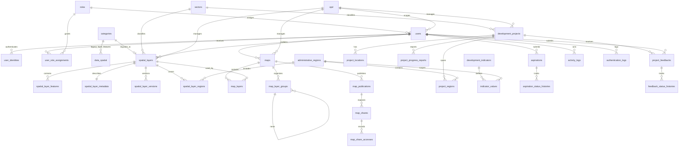

# SKEMA DATABASE MARIMOI V2

## Ringkasan

Dokumen ini adalah rancangan skema database MARIMOI V2. Skema dirancang untuk mendukung WebGIS terpadu, katalog layer, peta yang dapat dikomposisi, publikasi/share URL dan QR code, dashboard eksekutif, pelacakan partisipasi publik, serta audit keamanan.

### Prinsip desain

1. **Master/reference data** menyimpan identitas dan pilihan yang dipakai banyak fitur. Master memiliki kode/slug stabil, unique constraint, dan umumnya tidak dihapus secara fisik.
2. **Transactional data** mencatat penggunaan, laporan, perubahan status, publikasi, share, dan histori. Data ini memiliki waktu kejadian serta actor bila relevan.
3. **Map** adalah konfigurasi/komposisi peta. Pada schema lama MARIMOI, **`categories` berfungsi sebagai layer** dan **`data_spatial` berfungsi sebagai feature** yang merujuk ke `categories.id` melalui `kategori_id`. Pada schema baru V2, penamaan tersebut diperjelas menjadi **`spatial_layers`** untuk layer dan **`spatial_layer_features`** untuk feature. **Map layer** adalah penggunaan layer pada map. **Geometry** adalah bentuk spasial feature.
4. Metadata layer tidak disalin ke konfigurasi map. Konfigurasi tampilan disimpan di `map_layers`.
5. `categories` dan `data_spatial` adalah tabel lama. Keduanya digunakan sebagai sumber migrasi dan compatibility layer, bukan sebagai nama canonical schema baru. Schema V2 menggunakan nama yang tidak ambigu dan migration bertahap.
6. PostgreSQL/PostGIS digunakan pada tahap awal. File sumber disimpan pada object storage dan import/analitik besar diproses melalui queue.
7. Semua identifier pada URL publik menggunakan UUID, slug, atau token acak, bukan ID integer berurutan.

### Status tabel

| Status | Arti |
| --- | --- |
| Existing | Sudah ada pada schema MARIMOI saat ini |
| New | Tabel baru yang direkomendasikan untuk V2 |
| Legacy | Dipertahankan sementara untuk backward compatibility |
| Optional | Dibuat bila kebutuhan fitur atau volume data membenarkannya |

### Konvensi umum

- Primary key internal dapat tetap `BIGINT` agar kompatibel dengan Laravel saat ini.
- Entitas yang menjadi identifier publik menggunakan kolom `uuid`/`public_id` unique.
- Semua tabel bisnis memiliki `created_at` dan `updated_at`; tabel histori juga memiliki waktu kejadian khusus.
- Foreign key actor/owner historis menggunakan `SET NULL` bila user dapat dinonaktifkan.
- Detail yang tidak bermakna tanpa parent menggunakan `CASCADE`; master yang masih direferensikan menggunakan `RESTRICT`.
- Geometry harus memakai tipe dan SRID eksplisit, misalnya `geometry(Point, 4326)` atau `geometry(MultiPolygon, 4326)`.

## Entity Relational Diagram / ERD

ERD berikut memuat entitas target V2. Relasi `categories -> data_spatial` adalah relasi schema lama untuk migration/compatibility; relasi canonical V2 menggunakan `spatial_layers -> spatial_layer_features`.



### Interpretasi relasi penting

- `categories` dan `data_spatial` adalah layer/feature pada schema lama; relasinya dipertahankan hanya untuk compatibility dan migration.
- `spatial_layers` adalah katalog layer canonical V2; `spatial_layer_features` adalah feature yang berada di dalam layer.
- `maps` adalah container peta.
- `map_layers` menyimpan konfigurasi layer (`spatial_layer_id`) pada map tertentu.
- `map_publications` memisahkan draft map dari versi yang diterbitkan.
- `map_shares` memberikan akses read-only berbasis token terhadap publication.
- `development_projects` adalah identitas proyek pembangunan; laporan progres dan nilai indikator adalah transaksi/histori.
- `data_spatial`, `aspirasi`, `project_feedbacks`, dan `publications` existing dipertahankan selama migration compatibility period.

## Authentication

### 1. `users` - Existing, diperbaiki

Menyimpan identitas user dan scope akses aplikasi.

| Kolom | Tipe/atribut | Fungsi dan pemakaian |
| --- | --- | --- |
| `id` | `BIGINT PK` | Referensi internal Laravel pada seluruh foreign key user. |
| `name` | `VARCHAR(255)` | Nama tampilan pada dashboard, activity log, submission, dan response admin. |
| `email` | `VARCHAR(255) UNIQUE` | Identitas login, notifikasi, dan kontak; wajib diverifikasi untuk akun publik. |
| `role_id` | `BIGINT FK NULL` | Role efektif utama untuk middleware dan policy. User Google baru selalu diisi role `publik`. |
| `opd_id` | `BIGINT FK NULL` | Scope Admin OPD untuk filter dan authorization resource. Null untuk publik/admin sistem bila tidak terkait OPD. |
| `email_verified_at` | `TIMESTAMP NULL` | Status verifikasi email/provider sebelum fitur yang membutuhkan akun dibuka. |
| `password` | `VARCHAR(255) NULL` | Kredensial lokal bila login admin lokal dipertahankan; tidak dipakai login Google. |
| `remember_token` | `VARCHAR(100) NULL` | Session remember Laravel. |
| `is_active` | `BOOLEAN DEFAULT TRUE` | Menolak login dan akses user yang dinonaktifkan tanpa menghapus histori. |
| `last_login_at` | `TIMESTAMP NULL` | Ringkasan login terakhir pada administrasi user; sumber detail tetap `authentication_logs`. |
| `disabled_at` | `TIMESTAMP NULL` | Waktu penonaktifan akun untuk audit dan lifecycle user. |
| `created_at` | `TIMESTAMP` | Waktu pembuatan akun. |
| `updated_at` | `TIMESTAMP` | Waktu perubahan profil/scope. |

Pemakai: authentication, user management, policy, owner layer/map/project, submission publik, dan audit actor.

### 2. `roles` - Existing

Master role. Rekomendasi slug: `admin-sistem`, `admin-bappeda`, `admin-opd`, `publik`.

| Kolom | Tipe/atribut | Fungsi dan pemakaian |
| --- | --- | --- |
| `id` | `BIGINT PK` | Referensi role user dan histori assignment. |
| `name` | `VARCHAR(100) UNIQUE` | Nama role untuk UI administrasi. |
| `slug` | `VARCHAR(100) UNIQUE` | Kode stabil pada middleware, policy, seeder, dan authorization. |
| `description` | `VARCHAR/TEXT NULL` | Penjelasan kewenangan role pada layar pengelolaan user. |
| `is_active` | `BOOLEAN DEFAULT TRUE` | Menonaktifkan role tanpa menghapus histori. |
| `created_at`, `updated_at` | `TIMESTAMP` | Audit perubahan master role. |

### 3. `opd` - Existing

Master organisasi/perangkat daerah.

| Kolom | Tipe/atribut | Fungsi dan pemakaian |
| --- | --- | --- |
| `id` | `BIGINT PK` | Referensi user, layer, map, proyek, indikator, dan feedback. |
| `name` | `VARCHAR(255)` | Nama resmi OPD pada katalog dan dashboard. |
| `singkatan` | `VARCHAR(50) UNIQUE` | Label ringkas pada filter, legend, dan tabel. |
| `logo` | `VARCHAR(255) NULL` | Logo pada profil OPD, katalog, dan dashboard. |
| `telepon` | `VARCHAR(50) NULL` | Kontak pengelola metadata atau feedback. |
| `email` | `VARCHAR(255) NULL` | Kontak sumber data dan notifikasi. |
| `is_active` | `BOOLEAN DEFAULT TRUE` | Menyembunyikan OPD nonaktif dari pilihan baru. |
| `created_at`, `updated_at` | `TIMESTAMP` | Audit master OPD. |

### 4. `user_identities` - New

Memisahkan identitas provider dari `users` dan mendukung Google OAuth.

| Kolom | Tipe/atribut | Fungsi dan pemakaian |
| --- | --- | --- |
| `id` | `BIGINT PK` | Identifier internal identity. |
| `user_id` | `BIGINT FK NOT NULL` | User aplikasi yang terhubung. `CASCADE` saat user dihapus sesuai kebijakan. |
| `provider` | `VARCHAR(50) NOT NULL` | Nilai provider, misalnya `google` atau `local`. |
| `provider_subject` | `VARCHAR(255) NOT NULL` | ID unik dari Google; tidak menggunakan email sebagai primary identity. |
| `provider_email` | `VARCHAR(255) NULL` | Email yang dikembalikan provider untuk rekonsiliasi. |
| `provider_data` | `JSONB NULL` | Data provider non-kritis yang diperlukan untuk sinkronisasi, tanpa access token. |
| `last_used_at` | `TIMESTAMP NULL` | Waktu identity terakhir dipakai login. |
| `created_at`, `updated_at` | `TIMESTAMP` | Audit koneksi provider. |

Constraint: unique `(provider, provider_subject)` dan index `user_id`.

Pemakai: Google login, account linking, duplicate identity prevention, dan audit authentication.

### 5. `user_role_assignments` - New, optional

Histori pemberian role dan OPD oleh Admin Sistem.

| Kolom | Tipe/atribut | Fungsi dan pemakaian |
| --- | --- | --- |
| `id` | `BIGINT PK` | Identifier histori. |
| `user_id` | `BIGINT FK NOT NULL` | User yang menerima perubahan. |
| `role_id` | `BIGINT FK NOT NULL` | Role yang diberikan. |
| `opd_id` | `BIGINT FK NULL` | Scope OPD ketika assignment berlaku. |
| `assigned_by` | `BIGINT FK NULL` | Admin Sistem yang membuat perubahan. |
| `started_at` | `TIMESTAMP NOT NULL` | Awal berlakunya assignment. |
| `ended_at` | `TIMESTAMP NULL` | Akhir berlakunya assignment. |
| `reason` | `TEXT NULL` | Alasan perubahan untuk audit. |
| `created_at`, `updated_at` | `TIMESTAMP` | Audit record. |

Pemakai: user management, audit role, dan investigasi perubahan permission.

### 6. `authentication_logs` - New

Log login/logout/callback yang tidak dihapus bersama user.

| Kolom | Tipe/atribut | Fungsi dan pemakaian |
| --- | --- | --- |
| `id` | `BIGINT PK` | Identifier event login. |
| `user_id` | `BIGINT FK NULL` | User jika identitas berhasil dikenali; null untuk login gagal sebelum user ditemukan. |
| `provider` | `VARCHAR(50)` | Provider/local login yang digunakan. |
| `event` | `VARCHAR(50)` | `login`, `logout`, `callback`, `failed`, `blocked`, atau `session_expired`. |
| `success` | `BOOLEAN` | Filter monitoring login berhasil/gagal. |
| `failure_reason` | `VARCHAR(255) NULL` | Alasan teknis/non-sensitif saat gagal. |
| `ip_hash` | `VARCHAR(128) NULL` | Korelasi keamanan tanpa menyimpan IP mentah permanen. |
| `user_agent` | `TEXT NULL` | Identifikasi perangkat/browser saat investigasi. |
| `session_id_hash` | `VARCHAR(128) NULL` | Korelasi session tanpa menyimpan session secret. |
| `request_id` | `VARCHAR(100) NULL` | Korelasi dengan application log. |
| `occurred_at` | `TIMESTAMP` | Waktu kejadian login. |
| `metadata` | `JSONB NULL` | Metadata non-rahasia seperti route atau provider response code. |

Pemakai: security dashboard, deteksi login gagal, compliance, dan audit.

## Master Data / Tabel

### 1. `categories` - Existing, legacy layer

Pada schema lama MARIMOI, `categories` berfungsi sebagai **master layer** atau katalog layer. Struktur parent-child membentuk tree layer yang ditampilkan ketika user memilih menu peta. Setelah user mengaktifkan node layer, aplikasi mengambil feature dari `data_spatial` berdasarkan `data_spatial.kategori_id = categories.id`. Pada schema V2, tabel ini menjadi sumber migrasi menuju `spatial_layers`.

Dengan demikian:

```text
categories (layer)
└── data_spatial (feature)
	├── dbf_attributes (atribut feature)
	└── geom (geometry feature)
```

Nama tabel `categories` dipertahankan sebagai legacy selama compatibility period. Schema V2 tidak menggunakannya sebagai layer canonical; gunakan `spatial_layers` sebagai nama baru yang eksplisit.

| Kolom | Tipe/atribut | Fungsi dan pemakaian |
| --- | --- | --- |
| `id` | `BIGINT PK` | Referensi kategori layer. |
| `type` | `VARCHAR(100) INDEX` | Kelompok/menu domain lama seperti tematik, PSD, PSN, Pokir, dan Musrenbang. Pada V2 dipakai sebagai klasifikasi/filter kompatibilitas, bukan sebagai tabel layer baru. |
| `name` | `VARCHAR(255) NOT NULL` | Nama layer yang tampil pada tree, legend, pencarian, dan panel aktivasi. Migrasi dari `nama`. |
| `slug` | `VARCHAR(255) UNIQUE` | Identifier URL/filter yang stabil. |
| `color` | `VARCHAR(25) NULL` | Warna kategori pada legend dan marker. Migrasi dari `warna`. |
| `icon` | `VARCHAR(255) NULL` | Icon kategori pada legend dan katalog. |
| `is_marker` | `BOOLEAN DEFAULT FALSE` | Menentukan renderer marker pada WebGIS. |
| `is_active` | `BOOLEAN DEFAULT TRUE` | Menyembunyikan kategori nonaktif dari pilihan baru. |
| `image_path` | `VARCHAR(255) NULL` | Gambar/thumbnail kategori. |
| `description` | `TEXT NULL` | Penjelasan kategori. |
| `parent_id` | `BIGINT FK NULL` | Parent layer untuk membentuk tree; self-reference dengan `SET NULL` agar child tidak ikut hilang ketika parent diarsipkan. |
| `created_by` | `BIGINT FK NULL` | User pembuat kategori, bila governance diperlukan. |
| `created_at`, `updated_at` | `TIMESTAMP` | Audit master. |

Pemakai schema lama: tree layer, menu satu Peta, legend, filter layer, dan `data_spatial.kategori_id`. Pada schema baru, pemakai tersebut berpindah ke `spatial_layers` dan `map_layers.spatial_layer_id`.

### 2. `sectors` - New

Master sektor/urusan pembangunan.

| Kolom | Tipe/atribut | Fungsi dan pemakaian |
| --- | --- | --- |
| `id` | `BIGINT PK` | Referensi layer, proyek, dan indikator. |
| `code` | `VARCHAR(50) UNIQUE` | Kode resmi/stabil untuk integrasi dan filter. |
| `name` | `VARCHAR(255)` | Label sektor. |
| `description` | `TEXT NULL` | Definisi sektor. |
| `is_active` | `BOOLEAN DEFAULT TRUE` | Pilihan sektor aktif pada form dan filter. |
| `created_at`, `updated_at` | `TIMESTAMP` | Audit master. |

### 3. `administrative_regions` - New

Master wilayah resmi dan hierarkis.

| Kolom | Tipe/atribut | Fungsi dan pemakaian |
| --- | --- | --- |
| `id` | `BIGINT PK` | Referensi lokasi layer, proyek, dan indikator. |
| `code` | `VARCHAR(50) UNIQUE` | Kode wilayah resmi BPS/Kemendagri yang disepakati. |
| `name` | `VARCHAR(255)` | Nama provinsi/kabupaten/kecamatan/desa. |
| `level` | `VARCHAR(30)` | Tingkat administrasi untuk filter bertingkat. |
| `parent_id` | `BIGINT FK NULL` | Hierarki wilayah; self-reference. |
| `geometry` | `GEOMETRY(MultiPolygon, 4326) NULL` | Batas wilayah untuk overlay dan spatial filter. |
| `is_active` | `BOOLEAN DEFAULT TRUE` | Menandai kode wilayah yang masih berlaku. |
| `created_at`, `updated_at` | `TIMESTAMP` | Audit master wilayah. |

Pemakai: filter wilayah, extent map, project region, dashboard agregasi, dan spatial join.

### 4. `data_stores` - New, optional

`data_stores` adalah **master/configuration registry backend penyimpanan**, bukan tabel feature dan bukan layer. Tabel ini mendeskripsikan di mana dan bagaimana feature layer dibaca, misalnya PostGIS lokal, object storage, atau DuckLake. Satu data store dapat dipakai banyak layer.

| Kolom | Tipe/atribut | Fungsi dan pemakaian |
| --- | --- | --- |
| `id` | `BIGINT PK` | Referensi backend dari layer. |
| `name` | `VARCHAR(100)` | Nama backend pada administrasi dan log import. |
| `type` | `VARCHAR(50)` | Jenis adapter: `postgis`, `object_storage`, atau `ducklake`. |
| `configuration` | `JSONB` | Konfigurasi non-secret seperti schema/table/bucket; credential berada di environment/secret manager. |
| `is_active` | `BOOLEAN DEFAULT TRUE` | Menentukan backend yang dapat digunakan importer/read service. |
| `created_at`, `updated_at` | `TIMESTAMP` | Audit registry. |

### 5. `development_indicators` - New

`development_indicators` adalah **master definisi indikator**, bukan transaksi nilai dan bukan hasil dashboard. Tabel ini menjawab “indikator apa yang diukur dan bagaimana cara membacanya”. Nilai per wilayah/periode disimpan pada `indicator_values`.

| Kolom | Tipe/atribut | Fungsi dan pemakaian |
| --- | --- | --- |
| `id` | `BIGINT PK` | Referensi nilai indikator. |
| `code` | `VARCHAR(100) UNIQUE` | Kode metric stabil pada dashboard dan integrasi. |
| `name` | `VARCHAR(255)` | Nama indikator pada kartu/grafik. |
| `definition` | `TEXT` | Definisi, formula, denominator, dan aturan validasi indikator. |
| `unit` | `VARCHAR(50)` | Satuan seperti persen, km, unit, atau rupiah. |
| `direction` | `VARCHAR(20)` | `higher_is_better`, `lower_is_better`, atau `neutral`. |
| `frequency` | `VARCHAR(30)` | Bulanan, triwulanan, tahunan, atau sesuai sumber. |
| `source_name` | `VARCHAR(255)` | Sumber resmi definisi/data indikator. |
| `owner_opd_id` | `BIGINT FK NULL` | OPD pemilik definisi dan pelaporan indikator. |
| `is_active` | `BOOLEAN DEFAULT TRUE` | Menentukan indikator yang tampil/diterima. |
| `created_at`, `updated_at` | `TIMESTAMP` | Audit definisi indikator. |

### 6. `kategori_aspirasi` - Existing

Master kategori aspirasi yang dapat dipetakan ke OPD.

| Kolom | Tipe/atribut | Fungsi dan pemakaian |
| --- | --- | --- |
| `id` | `BIGINT PK` | Referensi pada `aspirations`. |
| `opd_id` | `BIGINT FK NULL` | OPD tujuan kategori. |
| `name` | `VARCHAR(255)` | Nama kategori; migrasi dari `nama_kategori`. |
| `description` | `TEXT NULL` | Penjelasan kategori. |
| `is_active` | `BOOLEAN DEFAULT TRUE` | Filter kategori aktif pada form publik. |
| `created_at`, `updated_at` | `TIMESTAMP` | Audit master. |

## Peta

### 1. `spatial_layers` - New, canonical V2

`spatial_layers` menggantikan fungsi layer dari tabel lama `categories`. Satu row adalah satu dataset/layer yang dapat digunakan pada banyak map. Feature berada pada `spatial_layer_features` dan tidak dicampur dengan metadata layer.

| Kolom | Tipe/atribut | Fungsi dan pemakaian |
| --- | --- | --- |
| `id` | `BIGINT PK` | Identifier internal layer dan parent relasi feature/map-layer. |
| `public_id` | `UUID UNIQUE NOT NULL` | Identifier publik layer yang tidak bergantung pada ID integer. |
| `slug` | `VARCHAR(255) UNIQUE NOT NULL` | Identifier URL dan pencarian layer yang stabil. |
| `name` | `VARCHAR(255) NOT NULL` | Nama teknis layer. |
| `title` | `VARCHAR(255) NOT NULL` | Judul yang ditampilkan pada tree, legend, katalog, dan panel aktivasi. |
| `description` | `TEXT NULL` | Ringkasan isi layer. |
| `layer_class` | `VARCHAR(30) NOT NULL` | Klasifikasi V2, minimal `thematic` atau `development`; menggantikan ketergantungan pada `categories.type`. |
| `source_type` | `VARCHAR(50) NOT NULL` | Tipe sumber: feature, raster, atau external service. |
| `legacy_category_id` | `BIGINT FK NULL` | Mapping satu layer baru ke `categories.id` lama selama transisi; bukan identitas layer canonical. |
| `sector_id` | `BIGINT FK NULL` | Sektor pembangunan untuk filter layer/map/dashboard. |
| `owner_user_id` | `BIGINT FK NULL` | User owner layer. |
| `owner_opd_id` | `BIGINT FK NULL` | OPD pengelola dan scope Admin OPD. |
| `data_store_id` | `BIGINT FK NULL` | Backend feature/data store. |
| `geometry_type` | `VARCHAR(30) NULL` | Tipe geometry layer. |
| `srid` | `INTEGER NULL` | Reference system layer; wajib saat publikasi feature spasial. |
| `extent` | `GEOMETRY(MultiPolygon, 4326) NULL` | Extent untuk fit map, bbox, dan validasi cakupan. |
| `center_point` | `GEOMETRY(Point, 4326) NULL` | Posisi awal layer pada map. |
| `min_zoom`, `max_zoom` | `SMALLINT NULL` | Batas zoom renderer. |
| `visibility` | `VARCHAR(20) DEFAULT 'private'` | `private`, `unlisted`, atau `public`. |
| `is_active` | `BOOLEAN DEFAULT TRUE` | Mencegah layer nonaktif dipakai pada map/publication baru. |
| `is_downloadable` | `BOOLEAN DEFAULT FALSE` | Kontrol download layer. |
| `published_at` | `TIMESTAMP NULL` | Waktu layer dipublikasikan. |
| `thumbnail_path` | `VARCHAR(255) NULL` | Thumbnail katalog. |
| `created_at`, `updated_at` | `TIMESTAMP` | Audit perubahan layer. |
| `deleted_at` | `TIMESTAMP NULL` | Arsip layer tanpa menghapus feature/version historis. |

Pemakai: katalog layer, panel WebGIS, tree layer V2, filter, policy, map composition, publication, API metadata, dan share validation.

### 2. `spatial_layer_metadata` - New

Metadata satu-per-satu untuk layer pada `spatial_layers`.

| Kolom | Tipe/atribut | Fungsi dan pemakaian |
| --- | --- | --- |
| `id` | `BIGINT PK` | Identifier metadata. |
| `spatial_layer_id` | `BIGINT FK UNIQUE` | Relasi tepat satu metadata per layer. |
| `abstract` | `TEXT NULL` | Ringkasan katalog yang lebih formal dari description. |
| `source_name` | `VARCHAR(255)` | Nama sumber data. |
| `source_url` | `TEXT NULL` | Link sumber/dokumentasi. |
| `license` | `VARCHAR(255) NULL` | Lisensi pemakaian data. |
| `attribution` | `TEXT NULL` | Atribusi yang tampil pada peta/publikasi. |
| `contact_name` | `VARCHAR(255) NULL` | Kontak pengelola data. |
| `contact_email` | `VARCHAR(255) NULL` | Email pengelola data. |
| `contact_phone` | `VARCHAR(50) NULL` | Telepon pengelola data. |
| `data_reference_date` | `DATE NULL` | Tanggal/periode referensi data. |
| `data_reference_year` | `SMALLINT NULL` | Tahun referensi bila data bersifat tahunan. |
| `update_frequency` | `VARCHAR(50) NULL` | Frekuensi pembaruan. |
| `last_verified_at` | `TIMESTAMP NULL` | Validasi metadata/data terakhir. |
| `lineage` | `TEXT NULL` | Asal-usul dan proses derivasi data. |
| `positional_accuracy` | `TEXT NULL` | Catatan akurasi posisi. |
| `attribute_accuracy` | `TEXT NULL` | Catatan akurasi atribut. |
| `completeness` | `TEXT NULL` | Catatan kelengkapan data. |
| `limitations` | `TEXT NULL` | Batasan penggunaan atau cakupan. |
| `language_code` | `VARCHAR(10) NULL` | Bahasa metadata/data. |
| `created_by`, `updated_by` | `BIGINT FK NULL` | Actor perubahan metadata. |
| `created_at`, `updated_at` | `TIMESTAMP` | Audit metadata. |

Pemakai: halaman detail layer, validasi kelayakan publish, API catalog, attribution, dan dashboard kualitas data.

### 3. `spatial_layer_versions` - New

Histori versi layer dan proses import.

| Kolom | Tipe/atribut | Fungsi dan pemakaian |
| --- | --- | --- |
| `id` | `BIGINT PK` | Referensi version dari feature/publication. |
| `spatial_layer_id` | `BIGINT FK NOT NULL` | Layer yang divisikan. |
| `version_number` | `INTEGER NOT NULL` | Nomor urut versi; unique bersama layer. |
| `label` | `VARCHAR(100) NULL` | Label versi untuk UI. |
| `source_file_key` | `VARCHAR(500) NULL` | Path/key file sumber di object storage. |
| `source_format` | `VARCHAR(50) NULL` | GeoJSON, Shapefile, GeoPackage, KML, dan lainnya. |
| `file_size` | `BIGINT NULL` | Ukuran file untuk katalog/storage monitoring. |
| `checksum` | `VARCHAR(128) NULL` | Idempotensi import dan deteksi file sama. |
| `feature_count` | `BIGINT NULL` | Jumlah feature hasil import dan statistik layer. |
| `srid` | `INTEGER NULL` | SRID file/versi sebelum transformasi. |
| `imported_by` | `BIGINT FK NULL` | Operator/import job. |
| `imported_at` | `TIMESTAMP NULL` | Waktu import selesai. |
| `import_status` | `VARCHAR(30)` | `pending`, `processing`, `completed`, `failed`. |
| `error_message` | `TEXT NULL` | Ringkasan kegagalan import. |
| `change_notes` | `TEXT NULL` | Catatan perubahan antarversi. |
| `is_current` | `BOOLEAN DEFAULT FALSE` | Menandai versi yang dibaca default oleh API. |
| `created_at`, `updated_at` | `TIMESTAMP` | Audit versi. |

Constraint: unique `(spatial_layer_id, version_number)` dan aturan maksimal satu `is_current` per layer.

### 4. `spatial_layer_features` - New, canonical V2

Satu row `spatial_layer_features` mewakili satu feature/objek spasial dan wajib merujuk ke `spatial_layers`. Tabel ini menggantikan fungsi feature dari `data_spatial` lama. `data_spatial` tetap dibaca selama compatibility period.

| Kolom | Tipe/atribut | Fungsi dan pemakaian |
| --- | --- | --- |
| `id` | `BIGINT PK` | Identifier feature internal. |
| `spatial_layer_id` | `BIGINT FK NOT NULL` | Layer pemilik feature. |
| `source_version_id` | `BIGINT FK NULL` | Versi sumber untuk lineage dan publication snapshot. |
| `external_id` | `VARCHAR(255) NULL` | ID feature dari sumber asal, unique dalam layer bila tersedia. |
| `geometry` | `GEOMETRY NOT NULL` | Bentuk spasial feature; tipe dan SRID dibatasi sesuai layer. |
| `attributes` | `JSONB NULL` | Atribut impor fleksibel; field dashboard penting diproyeksikan terstruktur. |
| `created_by` | `BIGINT FK NULL` | User/job yang membuat atau mengimpor feature. |
| `created_at`, `updated_at` | `TIMESTAMP` | Audit/import feature. |

Pemakai: GeoJSON, bbox query, spatial filter, feature detail, renderer map, dan analitik. Index wajib: `spatial_layer_id`, `source_version_id`, serta GiST pada `geometry`.

### 5. `spatial_layer_regions` - New

Pivot cakupan layer dan wilayah.

| Kolom | Tipe/atribut | Fungsi dan pemakaian |
| --- | --- | --- |
| `id` | `BIGINT PK` | Identifier pivot. |
| `spatial_layer_id` | `BIGINT FK` | Layer yang mencakup wilayah. |
| `region_id` | `BIGINT FK` | Wilayah cakupan. |
| `created_at`, `updated_at` | `TIMESTAMP` | Audit relasi. |

Constraint: unique `(spatial_layer_id, region_id)`. Pemakai: filter wilayah dan metadata cakupan.

### 6. `maps` - New

Container peta, mengikuti konsep `project` pada GOAT.

| Kolom | Tipe/atribut | Fungsi dan pemakaian |
| --- | --- | --- |
| `id` | `BIGINT PK` | Referensi map dan child tables. |
| `public_id` | `UUID UNIQUE NOT NULL` | Identifier API/share yang tidak berurutan. |
| `slug` | `VARCHAR(255) UNIQUE` | URL map dan pencarian. |
| `title` | `VARCHAR(255)` | Judul map pada menu dan publication. |
| `description` | `TEXT NULL` | Deskripsi map. |
| `owner_user_id` | `BIGINT FK NULL` | User pembuat/pemilik map. |
| `owner_opd_id` | `BIGINT FK NULL` | Scope pengelola map. |
| `visibility` | `VARCHAR(20)` | `private`, `unlisted`, atau `public`. |
| `is_active` | `BOOLEAN DEFAULT TRUE` | Map aktif pada katalog/publication. |
| `basemap_config` | `JSONB NULL` | Basemap dan konfigurasi provider map. |
| `center_point` | `GEOMETRY(Point, 4326) NULL` | Center default map. |
| `zoom` | `DECIMAL(5,2) NULL` | Zoom default map. |
| `max_extent` | `GEOMETRY(MultiPolygon, 4326) NULL` | Batas navigasi map. |
| `published_at` | `TIMESTAMP NULL` | Waktu map dipublikasikan. |
| `created_at`, `updated_at` | `TIMESTAMP` | Audit map. |
| `deleted_at` | `TIMESTAMP NULL` | Soft delete map. |

Pemakai: satu menu Peta, map editor, dashboard map, publication, share URL, dan QR.

### 7. `map_layers` - New

Pivot dan konfigurasi layer pada map tertentu, padanan GOAT `layer_project`.

| Kolom | Tipe/atribut | Fungsi dan pemakaian |
| --- | --- | --- |
| `id` | `BIGINT PK` | Identifier konfigurasi map-layer. |
| `map_id` | `BIGINT FK NOT NULL` | Map yang menggunakan layer. |
| `spatial_layer_id` | `BIGINT FK NOT NULL` | Layer `spatial_layers` yang digunakan ulang pada map. |
| `layer_group_id` | `BIGINT FK NULL` | Group layer pada map. |
| `display_order` | `INTEGER DEFAULT 0` | Urutan layer pada panel dan renderer. |
| `display_name` | `VARCHAR(255) NULL` | Alias nama layer pada map tertentu. |
| `is_visible` | `BOOLEAN DEFAULT TRUE` | Visibility awal layer. |
| `opacity` | `DECIMAL(4,3) DEFAULT 1` | Opacity renderer; check 0 sampai 1. |
| `style_config` | `JSONB NULL` | Style/rendering layer pada map ini. |
| `filter_config` | `JSONB NULL` | Filter/CQL terstruktur pada map ini. |
| `chart_config` | `JSONB NULL` | Konfigurasi chart/popup layer. |
| `min_zoom`, `max_zoom` | `SMALLINT NULL` | Override zoom pada map ini. |
| `created_at`, `updated_at` | `TIMESTAMP` | Audit konfigurasi. |

Constraint: unique `(map_id, spatial_layer_id)`, index `(map_id, display_order)`. Metadata layer tidak disimpan ulang di sini.

### 8. `map_layer_groups` - Optional

Group layer bertingkat pada satu map.

| Kolom | Tipe/atribut | Fungsi dan pemakaian |
| --- | --- | --- |
| `id` | `BIGINT PK` | Identifier group. |
| `map_id` | `BIGINT FK` | Map pemilik group. |
| `parent_id` | `BIGINT FK NULL` | Nested group. |
| `name` | `VARCHAR(255)` | Nama group panel layer. |
| `display_order` | `INTEGER DEFAULT 0` | Urutan group. |
| `properties` | `JSONB NULL` | Properti tampilan group. |
| `created_at`, `updated_at` | `TIMESTAMP` | Audit group. |

### 9. `map_publications` - New

Snapshot/revision map yang siap dibaca publik.

| Kolom | Tipe/atribut | Fungsi dan pemakaian |
| --- | --- | --- |
| `id` | `BIGINT PK` | Referensi publication dan share. |
| `map_id` | `BIGINT FK NOT NULL` | Map sumber. |
| `revision` | `INTEGER NOT NULL` | Nomor revisi publication. |
| `config_snapshot` | `JSONB NOT NULL` | Snapshot konfigurasi map dan map-layer. |
| `layer_version_snapshot` | `JSONB NULL` | Versi layer yang dipakai untuk reproduksi map. |
| `published_by` | `BIGINT FK NULL` | Actor yang menerbitkan. |
| `published_at` | `TIMESTAMP` | Waktu publish. |
| `unpublished_at` | `TIMESTAMP NULL` | Waktu publication dihentikan. |
| `is_current` | `BOOLEAN DEFAULT FALSE` | Publication aktif untuk map. |
| `created_at`, `updated_at` | `TIMESTAMP` | Audit publication. |

### 10. `map_shares` - New

Token share URL read-only terhadap publication.

| Kolom | Tipe/atribut | Fungsi dan pemakaian |
| --- | --- | --- |
| `id` | `BIGINT PK` | Identifier share internal. |
| `map_publication_id` | `BIGINT FK` | Publication yang dibagikan. |
| `token_hash` | `VARCHAR(128) UNIQUE` | Lookup token setelah token plaintext di-hash. |
| `created_by` | `BIGINT FK NULL` | User yang membuat share. |
| `expires_at` | `TIMESTAMP NULL` | Batas berlaku URL/QR. |
| `revoked_at` | `TIMESTAMP NULL` | Waktu pencabutan share. |
| `is_active` | `BOOLEAN DEFAULT TRUE` | Status cepat untuk validasi. |
| `access_count` | `BIGINT DEFAULT 0` | Counter agregat akses. |
| `last_accessed_at` | `TIMESTAMP NULL` | Akses terakhir. |
| `qr_path` | `VARCHAR(500) NULL` | Path QR bila QR dicache/cetak; QR tetap dibuat dari URL. |
| `created_at`, `updated_at` | `TIMESTAMP` | Audit share. |

Pemakai: tombol Share, route `/maps/share/{token}`, QR generator, revoke, expiry, dan access monitoring.

### 11. `map_share_accesses` - Optional

Audit detail akses share.

| Kolom | Tipe/atribut | Fungsi dan pemakaian |
| --- | --- | --- |
| `id` | `BIGINT PK` | Identifier akses. |
| `map_share_id` | `BIGINT FK` | Share yang diakses. |
| `accessed_at` | `TIMESTAMP` | Waktu akses. |
| `ip_hash` | `VARCHAR(128) NULL` | Analisis abuse tanpa IP mentah. |
| `user_agent` | `TEXT NULL` | Statistik perangkat. |
| `referer` | `TEXT NULL` | Sumber navigasi. |
| `response_status` | `SMALLINT` | Status hasil request. |

Index: `(map_share_id, accessed_at)` dan kebijakan retensi.

## Tabel Lainnya

### A. Data pembangunan dan dashboard

#### 1. `development_projects` - New

Master identitas proyek pembangunan; laporan dinamis tidak disimpan pada tabel ini.

| Kolom | Tipe/atribut | Fungsi dan pemakaian |
| --- | --- | --- |
| `id` | `BIGINT PK` | Referensi project region/location/report/feedback. |
| `public_id` | `UUID UNIQUE` | Identifier API publik proyek. |
| `project_code` | `VARCHAR(100) UNIQUE` | Kode resmi proyek dan integrasi. |
| `name` | `VARCHAR(255)` | Nama proyek. |
| `description` | `TEXT NULL` | Deskripsi proyek. |
| `owner_opd_id` | `BIGINT FK` | OPD penanggung jawab dan scope Admin OPD. |
| `sector_id` | `BIGINT FK NULL` | Sektor pembangunan. |
| `fiscal_year` | `SMALLINT` | Tahun anggaran pada filter/dashboard. |
| `status` | `VARCHAR(40)` | Status proyek yang dapat ditampilkan dan difilter. |
| `budget_amount` | `DECIMAL(20,2) NULL` | Pagu/anggaran proyek. |
| `funding_source` | `VARCHAR(100) NULL` | Sumber dana. |
| `is_active` | `BOOLEAN DEFAULT TRUE` | Proyek yang tersedia pada map/dashboard. |
| `created_by` | `BIGINT FK NULL` | Actor pembuat. |
| `created_at`, `updated_at` | `TIMESTAMP` | Audit proyek. |

#### 2. `project_regions` - New

Pivot proyek dan wilayah.

| Kolom | Tipe/atribut | Fungsi dan pemakaian |
| --- | --- | --- |
| `id` | `BIGINT PK` | Identifier pivot. |
| `development_project_id` | `BIGINT FK` | Proyek. |
| `region_id` | `BIGINT FK` | Wilayah proyek. |
| `created_at`, `updated_at` | `TIMESTAMP` | Audit relasi. |

Constraint: unique `(development_project_id, region_id)`. Dipakai filter wilayah dan agregasi proyek.

#### 3. `project_locations` - New

Geometry lokasi proyek.

| Kolom | Tipe/atribut | Fungsi dan pemakaian |
| --- | --- | --- |
| `id` | `BIGINT PK` | Identifier lokasi. |
| `development_project_id` | `BIGINT FK` | Proyek pemilik lokasi. |
| `name` | `VARCHAR(255) NULL` | Nama lokasi/segmen. |
| `geometry_type` | `VARCHAR(30)` | Point, LineString, Polygon, atau Multi*. |
| `geometry` | `GEOMETRY NOT NULL` | Geometry proyek pada peta. |
| `region_id` | `BIGINT FK NULL` | Wilayah hasil verifikasi/manual mapping. |
| `notes` | `TEXT NULL` | Catatan lokasi. |
| `created_at`, `updated_at` | `TIMESTAMP` | Audit lokasi. |

Index: GiST pada `geometry`, index `development_project_id` dan `region_id`.

#### 4. `project_progress_reports` - New

Histori laporan fisik dan keuangan berkala.

| Kolom | Tipe/atribut | Fungsi dan pemakaian |
| --- | --- | --- |
| `id` | `BIGINT PK` | Identifier laporan. |
| `development_project_id` | `BIGINT FK` | Proyek yang dilaporkan. |
| `period_start`, `period_end` | `DATE` | Periode pengukuran. |
| `physical_target` | `DECIMAL(7,4) NULL` | Target progres fisik, biasanya persen 0-100. |
| `physical_realization` | `DECIMAL(7,4) NULL` | Realisasi fisik periode. |
| `financial_target` | `DECIMAL(20,2) NULL` | Target keuangan periode. |
| `financial_realization` | `DECIMAL(20,2) NULL` | Realisasi keuangan periode. |
| `status` | `VARCHAR(40)` | Status pada periode laporan. |
| `source_name` | `VARCHAR(255) NULL` | Sumber laporan. |
| `reported_by` | `BIGINT FK NULL` | User pelapor. |
| `notes` | `TEXT NULL` | Catatan verifikasi/kendala. |
| `created_at`, `updated_at` | `TIMESTAMP` | Audit laporan. |

Constraint check nilai persen 0-100, financial value tidak negatif, dan unique sesuai kebijakan `(project_id, period_start, period_end)`.

#### 5. `indicator_values` - New

Nilai indikator menurut wilayah, OPD, sektor, dan periode.

| Kolom | Tipe/atribut | Fungsi dan pemakaian |
| --- | --- | --- |
| `id` | `BIGINT PK` | Identifier nilai. |
| `development_indicator_id` | `BIGINT FK` | Definisi indikator. |
| `region_id` | `BIGINT FK NULL` | Dimensi wilayah. |
| `opd_id` | `BIGINT FK NULL` | Dimensi OPD. |
| `sector_id` | `BIGINT FK NULL` | Dimensi sektor. |
| `period_start`, `period_end` | `DATE` | Periode nilai. |
| `target_value` | `DECIMAL(20,6) NULL` | Target pada periode. |
| `actual_value` | `DECIMAL(20,6)` | Nilai aktual. |
| `source_name` | `VARCHAR(255) NULL` | Sumber angka. |
| `reported_at` | `TIMESTAMP NULL` | Waktu pelaporan. |
| `reported_by` | `BIGINT FK NULL` | User pelapor/verifikator. |
| `created_at`, `updated_at` | `TIMESTAMP` | Audit nilai. |

Index: `(indicator_id, region_id, period_start)` dan kombinasi query dashboard.

### B. Partisipasi publik dan tracking

#### 1. `aspirations` - Legacy `aspirasi`, direkomendasikan rename bertahap

Pengajuan aspirasi/usulan publik. Struktur lama tetap dibaca selama compatibility period.

| Kolom | Tipe/atribut | Fungsi dan pemakaian |
| --- | --- | --- |
| `id` | `BIGINT PK` | Identifier internal pengajuan. |
| `tracking_code` | `VARCHAR(100) UNIQUE` | Nomor tiket yang dibagikan kepada pengirim. |
| `submitter_user_id` | `BIGINT FK NULL` | User Google pengirim; null hanya bila legacy/public anonymous diizinkan. |
| `category_id` | `BIGINT FK` | Kategori aspirasi/OPD tujuan. |
| `name`, `email`, `phone` | `VARCHAR` | Snapshot kontak saat pengajuan, tidak bergantung pada profil user. |
| `address` | `TEXT NULL` | Alamat pengirim/lokasi yang ditulis user. |
| `type` | `VARCHAR(40)` | Usulan, kritik, atau saran; pengganti enum yang sulit berkembang. |
| `title` | `VARCHAR(255)` | Judul pengajuan. |
| `content` | `TEXT` | Isi pengajuan. |
| `attachment_metadata` | `JSONB NULL` | Metadata attachment; file disimpan di object storage. |
| `location` | `GEOMETRY(Point, 4326) NULL` | Lokasi usulan bila tersedia. |
| `status` | `VARCHAR(40)` | `submitted`, `under_review`, `in_progress`, `resolved`, `rejected`. |
| `admin_response` | `TEXT NULL` | Response publik/admin. |
| `responded_by` | `BIGINT FK NULL` | Admin yang merespons. |
| `responded_at` | `TIMESTAMP NULL` | Waktu response. |
| `created_at`, `updated_at` | `TIMESTAMP` | Waktu pengajuan dan update. |

#### 2. `aspiration_status_histories` - New

Timeline perubahan status aspirasi.

| Kolom | Tipe/atribut | Fungsi dan pemakaian |
| --- | --- | --- |
| `id` | `BIGINT PK` | Identifier histori. |
| `aspiration_id` | `BIGINT FK` | Aspirasi yang berubah. |
| `from_status`, `to_status` | `VARCHAR(40)` | Transisi status. |
| `changed_by` | `BIGINT FK NULL` | Actor perubahan. |
| `public_note` | `TEXT NULL` | Catatan yang boleh dilihat pengirim. |
| `internal_note` | `TEXT NULL` | Catatan internal admin. |
| `created_at` | `TIMESTAMP` | Waktu transisi. |

#### 3. `project_feedbacks` - Existing, diperluas

Tanggapan publik terhadap proyek. Nama/wilayah teks lama dipertahankan sebagai snapshot historis.

| Kolom | Tipe/atribut | Fungsi dan pemakaian |
| --- | --- | --- |
| `id` | `BIGINT PK` | Identifier feedback. |
| `development_project_id` | `BIGINT FK NULL` | Relasi proyek terverifikasi. |
| `data_spatial_id` | `BIGINT FK NULL` | Relasi legacy ke data spasial. |
| `submitter_user_id` | `BIGINT FK NULL` | User publik pengirim. |
| `opd_id` | `BIGINT FK NULL` | OPD tujuan/penanggung jawab. |
| `project_location_id` | `BIGINT FK NULL` | Lokasi proyek terverifikasi. |
| `region_id` | `BIGINT FK NULL` | Wilayah terstruktur; menggantikan ketergantungan pada teks. |
| `nama_pemberi_aspirasi` | `VARCHAR(255)` | Snapshot nama legacy. |
| `nama_proyek` | `VARCHAR(255)` | Snapshot nama proyek saat feedback dibuat. |
| `kabupaten_kota`, `kecamatan` | `VARCHAR(255)` | Snapshot wilayah legacy. |
| `location` | `GEOMETRY(Point, 4326) NULL` | Lokasi feedback. |
| `jenis_tanggapan` | `VARCHAR(40)` | Keluhan, saran, apresiasi, atau pertanyaan. |
| `tanggapan` | `TEXT` | Isi feedback. |
| `status` | `VARCHAR(40)` | Status penanganan. |
| `email`, `phone` | `VARCHAR` | Kontak snapshot untuk response. |
| `response_admin` | `TEXT NULL` | Response publik. |
| `responded_by` | `BIGINT FK NULL` | Admin responder. |
| `responded_at` | `TIMESTAMP NULL` | Waktu response. |
| `attachment_metadata` | `JSONB NULL` | Metadata laporan gambar/attachment. |
| `created_at`, `updated_at` | `TIMESTAMP` | Audit feedback. |

#### 4. `feedback_status_histories` - New

Struktur sama dengan `aspiration_status_histories`, tetapi foreign key menuju `project_feedbacks`. Dipakai tracking timeline dan audit perubahan status feedback.

### C. Audit aktivitas

#### 1. `activity_logs` - New

Mencatat CREATE/UPDATE/DELETE dan aktivitas penting admin maupun publik.

| Kolom | Tipe/atribut | Fungsi dan pemakaian |
| --- | --- | --- |
| `id` | `BIGINT PK` | Identifier event. |
| `actor_user_id` | `BIGINT FK NULL` | User yang melakukan aktivitas; null untuk system job. |
| `action` | `VARCHAR(30)` | `create`, `update`, `delete`, `publish`, `revoke`, `import`, atau action lain. |
| `auditable_type` | `VARCHAR(255)` | Nama model/resource yang berubah. |
| `auditable_id` | `VARCHAR(100)` | ID resource; string mendukung UUID. |
| `old_values` | `JSONB NULL` | Nilai lama untuk update/delete yang aman diaudit. |
| `new_values` | `JSONB NULL` | Nilai baru; redaksi password/token wajib. |
| `request_id` | `VARCHAR(100) NULL` | Korelasi request. |
| `ip_hash` | `VARCHAR(128) NULL` | Korelasi keamanan dengan retensi terkontrol. |
| `user_agent` | `TEXT NULL` | Konteks perangkat. |
| `occurred_at` | `TIMESTAMP` | Waktu event. |

Index: `(actor_user_id, occurred_at)`, `(auditable_type, auditable_id)`, dan `occurred_at`.

### D. Legacy dan infrastructure tables

#### 1. `data_spatial` - Legacy

Pertahankan sementara tabel ini sebagai feature store legacy. Relasi schema lama menggunakan `kategori_id -> categories.id`; pada schema baru record dipetakan ke `spatial_layer_id`.

| Kolom | Tipe/atribut | Fungsi dan pemakaian |
| --- | --- | --- |
| `id` | `BIGINT PK` | Identifier internal record legacy dan referensi `project_feedbacks.data_spatial_id`. |
| `user_id` | `BIGINT FK NULL` | User pembuat/import record; dipakai filter ownership legacy. |
| `uuid` | `VARCHAR UNIQUE` | Identifier publik legacy; wajib diisi dan tidak boleh digunakan sebagai ID berurutan. |
| `data_type` | `VARCHAR INDEX` | Klasifikasi lama seperti `tematik`, `usulan_musrenbang`, `pokir_dprd`, atau `proyek_strategis`; compatibility filter saja setelah menu peta V2 aktif. |
| `sub_type` | `VARCHAR NULL` | Subklasifikasi lama seperti PSD/PSN; dipetakan ke `layer_class`/domain baru. |
| `gambar` | `VARCHAR NULL` | Path gambar legacy; target baru `thumbnail_path` pada katalog layer. |
| `kategori_id` | `BIGINT FK NULL` | Layer pemilik feature; dipakai tree layer untuk mengambil feature. |
| `deskripsi` | `TEXT NULL` | Deskripsi legacy; migrasikan ke metadata layer atau atribut feature sesuai cardinality. |
| `dbf_attributes` | `JSONB NULL` | Atribut mentah hasil impor; dipakai endpoint lama/detail feature, bukan sumber utama filter dashboard. |
| `tahun` | `INTEGER NULL` | Tahun legacy yang harus dipetakan menjadi `data_reference_year` atau `fiscal_year`. |
| `views` | `BIGINT DEFAULT 0` | Counter akses legacy; fitur baru menggunakan access log/share access terpisah. |
| `geom` | `GEOMETRY NULL` | Geometry feature; validasi SRID dan tipe dilakukan saat import/query. |
| `created_at`, `updated_at` | `TIMESTAMP` | Audit record legacy dan batas incremental migration. |

Pemakai saat transisi: endpoint lama, importer lama, controller lama, dan migrasi data. Jangan gunakan sebagai sumber baru untuk katalog, publication, atau dashboard setelah read path V2 aktif.

#### 2. `publications`, `publication_downloads`, `surveys` - Existing

Tetap dipertahankan untuk fitur dokumen/publikasi non-map.

##### `publications`

| Kolom | Tipe/atribut | Fungsi dan pemakaian |
| --- | --- | --- |
| `id` | `BIGINT PK` | Identifier dokumen publikasi. |
| `title` | `VARCHAR(255)` | Judul dokumen pada katalog publikasi. |
| `description` | `TEXT NULL` | Ringkasan dokumen. |
| `file_name` | `VARCHAR(255)` | Nama file yang ditampilkan/diunduh. |
| `file_path` | `VARCHAR(500)` | Path/key object storage dokumen. |
| `file_type` | `VARCHAR(50)` | MIME/format file untuk response dan validasi download. |
| `file_size` | `BIGINT NULL` | Ukuran file untuk UI dan monitoring storage. |
| `cover` | `VARCHAR(500) NULL` | Path cover/thumbnail publikasi. |
| `category` | `VARCHAR(100) NULL` | Kategori dokumen legacy; dapat dimigrasikan ke master category publikasi. |
| `download_count` | `BIGINT DEFAULT 0` | Counter agregat; detail akses berada di `publication_downloads`. |
| `created_at`, `updated_at` | `TIMESTAMP` | Audit publikasi. |

##### `publication_downloads`

| Kolom | Tipe/atribut | Fungsi dan pemakaian |
| --- | --- | --- |
| `id` | `BIGINT PK` | Identifier transaksi download. |
| `publication_id` | `BIGINT FK` | Dokumen yang diunduh; `CASCADE` bila detail tidak dipertahankan. |
| `name`, `email`, `phone` | `VARCHAR` | Snapshot identitas pengunduh untuk form download dan survey. |
| `organization` | `VARCHAR(255) NULL` | Organisasi pengunduh. |
| `position` | `VARCHAR(255) NULL` | Jabatan pengunduh. |
| `purpose` | `VARCHAR/TEXT NULL` | Tujuan penggunaan dokumen. |
| `ip_address` | `VARCHAR NULL` | IP transaksi; perlu retensi/privacy policy. |
| `user_agent` | `TEXT NULL` | Browser/perangkat saat download. |
| `downloaded_at` | `TIMESTAMP` | Waktu file diberikan. |
| `created_at`, `updated_at` | `TIMESTAMP` | Audit transaksi. |

##### `surveys`

| Kolom | Tipe/atribut | Fungsi dan pemakaian |
| --- | --- | --- |
| `id` | `BIGINT PK` | Identifier survey. |
| `publication_id` | `BIGINT FK NULL` | Publikasi yang dinilai pada survey download/general. |
| `publication_download_id` | `BIGINT FK NULL` | Transaksi download yang menjadi konteks survey. |
| `name`, `email`, `phone` | `VARCHAR` | Identitas responden/snapshot kontak. |
| `organization` | `VARCHAR(255) NULL` | Organisasi responden. |
| `position` | `VARCHAR(255) NULL` | Jabatan responden. |
| `survey_type` | `VARCHAR(30)` | `download` atau `general`. |
| `rating` | `SMALLINT NULL` | Nilai rating; gunakan check constraint sesuai skala yang dipilih. |
| `feedback` | `TEXT NULL` | Masukan responden. |
| `suggestions` | `TEXT NULL` | Saran perbaikan. |
| `additional_data` | `JSONB NULL` | Jawaban tambahan yang belum menjadi kolom tetap. |
| `ip_address` | `VARCHAR NULL` | IP responden dengan retensi terbatas. |
| `user_agent` | `TEXT NULL` | Konteks perangkat/browser. |
| `created_at`, `updated_at` | `TIMESTAMP` | Audit survey. |

Kolom identitas pribadi dan IP memiliki retensi serta kebijakan privacy terpisah dari katalog WebGIS.

#### 3. `dokumens` - Existing

Dokumen pendukung aplikasi, berbeda dari `publications` yang memiliki alur download dan survey.

| Kolom | Tipe/atribut | Fungsi dan pemakaian |
| --- | --- | --- |
| `id` | `BIGINT PK` | Identifier dokumen. |
| `nama` | `VARCHAR(255)` | Nama dokumen pada daftar/download admin. |
| `file` | `VARCHAR(500)` | Path/key file pada storage. |
| `created_at`, `updated_at` | `TIMESTAMP` | Audit dokumen. |

#### 4. `visitors` - Existing

Statistik kunjungan publik. Data IP dan lokasi harus memiliki retensi yang jelas.

| Kolom | Tipe/atribut | Fungsi dan pemakaian |
| --- | --- | --- |
| `id` | `BIGINT PK` | Identifier kunjungan. |
| `ip` | `VARCHAR(255)` | Identifikasi agregasi pengunjung; pertimbangkan hash/anonymization. |
| `user_agent` | `TEXT NULL` | Statistik browser/perangkat. |
| `latitude`, `longitude` | `DECIMAL NULL` | Lokasi perkiraan visitor bila tersedia; bukan geometry layer. |
| `country`, `city` | `VARCHAR NULL` | Hasil geolocation untuk statistik. |
| `page_visited` | `VARCHAR(255)` | Halaman yang dikunjungi. |
| `created_at`, `updated_at` | `TIMESTAMP` | Waktu kunjungan dan audit record. |

Pemakai: statistik website dan dashboard traffic, bukan authorization.

#### 5. `api_tokens` - Existing

Token akses API internal/eksternal. Token plaintext tidak boleh disimpan bila hash lookup dapat digunakan.

| Kolom | Tipe/atribut | Fungsi dan pemakaian |
| --- | --- | --- |
| `id` | `BIGINT PK` | Identifier token. |
| `name` | `VARCHAR(255)` | Nama integrasi/token pada administrasi. |
| `token` | `VARCHAR(255) UNIQUE` | Credential API; idealnya disimpan sebagai hash dan hanya ditampilkan saat dibuat. |
| `last_used_at` | `TIMESTAMP NULL` | Monitoring penggunaan token. |
| `expires_at` | `TIMESTAMP NULL` | Batas waktu token. |
| `created_at`, `updated_at` | `TIMESTAMP` | Audit lifecycle token. |

#### 6. Laravel infrastructure

Tabel berikut dikelola oleh framework dan tidak termasuk domain master/transaksional bisnis, tetapi tetap perlu dicatat karena dipakai oleh authentication dan queue.

##### `sessions`

| Kolom | Tipe/atribut | Fungsi dan pemakaian |
| --- | --- | --- |
| `id` | `VARCHAR PK` | Identifier session Laravel. |
| `user_id` | `BIGINT NULL` | User session; tambahkan FK bila data existing memungkinkan. |
| `ip_address` | `VARCHAR NULL` | IP session dengan pertimbangan privacy. |
| `user_agent` | `TEXT NULL` | Browser/perangkat session. |
| `payload` | `LONGTEXT` | Data session Laravel. |
| `last_activity` | `INTEGER` | Timestamp aktivitas terakhir untuk cleanup session. |

##### `cache` dan `cache_locks`

| Tabel | Kolom | Tipe/atribut | Fungsi dan pemakaian |
| --- | --- | --- | --- |
| `cache` | `key` | `VARCHAR PK` | Key cache query/catalog/config. |
| `cache` | `value` | `MEDIUMTEXT` | Nilai cache. |
| `cache` | `expiration` | `INTEGER` | Waktu kedaluwarsa cache. |
| `cache_locks` | `key` | `VARCHAR PK` | Key distributed lock. |
| `cache_locks` | `owner` | `VARCHAR` | Pemilik lock. |
| `cache_locks` | `expiration` | `INTEGER` | Waktu lock berakhir. |

##### `jobs`, `job_batches`, dan `failed_jobs`

| Tabel | Kolom | Tipe/atribut | Fungsi dan pemakaian |
| --- | --- | --- | --- |
| `jobs` | `id` | `BIGINT PK` | Identifier job queue. |
| `jobs` | `queue` | `VARCHAR` | Nama antrean import/analytics/notification. |
| `jobs` | `payload` | `LONGTEXT` | Payload job; jangan menyimpan secret mentah. |
| `jobs` | `attempts`, `reserved_at`, `available_at`, `created_at` | `INTEGER` | Retry, scheduling, dan waktu job. |
| `job_batches` | `id` | `VARCHAR PK` | Identifier batch job. |
| `job_batches` | `name` | `VARCHAR` | Nama batch import/aggregation. |
| `job_batches` | `total_jobs`, `pending_jobs`, `failed_jobs` | `INTEGER` | Progress batch. |
| `job_batches` | `failed_job_ids` | `LONGTEXT` | Daftar job gagal. |
| `job_batches` | `options` | `MEDIUMTEXT` | Opsi batch. |
| `job_batches` | `cancelled_at`, `created_at`, `finished_at` | `INTEGER` | Lifecycle batch. |
| `failed_jobs` | `id` | `BIGINT PK` | Identifier kegagalan. |
| `failed_jobs` | `uuid` | `VARCHAR UNIQUE` | Identifier retry job. |
| `failed_jobs` | `connection`, `queue` | `TEXT` | Sumber antrean. |
| `failed_jobs` | `payload`, `exception` | `LONGTEXT` | Detail job/error untuk diagnosis; redaksi data sensitif. |
| `failed_jobs` | `failed_at` | `TIMESTAMP` | Waktu gagal. |

##### `password_reset_tokens`

| Kolom | Tipe/atribut | Fungsi dan pemakaian |
| --- | --- | --- |
| `email` | `VARCHAR PK` | User target reset password. |
| `token` | `VARCHAR` | Token reset; harus disimpan aman/hashed bila mekanisme mendukung. |
| `created_at` | `TIMESTAMP NULL` | Validasi umur token. |

Queue dipakai untuk import, validasi geometry, perhitungan extent, snapshot publication, notifikasi tracking, dan agregasi dashboard.

## Aturan Integritas, Index, dan Pemakaian Lintas Fitur

### Foreign key dan delete policy

| Relasi | Kebijakan |
| --- | --- |
| User ke resource owner | `SET NULL` untuk histori; resource tidak otomatis hilang hanya karena akun dinonaktifkan. |
| OPD ke layer/map/proyek aktif | `RESTRICT` atau soft delete OPD agar data historis tetap valid. |
| Map ke map layer/publication/share | `CASCADE` untuk detail yang tidak bermakna tanpa map, sesuai kebutuhan audit. |
| Layer ke feature/version | `RESTRICT` atau soft delete; jangan menghapus versi yang direferensikan publication. |
| Master category/sector/region ke transaksi | `RESTRICT`; gunakan `is_active` untuk menghentikan pemakaian baru. |
| Aspirasi/feedback ke status history | `CASCADE` hanya jika kebijakan retensi mengizinkan; idealnya histori dipertahankan. |

### Kolom filter utama dan pemakai

| Filter | Sumber terstruktur | Fitur pemakai |
| --- | --- | --- |
| Wilayah | `region_id`, `project_regions`, `spatial_layer_regions` | WebGIS, dashboard, feedback, indikator |
| Sektor | `sector_id` | katalog layer, proyek, dashboard |
| OPD | `owner_opd_id`, `opd_id` | authorization, katalog, dashboard, tracking |
| Tahun | `data_reference_year`, `fiscal_year`, periode laporan | katalog, proyek, dashboard, tren |
| Status | status code pada resource/transaksi | publication, proyek, laporan, tracking |
| Geometry | PostGIS geometry + GiST | bbox, map rendering, spatial filter |

### Kriteria publikasi layer/map

Layer/map hanya boleh dipublikasikan bila:

- metadata minimum tersedia;
- owner dan OPD pengelola jelas;
- SRID dan tipe geometry tervalidasi;
- current version tersedia;
- status aktif dan visibility mengizinkan;
- publication tidak merujuk layer private/inactive tanpa grant yang sah.

### Keputusan bisnis yang sudah ditetapkan

#### Struktur schema lama dan baru

- Schema lama: `categories` adalah layer/tree layer, `data_spatial` adalah feature, dan `data_spatial.kategori_id` adalah foreign key ke `categories.id`.
- Schema baru: `spatial_layers` adalah layer canonical, `spatial_layer_features` adalah feature canonical, dan `map_layers.spatial_layer_id` menghubungkan layer ke map.
- `categories` dan `data_spatial` dipertahankan sebagai legacy selama compatibility period dan menjadi sumber migration.
- `categories.type` dipetakan ke `spatial_layers.layer_class`/domain baru; lima menu lama tidak menjadi struktur menu canonical V2.
- Saat user mengaktifkan layer baru, query feature menggunakan `spatial_layer_features.spatial_layer_id`, bukan langsung mengandalkan `data_spatial.kategori_id`.

#### Scope akses admin

- Admin Bappeda dapat membaca dan mengelola seluruh data spasial sesuai permission resource.
- Admin OPD hanya dapat membaca dan mengelola feature/layer/map/proyek yang `owner_opd_id` atau `opd_id`-nya sama dengan OPD user, kecuali permission eksplisit diberikan.
- Admin Sistem memiliki akses lintas OPD dan mengelola provisioning role.
- Scope OPD wajib diperiksa pada Policy/query, bukan hanya disembunyikan pada UI.

### Keputusan yang masih terbuka dan rekomendasi

#### Tingkat wilayah Kemendagri

Gunakan kode wilayah Kemendagri sebagai format master `administrative_regions`, dengan struktur parent-child. Tingkat awal yang direkomendasikan adalah provinsi, kabupaten/kota, dan kecamatan karena sudah cukup untuk kebutuhan filter utama dan lebih ringan untuk implementasi. Desa/kelurahan dapat ditambahkan kemudian tanpa mengubah relasi, selama `level` dan `parent_id` digunakan sejak awal.

Tabel `administrative_regions` sebaiknya sudah mampu menampung desa/kelurahan, tetapi seed data dan UI tidak wajib mengaktifkan level tersebut sebelum kebutuhan, kualitas geometry, dan volume data dinilai. Project/layer dapat menyimpan lebih dari satu region melalui pivot.

#### Metadata minimum bertingkat

Jangan menjadikan seluruh metadata GOAT sebagai field wajib. Gunakan tingkat kelengkapan:

| Tingkat | Wajib | Tujuan |
| --- | --- | --- |
| Draft | `title`/nama layer dan owner | Layer dapat disimpan dan disiapkan oleh admin. |
| Internal aktif | Draft + `source_name`, tanggal/tahun data, `owner_opd_id`, `geometry_type`, `srid` | Layer aman dipakai internal dan dapat difilter. |
| Public | Internal aktif + `last_verified_at`, `description`, `license`/attribution atau catatan penggunaan | Layer layak ditampilkan publik dengan konteks minimum. |

Dengan aturan ini, input awal tetap sederhana, tetapi publication tidak dapat dilakukan tanpa sumber data, waktu pembaruan/referensi, dan instansi pengelola. Field kontak, lineage, akurasi, kelengkapan, URL sumber, dan limitations bersifat opsional tetapi disarankan untuk dataset strategis.

#### Masa berlaku dan akses share URL

- `expires_at` nullable berarti share tidak memiliki batas waktu; jika diisi, URL/QR kedaluwarsa otomatis.
- User publik wajib login untuk membuat share URL, sehingga actor dan ownership dapat dicatat.
- Keputusan akses penerima masih terbuka: mode **guest** lebih mudah dibagikan, sedangkan mode **login required** memberi kontrol audit dan pembatasan user.
- Rekomendasi tahap awal: publication `public` dapat diakses guest melalui token, sedangkan publication `unlisted` atau map yang mengandung data terbatas mewajibkan login.
- Guest tidak boleh memperoleh akses edit atau API internal; token hanya membuka publication read-only yang valid.

### Urutan implementasi schema

1. Audit kualitas geometry, nilai `kategori_id`, tree `categories`, dan kecocokan `data_type`/`type` pada schema lama.
2. Tambahkan `is_active`, `owner_opd_id`, public identifier, dan master sektor/wilayah secara additive.
3. Buat `spatial_layers`, `spatial_layer_metadata`, `spatial_layer_versions`, dan `spatial_layer_regions`, lalu mapping dari `categories`.
4. Buat `maps`, `map_layers`, groups, publications, dan shares.
5. Buat proyek pembangunan, laporan progres, indikator, dan nilai indikator.
6. Tambahkan authentication/activity/status history serta policy.
7. Migrasikan read/write path, jalankan compatibility period, lalu deprecate tabel/kolom lama.

### Keputusan yang wajib dikunci sebelum migration produksi

Keputusan berikut sudah menjadi baseline desain:

- Schema lama menggunakan `categories` sebagai layer/tree layer dan `data_spatial` sebagai feature; schema baru menggunakan `spatial_layers` dan `spatial_layer_features`.
- Kode wilayah menggunakan standar Kemendagri;
- Admin Bappeda memiliki akses seluruh data spasial, sedangkan Admin OPD dibatasi oleh OPD resource;
- user publik wajib login untuk membuat share URL;
- share tanpa batas waktu dimungkinkan dengan `expires_at = NULL`;
- metadata publication minimal harus memiliki sumber data, tanggal/tahun referensi atau pembaruan, dan instansi pengelola.

Parameter yang masih harus diputuskan sebelum migration produksi:

- level seed wilayah awal: kabupaten/kota saja, kabupaten/kota plus kecamatan, atau sampai desa/kelurahan;
- penerima share URL publication public boleh guest atau wajib login;
- apakah map publik membaca current version atau snapshot version tertentu;
- apakah metadata tambahan seperti kontak, lisensi, lineage, dan kualitas wajib untuk layer strategis;
- masa retensi access log, activity log, authentication log, dan data pribadi.