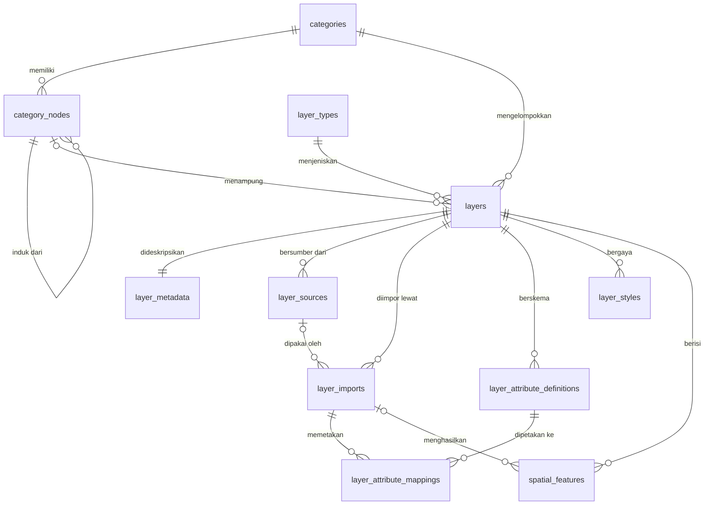

# Rancangan Database MARIMOI (WebGIS)

> **Versi dokumen:** 1.1
> **Tanggal:** 3 Oktober 2026
> **DBMS target:** PostgreSQL 15+ dengan ekstensi PostGIS 3.3+
> **Ruang lingkup:** Core system: data layer, kategori, metadata, sumber data, impor, atribut, style, dan fitur spasial.

---

## 1. Prinsip Desain

### 1.1 Layer adalah objek GIS utama

```
Layer
├── berada di 1 kategori (opsional di 1 node/subkategori)
├── memiliki 1 jenis layer
├── memiliki 1 metadata
├── memiliki banyak sumber data
├── memiliki banyak riwayat impor
├── memiliki banyak definisi atribut
├── memiliki banyak style (1 default)
└── memiliki banyak spatial feature
```

### 1.2 Kategori adalah organisasi dan discovery layer

```
Kategori (categories)
└── Subkategori (category_nodes)
    └── Subkategori (category_nodes)
        └── Layer
```

- `categories` adalah **akar** (misalnya: *Tata Ruang*, *Kebencanaan*, *Infrastruktur*).
- `category_nodes` adalah **pohon subkategori** di bawah sebuah kategori, dengan kedalaman tak terbatas (self-reference `parent_id`).
- Layer dapat ditempatkan langsung di akar kategori (`category_node_id = NULL`) atau di salah satu node.

### 1.3 Peta adalah tampilan, bukan data master

```
Layer yang tersimpan (database)
        ↓
User memilih layer di panel kategori
        ↓
Active layer state (di browser: state aplikasi / URL / localStorage)
        ↓
Render di peta
```

### 1.4 Database tidak berubah karena user menampilkan atau menyembunyikan layer

Ribuan pengguna dapat membuka MARIMOI dan memakai **dataset layer yang sama**, masing-masing dengan kombinasi layer berbeda di browser, tanpa menulis satu record pun ke database. Karena itu, entitas berikut **tidak** termasuk core system:

| Entitas | Keputusan | Alasan |
|---|---|---|
| `maps` | Tidak | Peta bukan data master |
| `map_layers` | Tidak | State tampilan disimpan di client |
| `map_shares` | Tidak | Berbagi tampilan cukup lewat URL state |
| `category_layers` (dulu `catalog_layers`) | Tidak | Relasi layer–kategori cukup lewat FK di `layers` (1 layer = 1 kategori) |

### 1.5 Entitas yang tidak dibuat di skema ini

Beberapa entitas yang sempat dirancang **dikeluarkan dari skema** karena sudah tersedia di aplikasi atau memang tidak diperlukan:

| Entitas | Keputusan | Alasan |
|---|---|---|
| `users` | **Sudah ada** | Memakai tabel `users` aplikasi (PK `bigint`, peran lewat tabel `roles` + paket permission). Kolom `created_by`/`updated_by`/`imported_by` di skema ini merujuk ke tabel tersebut, bukan membuat tabel baru. |
| `audit_logs` | Tidak | Jejak autentikasi sudah ditangani `authentication_logs`, dan aplikasi sudah punya modul Log Sistem. Jejak perubahan data cukup lewat kolom audit (`created_by`, `updated_by`) dan riwayat impor. |
| `documents` | Tidak | Dokumen pendukung (SK, Perda, laporan, PDF peta) sudah ditangani modul **Publikasi** (`publications`) yang ada. |
| `layer_versions` | Tidak | Versi data layer tidak diperlukan. Riwayat perubahan data sudah terekam di `layer_imports` (file sumber, pemetaan kolom, jumlah fitur, log), dan `spatial_features` selalu berisi data layer yang berlaku saat ini. |
| `saved_maps` | Tidak | Fitur "Simpan Peta" tidak diperlukan; berbagi tampilan cukup lewat URL state (lihat §6). |

Konsekuensi penting dari dikeluarkannya `layer_versions`:

- `layers` tidak punya `current_version_id`; `bbox` dan `feature_count` langsung menggambarkan isi `spatial_features` layer tersebut.
- `spatial_features` ditautkan ke `layer_imports` (`layer_import_id`) agar asal-usul setiap fitur tetap bisa dilacak.
- Impor ulang memakai `import_mode = 'replace'` (ganti seluruh fitur layer) atau `'append'` (tambahkan). Tidak ada mekanisme rollback versi; lihat §8.2.

---

## 2. Daftar Entitas

| No | Entitas | Status | Fungsi singkat |
|---|---|---|---|
| 1 | `categories` | Core | Kategori akar untuk organisasi layer |
| 2 | `category_nodes` | Core | Pohon subkategori di dalam kategori |
| 3 | `layer_types` | Core (referensi) | Jenis layer: titik, garis, poligon, raster, WMS, dll. |
| 4 | `layers` | Core | Objek GIS utama |
| 5 | `layer_metadata` | Core | Metadata deskriptif layer (1:1) |
| 6 | `layer_sources` | Core | Asal data: file unggahan atau layanan eksternal |
| 7 | `layer_imports` | Core | Riwayat proses impor file ke database |
| 8 | `layer_attribute_definitions` | Core | Skema atribut yang terstandar per layer |
| 9 | `layer_attribute_mappings` | Core | Pemetaan kolom file sumber → atribut standar per impor |
| 10 | `layer_styles` | Core | Simbolisasi dan legenda layer |
| 11 | `spatial_features` | Core | Geometri dan atribut setiap fitur |

> Kolom audit (`created_by`, `updated_by`, `imported_by`) merujuk ke tabel `users` **yang sudah ada di aplikasi** dengan PK `bigint`, sehingga kolom-kolom tersebut bertipe `bigint` (bukan `uuid` seperti PK tabel-tabel di skema ini).

---

## 3. Diagram Relasi (ERD)



Ringkasan kardinalitas:

| Relasi | Kardinalitas |
|---|---|
| `categories` → `category_nodes` | 1 : N |
| `category_nodes` → `category_nodes` (parent) | 1 : N |
| `categories` → `layers` | 1 : N |
| `category_nodes` → `layers` | 1 : N (opsional) |
| `layer_types` → `layers` | 1 : N |
| `layers` → `layer_metadata` | 1 : 1 |
| `layers` → `layer_sources` / `layer_imports` / `layer_attribute_definitions` / `layer_styles` | 1 : N |
| `layers` → `spatial_features` | 1 : N (sangat besar) |
| `layer_imports` → `spatial_features` | 1 : N (opsional) |
| `layer_imports` → `layer_attribute_mappings` | 1 : N |

---

## 4. Konvensi

| Aspek | Ketentuan |
|---|---|
| Penamaan | `snake_case`, nama tabel jamak (plural), bahasa Inggris |
| Primary key | `uuid` (`gen_random_uuid()`), kecuali `spatial_features` memakai `bigint identity` karena volumenya besar |
| Kolom audit | `bigint` merujuk `users(id)` milik aplikasi |
| Waktu | `timestamptz`, disimpan dalam UTC; tampilan dikonversi ke WIT (Asia/Jayapura) di aplikasi |
| Soft delete | Kolom `deleted_at` pada tabel master (`categories`, `category_nodes`, `layers`) |
| SRID penyimpanan | **EPSG:4326** (WGS 84). Data sumber dengan SRID lain ditransformasi saat impor (`ST_Transform`) |
| Perhitungan luas/panjang | Memakai `geography` atau proyeksi UTM zona 52N/52S (EPSG:32652 / EPSG:32752) untuk wilayah Maluku Utara |
| Nilai enumerasi | `text` + `CHECK` (lebih mudah diubah daripada tipe `ENUM` PostgreSQL) |
| Atribut dinamis | `jsonb` (`properties`), dengan skema yang dijaga oleh `layer_attribute_definitions` |
| `updated_at` | Diperbarui otomatis melalui trigger |

---

## 5. Definisi Tabel

### 5.0 Persiapan

```sql
CREATE EXTENSION IF NOT EXISTS postgis;
CREATE EXTENSION IF NOT EXISTS pgcrypto;   -- gen_random_uuid()
CREATE EXTENSION IF NOT EXISTS ltree;      -- path hierarki category_nodes
CREATE EXTENSION IF NOT EXISTS pg_trgm;    -- pencarian teks fuzzy

-- Trigger umum untuk updated_at
CREATE OR REPLACE FUNCTION set_updated_at() RETURNS trigger AS $$
BEGIN
  NEW.updated_at := now();
  RETURN NEW;
END;
$$ LANGUAGE plpgsql;
```

> Tabel `users` tidak dibuat di sini karena sudah ada di aplikasi (lihat §1.5). Seluruh FK audit di bawah mengacu ke tabel tersebut.

> `pgcrypto` sebenarnya opsional pada PostgreSQL 13+ karena `gen_random_uuid()` sudah masuk inti; baris di atas dipertahankan agar DDL tetap aman dijalankan di versi lama. Pada server pengembangan saat ini (PostgreSQL 17) `ltree` dan `pg_trgm` **belum terpasang**, jadi kedua `CREATE EXTENSION` tersebut wajib dijalankan sebelum migrasi `category_nodes` dan `layers`.

---

### 5.1 `categories`

Kategori akar yang tampil sebagai kelompok utama di panel layer.

| Kolom | Tipe | Null | Keterangan |
|---|---|---|---|
| `id` | uuid | PK | |
| `code` | varchar(50) | Tidak | Kode unik, mis. `TATA_RUANG` |
| `name` | varchar(150) | Tidak | Nama tampilan |
| `slug` | varchar(160) | Tidak | Unik, untuk URL |
| `description` | text | Ya | |
| `icon` | varchar(100) | Ya | Nama ikon untuk UI |
| `color` | varchar(9) | Ya | Warna aksen (hex) |
| `sort_order` | integer | Tidak | Urutan tampil |
| `is_active` | boolean | Tidak | Kategori nonaktif tidak tampil di publik |
| `created_by`, `updated_by` | bigint | Ya | FK `users` (tabel aplikasi) |
| `created_at`, `updated_at`, `deleted_at` | timestamptz | | |

```sql
CREATE TABLE categories (
  id           uuid PRIMARY KEY DEFAULT gen_random_uuid(),
  code         varchar(50)  NOT NULL,
  name         varchar(150) NOT NULL,
  slug         varchar(160) NOT NULL,
  description  text,
  icon         varchar(100),
  color        varchar(9),
  sort_order   integer NOT NULL DEFAULT 0,
  is_active    boolean NOT NULL DEFAULT true,
  created_by   bigint REFERENCES users(id),
  updated_by   bigint REFERENCES users(id),
  created_at   timestamptz NOT NULL DEFAULT now(),
  updated_at   timestamptz NOT NULL DEFAULT now(),
  deleted_at   timestamptz
);

CREATE UNIQUE INDEX uq_categories_code ON categories (code) WHERE deleted_at IS NULL;
CREATE UNIQUE INDEX uq_categories_slug ON categories (slug) WHERE deleted_at IS NULL;
```

---

### 5.2 `category_nodes`

Subkategori bertingkat di dalam satu kategori.

| Kolom | Tipe | Null | Keterangan |
|---|---|---|---|
| `id` | uuid | PK | |
| `category_id` | uuid | Tidak | FK `categories` |
| `parent_id` | uuid | Ya | FK `category_nodes`; `NULL` = node tingkat pertama |
| `name` | varchar(150) | Tidak | |
| `slug` | varchar(160) | Tidak | Unik di antara saudara (sibling) |
| `description` | text | Ya | |
| `path` | ltree | Tidak | Jalur materialized, mis. `tata_ruang.rtrw.pola_ruang` |
| `depth` | smallint | Tidak | 1 = tingkat pertama |
| `sort_order` | integer | Tidak | |
| `is_active` | boolean | Tidak | |
| audit & waktu | | | sama seperti `categories` |

Aturan:
- `parent_id` harus berada di `category_id` yang sama (dijaga composite FK).
- `path` dan `depth` diisi trigger saat insert/pindah node, sehingga query satu cabang cukup `WHERE path <@ 'tata_ruang.rtrw'`.

```sql
CREATE TABLE category_nodes (
  id           uuid PRIMARY KEY DEFAULT gen_random_uuid(),
  category_id  uuid NOT NULL REFERENCES categories(id) ON DELETE CASCADE,
  parent_id    uuid,
  name         varchar(150) NOT NULL,
  slug         varchar(160) NOT NULL,
  description  text,
  path         ltree NOT NULL,
  depth        smallint NOT NULL DEFAULT 1 CHECK (depth >= 1),
  sort_order   integer NOT NULL DEFAULT 0,
  is_active    boolean NOT NULL DEFAULT true,
  created_by   bigint REFERENCES users(id),
  updated_by   bigint REFERENCES users(id),
  created_at   timestamptz NOT NULL DEFAULT now(),
  updated_at   timestamptz NOT NULL DEFAULT now(),
  deleted_at   timestamptz,

  -- dibutuhkan agar layers & child node bisa memastikan konsistensi kategori
  CONSTRAINT uq_category_nodes_id_category UNIQUE (id, category_id),
  CONSTRAINT fk_category_nodes_parent
    FOREIGN KEY (parent_id, category_id)
    REFERENCES category_nodes (id, category_id) ON DELETE CASCADE,
  CONSTRAINT ck_category_nodes_not_self CHECK (parent_id IS DISTINCT FROM id)
);

CREATE UNIQUE INDEX uq_category_nodes_sibling_slug
  ON category_nodes (category_id, COALESCE(parent_id, '00000000-0000-0000-0000-000000000000'::uuid), slug)
  WHERE deleted_at IS NULL;
CREATE INDEX ix_category_nodes_path   ON category_nodes USING gist (path);
CREATE INDEX ix_category_nodes_parent ON category_nodes (parent_id);
```

---

### 5.3 `layer_types`

Tabel referensi jenis layer. Isinya relatif tetap (seed data).

| Kolom | Tipe | Null | Keterangan |
|---|---|---|---|
| `id` | smallint | PK | |
| `code` | varchar(40) | Tidak | Unik |
| `name` | varchar(100) | Tidak | |
| `data_kind` | text | Tidak | `vector`, `raster`, `service` |
| `geometry_type` | text | Ya | `POINT`, `LINESTRING`, `POLYGON`, `MULTI*`, `GEOMETRY`; `NULL` untuk raster/service |
| `stores_features` | boolean | Tidak | `true` jika fiturnya disimpan di `spatial_features` |
| `description` | text | Ya | |

```sql
CREATE TABLE layer_types (
  id               smallint PRIMARY KEY,
  code             varchar(40)  NOT NULL UNIQUE,
  name             varchar(100) NOT NULL,
  data_kind        text NOT NULL CHECK (data_kind IN ('vector','raster','service')),
  geometry_type    text CHECK (geometry_type IN
                     ('POINT','MULTIPOINT','LINESTRING','MULTILINESTRING',
                      'POLYGON','MULTIPOLYGON','GEOMETRY')),
  stores_features  boolean NOT NULL DEFAULT true,
  description      text
);

INSERT INTO layer_types (id, code, name, data_kind, geometry_type, stores_features) VALUES
 (1,  'vector_point',      'Vektor Titik',         'vector',  'MULTIPOINT',      true),
 (2,  'vector_line',       'Vektor Garis',         'vector',  'MULTILINESTRING', true),
 (3,  'vector_polygon',    'Vektor Poligon',       'vector',  'MULTIPOLYGON',    true),
 (4,  'vector_mixed',      'Vektor Campuran',      'vector',  'GEOMETRY',        true),
 (10, 'raster_cog',        'Raster (COG/GeoTIFF)', 'raster',  NULL,              false),
 (20, 'service_wms',       'Layanan WMS',          'service', NULL,              false),
 (21, 'service_wmts',      'Layanan WMTS',         'service', NULL,              false),
 (22, 'service_xyz',       'Tile XYZ',             'service', NULL,              false),
 (23, 'service_arcgis',    'ArcGIS REST',          'service', NULL,              false),
 (24, 'service_vector_tile','Vector Tile (MVT)',   'service', NULL,              false);
```

---

### 5.4 `layers`

Objek GIS utama.

| Kolom | Tipe | Null | Keterangan |
|---|---|---|---|
| `id` | uuid | PK | |
| `category_id` | uuid | Tidak | FK `categories` |
| `category_node_id` | uuid | Ya | FK `category_nodes` (harus di kategori yang sama) |
| `layer_type_id` | smallint | Tidak | FK `layer_types` |
| `code` | varchar(80) | Tidak | Kode unik, mis. `RTRW_POLA_RUANG_2024` |
| `name` | varchar(200) | Tidak | Nama tampilan |
| `slug` | varchar(220) | Tidak | Unik |
| `short_description` | varchar(500) | Ya | Ringkasan untuk panel layer |
| `geometry_type` | text | Ya | Dipertegas per layer (bisa lebih spesifik dari `layer_types`) |
| `storage_srid` | integer | Tidak | Default 4326 |
| `bbox` | geometry(Polygon,4326) | Ya | Batas cakupan fitur layer, untuk *zoom to layer* |
| `feature_count` | integer | Tidak | Jumlah fitur layer (cache) |
| `default_style_id` | uuid | Ya | FK `layer_styles` |
| `visibility` | text | Tidak | `public`, `internal`, `private` |
| `status` | text | Tidak | `draft`, `published`, `archived` |
| `is_default_on` | boolean | Tidak | Langsung tampil saat peta pertama dibuka |
| `is_downloadable` | boolean | Tidak | Boleh diunduh publik |
| `is_queryable` | boolean | Tidak | Bisa diklik untuk popup atribut |
| `min_zoom`, `max_zoom` | smallint | Ya | Rentang zoom tampil |
| `default_opacity` | numeric(3,2) | Tidak | 0–1 |
| `sort_order` | integer | Tidak | Urutan di dalam node |
| `published_at` | timestamptz | Ya | |
| audit & waktu | | | `created_by`, `updated_by`, `created_at`, `updated_at`, `deleted_at` |

```sql
CREATE TABLE layers (
  id                 uuid PRIMARY KEY DEFAULT gen_random_uuid(),
  category_id        uuid NOT NULL REFERENCES categories(id),
  category_node_id   uuid,
  layer_type_id      smallint NOT NULL REFERENCES layer_types(id),
  code               varchar(80)  NOT NULL,
  name               varchar(200) NOT NULL,
  slug               varchar(220) NOT NULL,
  short_description  varchar(500),
  geometry_type      text,
  storage_srid       integer NOT NULL DEFAULT 4326,
  bbox               geometry(Polygon, 4326),
  feature_count      integer NOT NULL DEFAULT 0,
  default_style_id   uuid,       -- FK ditambahkan setelah layer_styles dibuat
  visibility         text NOT NULL DEFAULT 'public'
                     CHECK (visibility IN ('public','internal','private')),
  status             text NOT NULL DEFAULT 'draft'
                     CHECK (status IN ('draft','published','archived')),
  is_default_on      boolean NOT NULL DEFAULT false,
  is_downloadable    boolean NOT NULL DEFAULT false,
  is_queryable       boolean NOT NULL DEFAULT true,
  min_zoom           smallint CHECK (min_zoom BETWEEN 0 AND 24),
  max_zoom           smallint CHECK (max_zoom BETWEEN 0 AND 24),
  default_opacity    numeric(3,2) NOT NULL DEFAULT 1.00
                     CHECK (default_opacity BETWEEN 0 AND 1),
  sort_order         integer NOT NULL DEFAULT 0,
  published_at       timestamptz,
  created_by         bigint REFERENCES users(id),
  updated_by         bigint REFERENCES users(id),
  created_at         timestamptz NOT NULL DEFAULT now(),
  updated_at         timestamptz NOT NULL DEFAULT now(),
  deleted_at         timestamptz,

  CONSTRAINT fk_layers_category_node
    FOREIGN KEY (category_node_id, category_id)
    REFERENCES category_nodes (id, category_id),
  CONSTRAINT ck_layers_zoom CHECK (min_zoom IS NULL OR max_zoom IS NULL OR min_zoom <= max_zoom),
  CONSTRAINT ck_layers_published CHECK (status <> 'published' OR published_at IS NOT NULL)
);

CREATE UNIQUE INDEX uq_layers_code ON layers (code) WHERE deleted_at IS NULL;
CREATE UNIQUE INDEX uq_layers_slug ON layers (slug) WHERE deleted_at IS NULL;
CREATE INDEX ix_layers_category      ON layers (category_id, category_node_id, sort_order);
CREATE INDEX ix_layers_status_vis    ON layers (status, visibility) WHERE deleted_at IS NULL;
CREATE INDEX ix_layers_bbox          ON layers USING gist (bbox);
CREATE INDEX ix_layers_name_trgm     ON layers USING gin (name gin_trgm_ops);
```

> **Catatan FK komposit:** `MATCH SIMPLE` (default) membuat FK diabaikan bila `category_node_id` bernilai `NULL`, sehingga layer boleh berada langsung di akar kategori.

> `bbox` dan `feature_count` adalah cache dari isi `spatial_features` layer ini; keduanya diperbarui di akhir setiap impor (lihat §8.1).

---

### 5.5 `layer_metadata`

Metadata deskriptif (relasi 1:1 dengan `layers`), mengacu pada elemen inti ISO 19115 / SNI ISO 19115 dan kebutuhan Satu Data Indonesia.

| Kolom | Tipe | Keterangan |
|---|---|---|
| `layer_id` | uuid | PK sekaligus FK `layers` |
| `title` | varchar(300) | Judul resmi dataset |
| `abstract` | text | Ringkasan isi |
| `purpose` | text | Tujuan pembuatan data |
| `keywords` | text[] | Kata kunci pencarian |
| `topic_category` | varchar(60) | Kategori topik ISO (mis. `planningCadastre`, `environment`) |
| `producer_organization` | varchar(200) | Walidata / produsen data |
| `contact_name`, `contact_email`, `contact_phone` | varchar | Narahubung |
| `data_year` | smallint | Tahun data |
| `reference_date` | date | Tanggal acuan data |
| `date_type` | text | `creation`, `publication`, `revision` |
| `update_frequency` | text | `once`, `annually`, `quarterly`, `monthly`, `irregular` |
| `scale_denominator` | integer | Skala, mis. 50000 untuk 1:50.000 |
| `positional_accuracy` | varchar(100) | Ketelitian posisi |
| `source_srid` | integer | SRID data asli |
| `administrative_area` | varchar(200) | Cakupan wilayah, mis. *Kota Ternate* |
| `lineage` | text | Riwayat/proses pembuatan data |
| `license` | varchar(100) | Lisensi, mis. `CC-BY-4.0` |
| `use_constraints` | text | Batasan penggunaan |
| `extra` | jsonb | Elemen metadata tambahan |
| `updated_at` | timestamptz | |

```sql
CREATE TABLE layer_metadata (
  layer_id               uuid PRIMARY KEY REFERENCES layers(id) ON DELETE CASCADE,
  title                  varchar(300),
  abstract               text,
  purpose                text,
  keywords               text[] NOT NULL DEFAULT '{}',
  topic_category         varchar(60),
  producer_organization  varchar(200),
  contact_name           varchar(150),
  contact_email          varchar(150),
  contact_phone          varchar(40),
  data_year              smallint CHECK (data_year BETWEEN 1900 AND 2100),
  reference_date         date,
  date_type              text CHECK (date_type IN ('creation','publication','revision')),
  update_frequency       text CHECK (update_frequency IN
                           ('once','annually','semiannually','quarterly','monthly','irregular')),
  scale_denominator      integer CHECK (scale_denominator > 0),
  positional_accuracy    varchar(100),
  source_srid            integer,
  administrative_area    varchar(200),
  lineage                text,
  license                varchar(100),
  use_constraints        text,
  extra                  jsonb NOT NULL DEFAULT '{}',
  updated_at             timestamptz NOT NULL DEFAULT now()
);

CREATE INDEX ix_layer_metadata_keywords ON layer_metadata USING gin (keywords);
```

---

### 5.6 `layer_sources`

Asal data sebuah layer. Untuk layer vektor hasil unggahan, sumbernya adalah file; untuk layer layanan (WMS/XYZ/dll.), sumber inilah yang langsung dirender oleh client.

| Kolom | Tipe | Keterangan |
|---|---|---|
| `id` | uuid | PK |
| `layer_id` | uuid | FK `layers` |
| `source_type` | text | `file_upload`, `wms`, `wmts`, `wfs`, `xyz`, `arcgis_rest`, `geojson_url`, `vector_tile`, `cog_url`, `database` |
| `name` | varchar(150) | Label sumber |
| `url` | text | Endpoint layanan (untuk tipe layanan) |
| `service_layer_name` | varchar(200) | Nama layer di layanan, mis. `LAYERS=` pada WMS |
| `format` | varchar(50) | `image/png`, `application/json`, dll. |
| `crs` | varchar(30) | CRS layanan, mis. `EPSG:3857` |
| `auth_type` | text | `none`, `api_key`, `basic`, `token` |
| `credential_ref` | varchar(200) | **Referensi** ke secret store/env, bukan secret itu sendiri |
| `options` | jsonb | Parameter tambahan (tileSize, attribution, dll.) |
| `is_primary` | boolean | Sumber utama untuk render |
| `health_status` | text | `unknown`, `ok`, `error` |
| `last_checked_at` | timestamptz | Waktu pengecekan terakhir |
| `created_at`, `updated_at` | timestamptz | |

```sql
CREATE TABLE layer_sources (
  id                  uuid PRIMARY KEY DEFAULT gen_random_uuid(),
  layer_id            uuid NOT NULL REFERENCES layers(id) ON DELETE CASCADE,
  source_type         text NOT NULL CHECK (source_type IN
                        ('file_upload','wms','wmts','wfs','xyz','arcgis_rest',
                         'geojson_url','vector_tile','cog_url','database')),
  name                varchar(150),
  url                 text,
  service_layer_name  varchar(200),
  format              varchar(50),
  crs                 varchar(30),
  auth_type           text NOT NULL DEFAULT 'none'
                      CHECK (auth_type IN ('none','api_key','basic','token')),
  credential_ref      varchar(200),
  options             jsonb NOT NULL DEFAULT '{}',
  is_primary          boolean NOT NULL DEFAULT false,
  health_status       text NOT NULL DEFAULT 'unknown'
                      CHECK (health_status IN ('unknown','ok','error')),
  last_checked_at     timestamptz,
  created_at          timestamptz NOT NULL DEFAULT now(),
  updated_at          timestamptz NOT NULL DEFAULT now(),

  CONSTRAINT ck_layer_sources_url CHECK (
    source_type IN ('file_upload','database') OR url IS NOT NULL)
);

CREATE UNIQUE INDEX uq_layer_sources_primary ON layer_sources (layer_id) WHERE is_primary;
```

---

### 5.7 `layer_imports`

Riwayat setiap proses impor file (SHP-zip, GeoJSON, KML/KMZ, GeoPackage, CSV berkoordinat) ke `spatial_features`. Tanpa `layer_versions`, tabel inilah **satu-satunya riwayat perubahan data layer**: file sumber, pemetaan kolom, jumlah fitur, dan log tiap impor tetap tersimpan meski fiturnya sudah diganti impor berikutnya.

| Kolom | Tipe | Keterangan |
|---|---|---|
| `id` | uuid | PK |
| `layer_id` | uuid | FK `layers` |
| `layer_source_id` | uuid | FK `layer_sources` (opsional) |
| `original_filename` | varchar(255) | Nama file asli |
| `storage_path` | text | Lokasi file di object storage |
| `file_format` | text | `shp_zip`, `geojson`, `kml`, `kmz`, `gpkg`, `csv` |
| `file_size_bytes` | bigint | |
| `checksum_sha256` | char(64) | Deteksi file duplikat |
| `source_srid` | integer | SRID terdeteksi/diisi user |
| `target_srid` | integer | Default 4326 |
| `encoding` | varchar(30) | Mis. `UTF-8`, `windows-1252` (penting untuk DBF) |
| `import_mode` | text | `replace` (ganti seluruh fitur layer) atau `append` (tambahkan) |
| `status` | text | `pending`, `uploaded`, `mapping`, `processing`, `completed`, `failed`, `cancelled` |
| `detected_fields` | jsonb | Daftar kolom & tipe hasil pembacaan file |
| `total_features` | integer | |
| `imported_features` | integer | |
| `failed_features` | integer | |
| `error_message` | text | |
| `log` | jsonb | Detail per baris yang gagal, peringatan geometri, dll. |
| `started_at`, `finished_at` | timestamptz | |
| `imported_by` | bigint | FK `users` (tabel aplikasi) |
| `created_at` | timestamptz | |

```sql
CREATE TABLE layer_imports (
  id                 uuid PRIMARY KEY DEFAULT gen_random_uuid(),
  layer_id           uuid NOT NULL REFERENCES layers(id) ON DELETE CASCADE,
  layer_source_id    uuid REFERENCES layer_sources(id) ON DELETE SET NULL,
  original_filename  varchar(255) NOT NULL,
  storage_path       text NOT NULL,
  file_format        text NOT NULL CHECK (file_format IN
                       ('shp_zip','geojson','kml','kmz','gpkg','csv')),
  file_size_bytes    bigint CHECK (file_size_bytes >= 0),
  checksum_sha256    char(64),
  source_srid        integer,
  target_srid        integer NOT NULL DEFAULT 4326,
  encoding           varchar(30) DEFAULT 'UTF-8',
  import_mode        text NOT NULL DEFAULT 'replace'
                     CHECK (import_mode IN ('replace','append')),
  status             text NOT NULL DEFAULT 'pending' CHECK (status IN
                       ('pending','uploaded','mapping','processing',
                        'completed','failed','cancelled')),
  detected_fields    jsonb NOT NULL DEFAULT '[]',
  total_features     integer,
  imported_features  integer NOT NULL DEFAULT 0,
  failed_features    integer NOT NULL DEFAULT 0,
  error_message      text,
  log                jsonb NOT NULL DEFAULT '{}',
  started_at         timestamptz,
  finished_at        timestamptz,
  imported_by        bigint REFERENCES users(id),
  created_at         timestamptz NOT NULL DEFAULT now(),

  CONSTRAINT uq_layer_imports_id_layer UNIQUE (id, layer_id)
);

CREATE INDEX ix_layer_imports_layer  ON layer_imports (layer_id, created_at DESC);
CREATE INDEX ix_layer_imports_status ON layer_imports (status)
  WHERE status IN ('pending','uploaded','mapping','processing');
```

> `uq_layer_imports_id_layer` dibutuhkan agar `spatial_features` bisa memastikan impor asalnya milik layer yang sama (FK komposit, lihat §5.11).

---

### 5.8 `layer_attribute_definitions`

Skema atribut standar milik layer. Menentukan label yang tampil di popup, tipe data, dan apakah atribut dapat dicari/difilter. Nilai aktual disimpan di `spatial_features.properties` dengan kunci `field_key`.

| Kolom | Tipe | Keterangan |
|---|---|---|
| `id` | uuid | PK |
| `layer_id` | uuid | FK `layers` |
| `field_key` | varchar(63) | Kunci di `properties`, `snake_case`, mis. `luas_ha` |
| `label` | varchar(150) | Label tampil, mis. *Luas (ha)* |
| `data_type` | text | `string`, `integer`, `decimal`, `boolean`, `date`, `datetime`, `enum`, `url` |
| `unit` | varchar(30) | Mis. `ha`, `m`, `jiwa` |
| `enum_options` | jsonb | Untuk `enum`: `[{"value":"KL","label":"Kawasan Lindung"}]` |
| `default_value` | text | |
| `is_required` | boolean | |
| `is_visible_in_popup` | boolean | |
| `is_searchable` | boolean | Ikut pencarian teks |
| `is_filterable` | boolean | Tampil sebagai filter |
| `is_label_field` | boolean | Dipakai sebagai label fitur di peta (maks. 1 per layer) |
| `display_order` | integer | |
| `description` | text | |
| `created_at`, `updated_at` | timestamptz | |

```sql
CREATE TABLE layer_attribute_definitions (
  id                   uuid PRIMARY KEY DEFAULT gen_random_uuid(),
  layer_id             uuid NOT NULL REFERENCES layers(id) ON DELETE CASCADE,
  field_key            varchar(63)  NOT NULL CHECK (field_key ~ '^[a-z][a-z0-9_]*$'),
  label                varchar(150) NOT NULL,
  data_type            text NOT NULL CHECK (data_type IN
                         ('string','integer','decimal','boolean','date','datetime','enum','url')),
  unit                 varchar(30),
  enum_options         jsonb,
  default_value        text,
  is_required          boolean NOT NULL DEFAULT false,
  is_visible_in_popup  boolean NOT NULL DEFAULT true,
  is_searchable        boolean NOT NULL DEFAULT false,
  is_filterable        boolean NOT NULL DEFAULT false,
  is_label_field       boolean NOT NULL DEFAULT false,
  display_order        integer NOT NULL DEFAULT 0,
  description          text,
  created_at           timestamptz NOT NULL DEFAULT now(),
  updated_at           timestamptz NOT NULL DEFAULT now(),

  CONSTRAINT uq_layer_attr_key UNIQUE (layer_id, field_key),
  CONSTRAINT ck_layer_attr_enum CHECK (data_type <> 'enum' OR enum_options IS NOT NULL)
);

CREATE UNIQUE INDEX uq_layer_attr_label_field
  ON layer_attribute_definitions (layer_id) WHERE is_label_field;
```

---

### 5.9 `layer_attribute_mappings`

Pemetaan kolom file sumber ke atribut standar, **per impor**. Ini yang memungkinkan file dengan nama kolom berbeda (mis. `LUAS`, `Luas_Ha`, `AREA_HA`) masuk ke atribut yang sama (`luas_ha`).

| Kolom | Tipe | Keterangan |
|---|---|---|
| `id` | uuid | PK |
| `layer_import_id` | uuid | FK `layer_imports` |
| `source_field_name` | varchar(255) | Nama kolom di file sumber |
| `source_field_type` | varchar(50) | Tipe terdeteksi di file |
| `attribute_definition_id` | uuid | FK `layer_attribute_definitions`; `NULL` jika diabaikan |
| `is_ignored` | boolean | Kolom tidak diimpor |
| `transform` | jsonb | Aturan transformasi, mis. `{"trim":true,"case":"upper","multiply":0.0001}` atau lookup nilai |
| `created_at` | timestamptz | |

```sql
CREATE TABLE layer_attribute_mappings (
  id                       uuid PRIMARY KEY DEFAULT gen_random_uuid(),
  layer_import_id          uuid NOT NULL REFERENCES layer_imports(id) ON DELETE CASCADE,
  source_field_name        varchar(255) NOT NULL,
  source_field_type        varchar(50),
  attribute_definition_id  uuid REFERENCES layer_attribute_definitions(id) ON DELETE SET NULL,
  is_ignored               boolean NOT NULL DEFAULT false,
  transform                jsonb NOT NULL DEFAULT '{}',
  created_at               timestamptz NOT NULL DEFAULT now(),

  CONSTRAINT uq_layer_attr_map_source UNIQUE (layer_import_id, source_field_name),
  CONSTRAINT ck_layer_attr_map_target CHECK (is_ignored OR attribute_definition_id IS NOT NULL)
);

-- Satu atribut standar hanya boleh diisi oleh satu kolom sumber per impor
CREATE UNIQUE INDEX uq_layer_attr_map_target
  ON layer_attribute_mappings (layer_import_id, attribute_definition_id)
  WHERE attribute_definition_id IS NOT NULL;
```

> Aplikasi wajib memastikan `attribute_definition_id` milik layer yang sama dengan `layer_import_id` (validasi di service layer atau trigger).

---

### 5.10 `layer_styles`

Simbolisasi layer. Disimpan sebagai JSON yang dapat diterjemahkan langsung ke style MapLibre GL / Leaflet, ditambah legenda siap tampil.

| Kolom | Tipe | Keterangan |
|---|---|---|
| `id` | uuid | PK |
| `layer_id` | uuid | FK `layers` |
| `name` | varchar(100) | Mis. *Default*, *Berdasarkan Fungsi Kawasan* |
| `style_type` | text | `simple`, `categorized`, `graduated`, `heatmap`, `raster`, `external` |
| `renderer` | text | `maplibre`, `leaflet`, `generic` |
| `classification_field` | varchar(63) | `field_key` untuk categorized/graduated |
| `definition` | jsonb | Definisi style (paint/layout, aturan kelas) |
| `legend` | jsonb | Item legenda: `[{"label":"Hutan Lindung","color":"#2E7D32","type":"fill"}]` |
| `sld` | text | Opsional, untuk interoperabilitas GeoServer/QGIS |
| `is_default` | boolean | Maks. 1 per layer |
| `created_by` | bigint | FK `users` (tabel aplikasi) |
| `created_at`, `updated_at` | timestamptz | |

```sql
CREATE TABLE layer_styles (
  id                    uuid PRIMARY KEY DEFAULT gen_random_uuid(),
  layer_id              uuid NOT NULL REFERENCES layers(id) ON DELETE CASCADE,
  name                  varchar(100) NOT NULL,
  style_type            text NOT NULL CHECK (style_type IN
                          ('simple','categorized','graduated','heatmap','raster','external')),
  renderer              text NOT NULL DEFAULT 'maplibre'
                        CHECK (renderer IN ('maplibre','leaflet','generic')),
  classification_field  varchar(63),
  definition            jsonb NOT NULL,
  legend                jsonb NOT NULL DEFAULT '[]',
  sld                   text,
  is_default            boolean NOT NULL DEFAULT false,
  created_by            bigint REFERENCES users(id),
  created_at            timestamptz NOT NULL DEFAULT now(),
  updated_at            timestamptz NOT NULL DEFAULT now(),

  CONSTRAINT uq_layer_styles_name UNIQUE (layer_id, name),
  CONSTRAINT uq_layer_styles_id_layer UNIQUE (id, layer_id),
  CONSTRAINT ck_layer_styles_class CHECK (
    style_type NOT IN ('categorized','graduated') OR classification_field IS NOT NULL)
);

CREATE UNIQUE INDEX uq_layer_styles_default ON layer_styles (layer_id) WHERE is_default;

ALTER TABLE layers
  ADD CONSTRAINT fk_layers_default_style
  FOREIGN KEY (default_style_id, id)
  REFERENCES layer_styles (id, layer_id)
  DEFERRABLE INITIALLY DEFERRED;
```

Contoh `definition` (categorized, MapLibre):

```json
{
  "type": "fill",
  "paint": {
    "fill-color": ["match", ["get", "fungsi_kawasan"],
      "KL", "#2E7D32",
      "KB", "#F9A825",
      "#9E9E9E"],
    "fill-opacity": 0.7,
    "fill-outline-color": "#424242"
  }
}
```

---

### 5.11 `spatial_features`

Tabel terbesar. Menyimpan geometri dan atribut setiap fitur dari layer vektor. Isinya selalu merupakan **data layer yang berlaku saat ini** — tidak ada kolom versi; `layer_import_id` hanya menandai impor mana yang memasukkan fitur tersebut.

| Kolom | Tipe | Keterangan |
|---|---|---|
| `id` | bigint | PK (identity) |
| `layer_id` | uuid | FK `layers` |
| `layer_import_id` | uuid | FK `layer_imports`; asal fitur (boleh `NULL` untuk data yang dibuat manual) |
| `source_fid` | varchar(100) | ID fitur di file asal |
| `geom` | geometry(Geometry,4326) | Geometri, selalu valid dan multi-part bila sesuai tipe layer |
| `geom_type` | text | Generated: `ST_GeometryType(geom)` |
| `properties` | jsonb | Atribut dengan kunci `field_key` |
| `label` | varchar(255) | Nilai label (cache dari atribut label) |
| `area_m2` | double precision | Generated untuk poligon (geography) |
| `length_m` | double precision | Generated untuk garis (geography) |
| `search_text` | tsvector | Untuk pencarian teks atribut |
| `created_at`, `updated_at` | timestamptz | |

```sql
CREATE TABLE spatial_features (
  id                bigint GENERATED ALWAYS AS IDENTITY PRIMARY KEY,
  layer_id          uuid NOT NULL REFERENCES layers(id) ON DELETE CASCADE,
  layer_import_id   uuid,
  source_fid        varchar(100),
  geom              geometry(Geometry, 4326) NOT NULL,
  geom_type         text GENERATED ALWAYS AS (ST_GeometryType(geom)) STORED,
  properties        jsonb NOT NULL DEFAULT '{}',
  label             varchar(255),
  area_m2           double precision GENERATED ALWAYS AS (
                      CASE WHEN ST_Dimension(geom) = 2
                           THEN ST_Area(geom::geography) END) STORED,
  length_m          double precision GENERATED ALWAYS AS (
                      CASE WHEN ST_Dimension(geom) = 1
                           THEN ST_Length(geom::geography) END) STORED,
  search_text       tsvector,
  created_at        timestamptz NOT NULL DEFAULT now(),
  updated_at        timestamptz NOT NULL DEFAULT now(),

  -- impor asal harus milik layer yang sama; NULL diizinkan (MATCH SIMPLE).
  -- Daftar kolom pada SET NULL (PostgreSQL 15+) wajib: tanpa itu, `layer_id`
  -- yang NOT NULL ikut di-NULL-kan saat baris layer_imports dihapus.
  CONSTRAINT fk_spatial_features_import
    FOREIGN KEY (layer_import_id, layer_id)
    REFERENCES layer_imports (id, layer_id)
    ON DELETE SET NULL (layer_import_id),
  CONSTRAINT ck_spatial_features_valid CHECK (ST_IsValid(geom) AND NOT ST_IsEmpty(geom))
);

CREATE INDEX ix_spatial_features_geom       ON spatial_features USING gist (geom);
CREATE INDEX ix_spatial_features_layer      ON spatial_features (layer_id);
CREATE INDEX ix_spatial_features_import     ON spatial_features (layer_import_id);
CREATE INDEX ix_spatial_features_properties ON spatial_features USING gin (properties jsonb_path_ops);
CREATE INDEX ix_spatial_features_search     ON spatial_features USING gin (search_text);
```

**Strategi skala:**
- Untuk jutaan fitur, gunakan **partisi** `PARTITION BY HASH (layer_id)` (mis. 16 partisi) atau `LIST` untuk layer yang sangat besar. Indeks GIST per partisi tetap efisien.
- Render peta memakai **vector tile** (`ST_AsMVT`) melalui server tile seperti Martin atau pg_tileserv, bukan GeoJSON penuh.
- Untuk zoom rendah, siapkan geometri tersederhanakan (`ST_SimplifyPreserveTopology`) sebagai *materialized view* per layer bila perlu.
- Impor mode `replace` menghapus seluruh fitur layer lalu menyisipkan yang baru dalam satu transaksi. Untuk layer sangat besar, pertimbangkan `TRUNCATE` pada partisi layer tersebut agar lebih cepat daripada `DELETE`.

---

### 5.12 Trigger `updated_at`

```sql
DO $$
DECLARE t text;
BEGIN
  FOREACH t IN ARRAY ARRAY[
    'categories','category_nodes','layers','layer_metadata','layer_sources',
    'layer_attribute_definitions','layer_styles','spatial_features']
  LOOP
    EXECUTE format(
      'CREATE TRIGGER trg_%1$s_updated_at BEFORE UPDATE ON %1$s
         FOR EACH ROW EXECUTE FUNCTION set_updated_at()', t);
  END LOOP;
END $$;
```

---

## 6. Active Layer State (di Client, bukan Database)

Struktur state yang disarankan di aplikasi frontend:

```json
{
  "view": {
    "center": [127.3836, 0.7893],
    "zoom": 11,
    "bearing": 0,
    "pitch": 0,
    "basemap": "osm"
  },
  "activeLayers": [
    { "layerId": "6f1c…", "styleId": null, "opacity": 0.8, "visible": true, "order": 1 },
    { "layerId": "a92e…", "styleId": "c31d…", "opacity": 1.0, "visible": false, "order": 2 }
  ]
}
```

- **Sumber awal:** layer dengan `is_default_on = true`.
- **Persistensi ringan:** `localStorage` untuk sesi berikutnya pada perangkat yang sama.
- **Berbagi tampilan:** state diringkas ke URL, mis. `?l=6f1c:0.8,a92e:1:c31d&c=127.38,0.79&z=11`.
- `styleId: null` berarti memakai `default_style_id` layer.

---

## 7. Aturan Bisnis

| No | Aturan | Ditegakkan oleh |
|---|---|---|
| R1 | Satu layer berada di tepat satu kategori; node (jika diisi) harus milik kategori yang sama | FK `layers.category_id` + FK komposit `(category_node_id, category_id)` |
| R2 | Node induk harus berada di kategori yang sama dengan node anak | FK komposit `category_nodes (parent_id, category_id)` |
| R3 | Node tidak boleh menjadi induk dirinya sendiri atau keturunannya | `CHECK` + validasi trigger berbasis `path` saat pemindahan |
| R4 | Hanya satu style default per layer, dan milik layer itu | Partial unique index `uq_layer_styles_default` + FK komposit |
| R5 | Fitur spasial harus merujuk impor dari layer yang sama | FK komposit `(layer_import_id, layer_id)` |
| R6 | Geometri harus valid, tidak kosong, dan ber-SRID 4326 | Tipe kolom + `CHECK ST_IsValid` |
| R7 | Layer `published` wajib punya `published_at`; layer vektor wajib punya fitur dan style default | `CHECK` + validasi service sebelum publish |
| R8 | Pengunjung publik hanya melihat layer `published` + `public` di kategori/node aktif | Query/view publik (§9) |
| R9 | Kredensial layanan eksternal tidak disimpan di database | `credential_ref` hanya berisi referensi |
| R10 | Menampilkan/menyembunyikan layer tidak menulis ke database | Desain (§1.3–1.4, §6) |

---

## 8. Alur Utama

### 8.1 Impor data layer vektor

```
1. Admin membuat layer (status: draft) + metadata
2. Unggah file            → layer_imports (status: uploaded), file ke object storage
3. Sistem membaca file    → detected_fields, source_srid, total_features (status: mapping)
4. Admin memetakan kolom  → layer_attribute_mappings
                            (membuat layer_attribute_definitions baru bila perlu)
5. Proses impor           → status: processing, dalam satu transaksi:
     • bila import_mode = 'replace': hapus seluruh spatial_features layer ini
     • transformasi ke EPSG:4326 (ST_Transform)
     • perbaikan geometri (ST_MakeValid), konversi ke multi-part (ST_Multi)
     • transformasi nilai atribut sesuai mapping
     • insert ke spatial_features dengan layer_import_id = impor ini
6. Selesai                → status: completed, catat imported/failed_features & log
7. Perbarui cache layer   → layers.bbox & layers.feature_count dihitung ulang
8. Publish layer          → status: published, published_at = now()
```

### 8.2 Perbaikan dan impor ulang data

Tidak ada rollback versi. Jika data hasil impor ternyata salah:

- Impor ulang file yang benar dengan `import_mode = 'replace'` — seluruh fitur layer diganti dalam satu transaksi, sehingga peta publik tidak pernah menampilkan data setengah jadi.
- File sumber setiap impor **tetap tersimpan** di object storage beserta `layer_attribute_mappings`-nya, jadi impor sebelumnya bisa dijalankan ulang bila perlu kembali ke data lama.
- Baris `layer_imports` lama tidak dihapus; `spatial_features.layer_import_id` dari impor yang sudah tergantikan akan bernilai `NULL` atau hilang bersama fiturnya, sementara riwayat impornya tetap terbaca untuk audit.
- Untuk layer kritis, simpan salinan basis data (backup/PITR) sebelum impor `replace` berskala besar.

---

## 9. Query Penting

### 9.1 View layer publik (dipakai API panel kategori)

```sql
CREATE VIEW v_public_layers AS
SELECT l.id, l.code, l.name, l.slug, l.short_description,
       l.category_id, c.name AS category_name,
       l.category_node_id, n.name AS node_name, n.path AS node_path,
       lt.code AS layer_type, l.geometry_type,
       l.bbox, l.feature_count, l.default_style_id,
       l.is_default_on, l.is_queryable, l.is_downloadable,
       l.min_zoom, l.max_zoom, l.default_opacity, l.sort_order
FROM layers l
JOIN categories c      ON c.id = l.category_id AND c.is_active AND c.deleted_at IS NULL
LEFT JOIN category_nodes n ON n.id = l.category_node_id
JOIN layer_types lt    ON lt.id = l.layer_type_id
WHERE l.status = 'published'
  AND l.visibility = 'public'
  AND l.deleted_at IS NULL
  AND (n.id IS NULL OR (n.is_active AND n.deleted_at IS NULL));
```

### 9.2 Pohon kategori lengkap

```sql
SELECT c.id AS category_id, c.name AS category,
       n.id AS node_id, n.parent_id, n.name AS node, n.depth, n.path
FROM categories c
LEFT JOIN category_nodes n ON n.category_id = c.id
     AND n.is_active AND n.deleted_at IS NULL
WHERE c.is_active AND c.deleted_at IS NULL
ORDER BY c.sort_order, n.path;
```

### 9.3 Fungsi vector tile per layer

```sql
CREATE OR REPLACE FUNCTION layer_mvt(p_layer_id uuid, z int, x int, y int)
RETURNS bytea AS $$
  WITH bounds AS (
    SELECT ST_TileEnvelope(z, x, y) AS env3857,
           ST_Transform(ST_TileEnvelope(z, x, y), 4326) AS env4326
  ),
  mvt AS (
    SELECT f.id, f.label, f.properties,
           ST_AsMVTGeom(ST_Transform(f.geom, 3857), b.env3857, 4096, 64, true) AS geom
    FROM spatial_features f
    CROSS JOIN bounds b
    WHERE f.layer_id = p_layer_id
      AND f.geom && b.env4326
  )
  SELECT ST_AsMVT(mvt.*, 'features', 4096, 'geom', 'id') FROM mvt;
$$ LANGUAGE sql STABLE PARALLEL SAFE;
```

### 9.4 Identifikasi fitur di titik klik (popup)

```sql
SELECT f.id, f.layer_id, f.label, f.properties
FROM spatial_features f
WHERE f.layer_id = ANY($1::uuid[])                         -- layer aktif dari client
  AND ST_DWithin(f.geom::geography,
                 ST_SetSRID(ST_MakePoint($2, $3), 4326)::geography,
                 $4)                                       -- toleransi meter
LIMIT 20;
```

### 9.5 Pencarian layer

```sql
SELECT l.id, l.name, similarity(l.name, $1) AS score
FROM v_public_layers l
LEFT JOIN layer_metadata m ON m.layer_id = l.id
WHERE l.name % $1 OR $1 = ANY (m.keywords)
ORDER BY score DESC
LIMIT 20;
```

---

## 10. Keamanan dan Hak Akses

Peran memakai role yang **sudah ada di aplikasi** (`roles.slug`), dengan hak akses detail ditegakkan oleh permission bernama `{modul}.{aksi}`:

| Peran | Kategori & Node | Layer & Metadata | Impor | Style |
|---|---|---|---|---|
| `super-admin` | CRUD | CRUD | Semua | CRUD |
| `admin-bappeda` | CRUD | CRUD + publish | Semua | CRUD |
| `admin-opd` | Baca | Buat/ubah draft | Impor data layer sendiri | CRUD |
| `user` | Baca | Baca (termasuk `internal`) | Baca | Baca |
| Publik (tanpa login) | Baca kategori aktif | `published` + `public` saja | — | Baca style default |

Rekomendasi tambahan:
- Akses API publik melalui role database terpisah yang hanya memiliki `SELECT` pada `v_public_layers`, fungsi tile, dan tabel referensi.
- Pertimbangkan Row Level Security (RLS) pada `layers` dan `spatial_features` bila layer `internal`/`private` dilayani dari database yang sama.

---

## 11. Urutan Migrasi

Tabel `users` tidak termasuk karena sudah dibuat oleh migrasi aplikasi yang ada.

1. Ekstensi dan fungsi `set_updated_at`
2. `categories`
3. `category_nodes`
4. `layer_types` + seed
5. `layers` (tanpa FK `default_style_id`)
6. `layer_metadata`
7. `layer_sources`
8. `layer_imports`
9. `layer_attribute_definitions`
10. `layer_attribute_mappings`
11. `layer_styles` + FK `layers.default_style_id`
12. `spatial_features` (+ partisi bila diperlukan)
13. Trigger, view `v_public_layers`, fungsi `layer_mvt`

---

## 12. Ringkasan Keputusan Akhir

| Entitas | Keputusan |
|---|---|
| `categories` | **Ya** |
| `category_nodes` | **Ya** |
| `layers` | **Ya** |
| `layer_types` | **Ya** |
| `layer_metadata` | **Ya** |
| `layer_sources` | **Ya** |
| `layer_imports` | **Ya** |
| `layer_attribute_definitions` | **Ya** |
| `layer_attribute_mappings` | **Ya** |
| `layer_styles` | **Ya** |
| `spatial_features` | **Ya** |
| `layer_versions` | **Tidak** — riwayat data cukup lewat `layer_imports` |
| `documents` | **Tidak** — sudah ditangani modul Publikasi (`publications`) |
| `saved_maps` | **Tidak** — fitur "Simpan Peta" tidak diperlukan |
| `users` | **Sudah ada di aplikasi** — kolom audit merujuk ke tabel tersebut (`bigint`) |
| `audit_logs` | **Tidak** — sudah ada `authentication_logs` + modul Log Sistem |
| `maps` | **Tidak untuk core system** |
| `map_layers` | **Tidak untuk core system** |
| `map_shares` | **Tidak untuk core system** |
| `category_layers` | **Tidak** |
