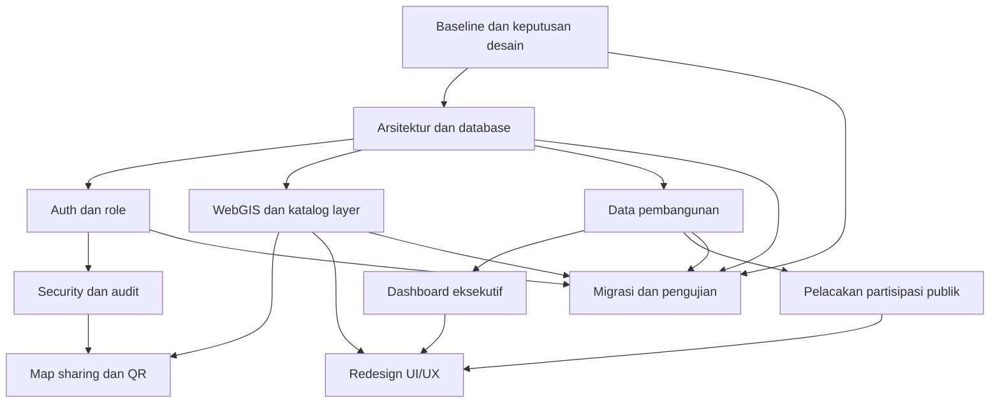

# MARIMOI V2 Overview

## Tujuan

MARIMOI V2 dikembangkan menjadi portal WebGIS dan dashboard pembangunan daerah yang menyatukan informasi peta tematik, data pembangunan, partisipasi publik, dan analisis eksekutif dalam satu pengalaman pengguna.

Pengembangan mengacu pada prinsip dari [analisis MARIMOI dan GOAT](../db-analysis/04-marimoi-x-goat.md): layer menyimpan dataset dan metadata, map menyimpan komposisi peta, dan konfigurasi layer disimpan pada relasi map-layer.

## Ruang Lingkup

1. [Arsitektur dan database](plan/01-arsitektur-database.md)
2. [Authentication, user, dan multi-role](plan/02-auth-user-role.md)
3. [Security, user log, dan activity log](plan/03-security-audit.md)
4. [WebGIS, katalog layer, filter, dan sharing](plan/04-webgis-map-layer.md)
5. [Dashboard eksekutif dan data pembangunan](plan/05-dashboard-eksekutif.md)
6. [Pelacakan aspirasi, kritik/saran, dan tanggapan proyek](plan/06-partisipasi-publik.md)
7. [Redesign UI/UX halaman utama](plan/07-uiux-main-page.md)
8. [Tahapan migrasi, pengujian, dan rollout](plan/08-migrasi-pengujian.md)

## Peran Pengguna

| Peran | Cara dibuat | Akses utama |
| --- | --- | --- |
| Admin Sistem | Dibuat atau dikelola sesuai kebijakan internal | Semua konfigurasi, user, role, data, audit, dan publikasi |
| Admin Bappeda | Hanya dibuat dan diberikan oleh Admin Sistem | Dashboard, pengelolaan data sesuai kewenangan Bappeda, publikasi, dan monitoring |
| Admin OPD Teknis | Hanya dibuat dan diberikan oleh Admin Sistem | Pengelolaan data dan laporan sesuai OPD, monitoring proyek yang menjadi kewenangannya |
| Publik | Daftar/login mandiri melalui Google | Membaca peta publik, dashboard publik yang diizinkan, memberi partisipasi, dan membuat share |

Role publik hasil login Google tidak boleh otomatis memperoleh akses dashboard administrasi. Akses admin harus berasal dari provisioning Admin Sistem dan diverifikasi dengan policy serta scope OPD.

## Aturan Bisnis Utama

- Dashboard administrasi hanya dapat diakses Admin Sistem, Admin Bappeda, dan Admin OPD Teknis.
- User publik wajib login dengan akun Google untuk mengirim kritik/saran, tanggapan proyek, aspirasi/usulan, membagikan peta, dan mengakses dashboard eksekutif yang memang dibuka untuk publik.
- Semua login admin ke dashboard dicatat sebagai authentication log dengan waktu, user, hasil, IP, user-agent, dan konteks akses yang relevan.
- Aktivitas `CREATE`, `UPDATE`, dan `DELETE` user admin dicatat. Aktivitas penting user publik juga dicatat dengan data pribadi seminimal mungkin.
- Peta lama yang terpisah menjadi Peta Tematik, Proyek Strategis Daerah, Proyek Strategis Nasional, Pokir DPRD, dan Musrenbang digabung ke satu menu peta.
- Model baru berfokus pada layer tematik dan layer pembangunan yang berkaitan dengan infrastruktur serta pengembangan wilayah.
- Pengguna dapat membagikan konfigurasi peta/layer aktif melalui URL dan QR code.
- Filter utama WebGIS dan dashboard adalah wilayah, sektor, OPD, tahun, dan status jika relevan.
- Angka dashboard harus memiliki sumber, periode, waktu pembaruan, dan definisi metric yang dapat ditelusuri.

## Prinsip Arsitektur

- Mulai dengan modular monolith Laravel; batas domain tetap jelas meskipun aplikasi masih satu deployment.
- Pisahkan katalog layer, konfigurasi map, feature/geometri, data pembangunan, sharing, dan audit.
- Pertahankan kompatibilitas dengan tabel lama selama migrasi melalui migration additive dan deprecation bertahap.
- Gunakan Policy, Form Request, API Resource, queue, dan job idempotent sesuai kebutuhan fitur.
- Jangan memindahkan data besar ke service atau storage baru sebelum ada kebutuhan yang dibuktikan melalui benchmark.

## Dependensi Pengembangan

## Dokumen Referensi

- [Analisis schema saat ini](../db-analysis/01-current-schema.md)
- [Analisis perbaikan database](../db-analysis/02-analysis.md)
- [Rencana peningkatan database](../db-analysis/03-database-planning.md)
- [Analisis MARIMOI berdasarkan GOAT](../db-analysis/04-marimoi-x-goat.md)
- [Hasil review aplikasi](../Hasil_Review_Marimoi_Jamil.md)
